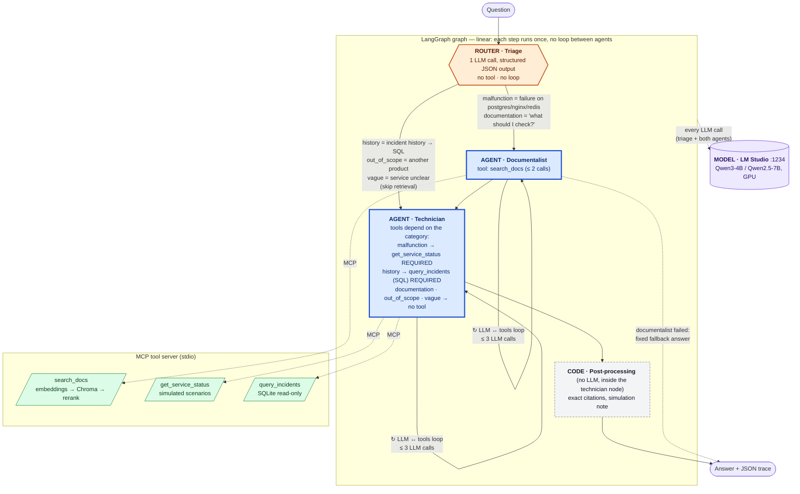
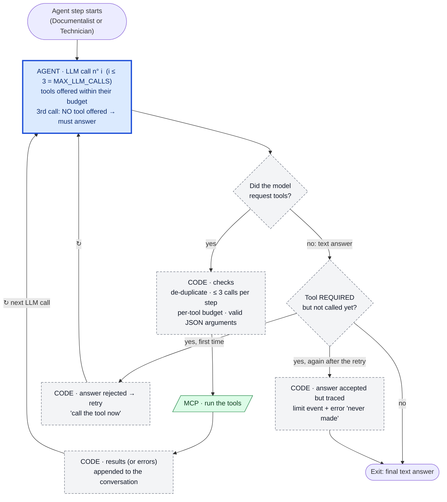
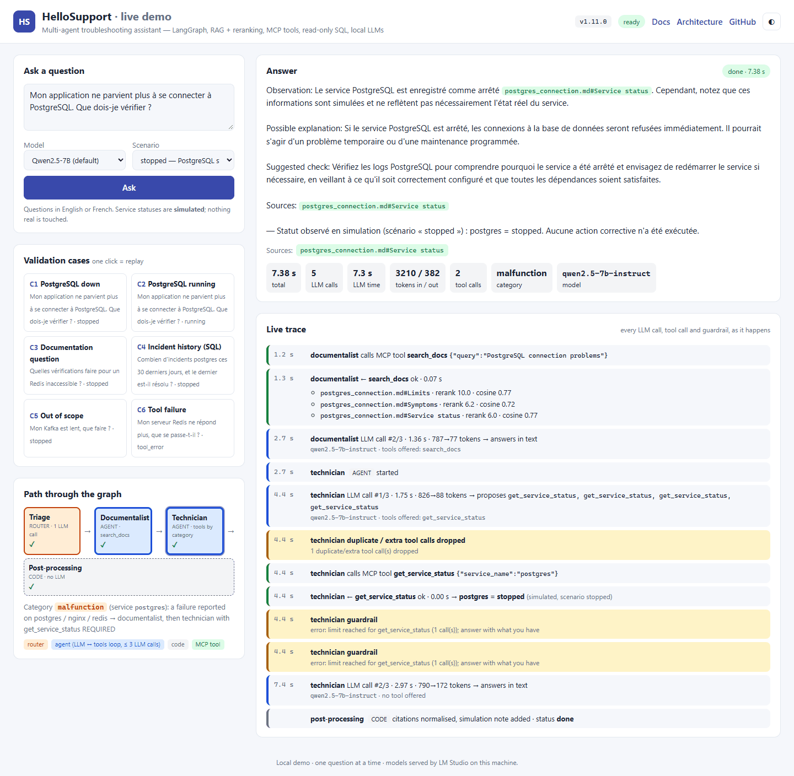

# HelloSupport

**A local-only, multi-agent troubleshooting assistant: LangGraph agents, RAG with reranking, MCP tools, guarded text-to-SQL, and a measured 4B-vs-7B model comparison. Runs on a single 8 GB GPU.**

[](CHANGELOG.md)
[](https://stephanehe.github.io/HelloSupport/)
[](LICENSE)
[](https://www.python.org/)
[](#requirements)
[](#tests)

HelloSupport is a deliberately small "hello world" project. It exercises the building blocks
of modern LLM applications **end to end, for real, and with measurements**. Ask it a support
question in English or French ("my app can't connect to PostgreSQL, what should I check?") and
three steps cooperate:

1. a **triage** step classifies the request with structured JSON output;
2. a **documentalist** agent retrieves cited passages from a small knowledge base (vector search + cross-encoder reranking);
3. a **technician** agent observes a (simulated) service status or queries an incidents database in SQL, then writes a diagnosis that separates **observations** from **hypotheses**.

Everything runs locally: models served by LM Studio, embeddings on the GPU, no cloud API, no account, no cost.

**Documentation:** [stephanehe.github.io/HelloSupport](https://stephanehe.github.io/HelloSupport/) — specification,
31 design decisions, benchmark method and raw reports, annotated demo. One version per release.

---

## Table of contents

- [Quick start](#quick-start) · [Architecture](#architecture) · [Features](#features) · [Measured results](#measured-results)
- [Requirements](#requirements) · [Installation](#installation) · [Usage](#usage) · [Demo](#demo) · [Web demo](#web-demo) · [Tests](#tests)
- [Documentation](#documentation) · [Repository layout](#repository-layout) · [Design decisions](#design-decisions) · [Known limitations](#known-limitations) · [Roadmap](#roadmap)
- [Contributing](#contributing) · [Security](#security) · [License](#license) · [Author](#author)

## Quick start

With an NVIDIA GPU, [LM Studio](https://lmstudio.ai/) (and its `lms` CLI) and [uv](https://docs.astral.sh/uv/) installed:

```bash
git clone https://github.com/StephaneHe/HelloSupport.git && cd HelloSupport
uv sync                                                    # Python 3.12 environment, PyTorch CUDA included
lms get "https://huggingface.co/lmstudio-community/Qwen2.5-7B-Instruct-GGUF@Q4_K_M" -y
lms server start
uv run hello-support smoke large                           # chat + tool calling on the default model
uv run hello-support ask "My app can no longer connect to PostgreSQL. What should I check?" --scenario stopped
uv run hello-support web                                   # browser demo on http://127.0.0.1:5179
```

The first `uv sync` downloads PyTorch CUDA (~2.5 GB). The first question takes one to two minutes
(retrieval models downloaded and loaded, vector index built); later questions take ~20–30 s from the
command line and 2–15 s in the web demo. Details and the 8 GB GPU settings are in [Installation](#installation).

## Architecture



**Legend**

| Style in the diagram | Kind | What it is | Loop? |
|---|---|---|---|
| 🟦 blue, thick border | **AGENT** | An LLM that chooses which tools to call and with which arguments, reads the results and answers (`run_agent`) | **yes**: LLM ↔ tools, ≤ 3 LLM calls |
| 🟧 orange hexagon | **ROUTER** | One LLM call constrained to a JSON schema: picks 1 of 5 fixed categories. No tool, so not an agent | no |
| ⬜ grey, dashed border | **CODE** | Deterministic Python, no LLM | no |
| 🟩 green parallelogram | **MCP TOOL** | Exposed by the separate MCP server; called by the agents | — |
| 🟪 purple cylinder | **MODEL** | LLM served locally by LM Studio (OpenAI-compatible API) | — |

The **LangGraph graph is linear**: triage → documentalist → technician for `malfunction` and `documentation`, triage → technician
directly for `history`, `out_of_scope` and `vague`. Each node runs once per question and nothing flows back from the technician to
the documentalist. The graph has three nodes; post-processing is code run at the end of the technician node. If the
documentalist fails (no LLM call succeeded), the graph ends there with a fixed fallback answer (dashed edge). The only
loops are **inside** each agent:



- **3 LLM calls at most** (`MAX_LLM_CALLS`). The last one is made without tools, so the agent always ends with a text answer.
- **3 tool calls at most per step**, after removing duplicates. Each tool also has its own budget (`search_docs` ≤ 2, `get_service_status` ≤ 1, `query_incidents` ≤ 2).
- **Required tool**: for `malfunction` and `history`, a tool call is required. If the model answers without calling it, the code rejects that answer and retries once. If the model answers in text again, that second answer is accepted, but it is traced as unobserved (a `limit` event and an error in the run).
- **Exit**: the loop ends as soon as the model answers in text without requesting a tool.

**Design principles**

- **Code decides the structure, the model decides the content.** The graph, the branch taken
  and the tools offered or *required* for each intent are enforced by code; the model writes
  the tool arguments (search queries, SQL) and the answer.
- **Hard boundary between agents and tools.** Tools live in a separate MCP server process; the
  agents only see their JSON schemas.

## Features

| Area | What is implemented |
|---|---|
| **Agents & orchestration** | LangGraph `StateGraph` with a conditional edge; shared bounded tool loop (call budgets, tool-free final call, de-duplication of repeated calls, verification of `tool_choice="required"` with one retry) |
| **Routing** | Structured-output triage (`malfunction`, `history`, `documentation`, `out_of_scope`, `vague`) driving a per-intent tool policy |
| **RAG** | Section-level chunking with citable ids, multilingual embeddings (`paraphrase-multilingual-MiniLM-L12-v2`) on CUDA, embedded **Chroma** index rebuilt only when content changes, **cross-encoder reranking** (top-5 → top-3) and an off-topic flag |
| **MCP** | Official Python SDK (v2), stdio transport, typed tool schemas (`enum` for services), explicit `ToolError`s; verified with MCP Inspector |
| **Data agent** | The model writes its own SQL against an incidents database behind **five independent guards**: single `SELECT`, forced `LIMIT`, read-only connection, SQLite authorizer, timeout |
| **Serving** | LM Studio, OpenAI-compatible API; 4B SLM and 7B model interchangeable by config; GPU offload, Q4_K_M quantization |
| **Reliability** | Deterministic post-processing: citations mapped back to exact ids, a "simulated status, no action executed" note written from tool results |
| **Observability** | Live event trace (agent, tool, arguments, result, guardrails) and a JSON export per run, with latency and token metrics |
| **Evaluation** | Six executable validation cases with automatic checks; benchmark across models with every answer archived; serving throughput measurement |

## Measured results

Six validation cases × 3 runs per model, warm (MCP session and model already loaded),
RTX 2070 Super 8 GB, code v1.11.2, pinned LM Studio settings (context 8192, 1 parallel session),
measured on 2026-10-04 with `hello-support bench --models slm --runs 3`, then `--models large`.
Full method and raw answers: [`docs/BENCH.md`](docs/BENCH.md), [`docs/bench/`](docs/bench/).

| Metric | Qwen3-4B-Instruct-2507 (SLM) | Qwen2.5-7B-Instruct (**default**) |
|---|---|---|
| Cases passed (all checks) | 16 / 18 | **18 / 18**† |
| Checks passed | 105 / 108 | **108 / 108**† |
| Latency per question, p50 / max | **4.4 s** / 7.2 s | 8.5 s / 15.8 s |
| LLM calls per question (mean) | 4.3 | 4.0 |
| Tokens in / out per question (mean) | 2,658 / 351 | 2,462 / 460 |
| Generation throughput, 1 request at a time‡ | **107 tok/s** | 71 tok/s |
| Aggregate throughput, 4 concurrent requests‡ | **173 tok/s** | 128 tok/s |
| Cost, local | $0 | $0 |
| Estimated cost if served by a hosted API, per 1,000 questions* | ~$0.61 (gpt-4o-mini) · ~$4.4 (Claude Haiku 4.5) | ~$0.65 · ~$4.8 |

\* Estimate only: measured tokens × indicative public list prices, no API call made. Check current pricing before quoting.<br/>
† Re-scored with the v1.11.2 check: the raw report says 16/18 and 106/108, but both C6 failures were false positives
of the check (the suggested check "make sure the service is running" was read as a status claim). 7B on C6 × 10
with the fixed check: 10/10 ([BENCH](docs/BENCH.md), section v1.11.2).<br/>
‡ Measured on 2026-10-02 (v1.7.0) with LM Studio's default of 4 parallel slots, before the settings were pinned to
1 session: the concurrency-4 figure is not reproduced with the recommended settings, and the raw `throughput` output
was not archived. The previous table (v1.7.0: 4B 15/18, 7B 18/18, p50 6.0 s and 9.0 s) is kept in [BENCH](docs/BENCH.md).

**Takeaways**
- The 4B model is ~1.9× faster (p50), but it is **less reliable when a tool fails** (case C6: 1/3; it invented source ids in 3/3 runs on v1.7.0, 1/3 on v1.11.2). The 7B is therefore the default ([ADR D-25](docs/DESIGN_DECISIONS.md)).
- Since v1.10.0, `out_of_scope` and `vague` skip retrieval: −55 % to −86 % latency on `vague`, −35 % on `out_of_scope` with the 4B (no change with the 7B), 2 LLM calls instead of 3–4 ([BENCH](docs/BENCH.md), D-30; ad hoc 5-run measurement, raw output not archived).
- With 4 parallel slots (before pinning), running 4 requests concurrently gave **1.6–1.8× more aggregate throughput** but **doubled per-request latency**.
- Cost is driven by **context** (~2,700 input tokens vs ~370 output), not by model size.
- Before the fixes of milestone J4, the same benchmark scored 10/18 (7B) and 7/18 (4B). Each fix came from an observed failure (see [Design decisions](#design-decisions)).

## Requirements

- **GPU**: NVIDIA, 8 GB VRAM is enough (the 7B in Q4_K_M takes ~4.7 GB). CPU works for the retrieval models, slowly.
- **[LM Studio](https://lmstudio.ai/)** with its `lms` CLI, to download and serve the LLMs.
- **[uv](https://docs.astral.sh/uv/)**; it installs Python 3.12 if needed. Tested on Windows 11; the code is cross-platform.
- Optional: **Node.js** to inspect the MCP server with MCP Inspector, and [mermaid-cli](https://github.com/mermaid-js/mermaid-cli) (`npm i -g @mermaid-js/mermaid-cli`) to rebuild the PDFs with their diagrams.
- ~10 GB of disk (two LLMs, PyTorch CUDA, retrieval models). No account, no API key.

## Installation

```bash
git clone https://github.com/StephaneHe/HelloSupport.git
cd HelloSupport
uv sync                                    # creates .venv (runtime, test and docs dependencies);
                                           # PyTorch CUDA comes from the PyTorch index (cu124)
```

Download the two models and start the local server:

```bash
lms get "qwen/qwen3-4b-2507@q4_k_m" -y                                                   # SLM, ~2.5 GB
lms get "https://huggingface.co/lmstudio-community/Qwen2.5-7B-Instruct-GGUF@Q4_K_M" -y   # 7B, ~4.7 GB
lms server start                                                                         # http://localhost:1234/v1
uv run hello-support smoke                 # checks chat + tool calling on both models
```

The embedding and reranking models (~0.5 GB) are pulled from the Hugging Face Hub on first use.
The incidents database `data/incidents.db` is generated on first use, with dates relative to the current day. It is
re-seeded automatically when the day changes, so "the last 30 days" always has the same answer.

> **8 GB GPU: pin the load settings.** Recent LM Studio builds auto-fit the context to the free
> VRAM (e.g. 25,600 tokens × 4 parallel slots for the 4B). Together with the retrieval models this
> saturates an 8 GB card and makes some LLM calls take 50–100 s. Set a **per-model default** for
> both models: auto-fit off, **context length 8192**, **1 parallel session**. You can do it in the
> model's load settings in the app, or with a per-model config file. Note that `lms load -c` alone
> is overridden by auto-fit. [`docs/BENCH.md`](docs/BENCH.md) says which runs were affected and shows the
> stable latencies after the fix.

Configuration is optional (environment variables or a `.env` file, see [`.env.example`](.env.example)):

| Variable | Default | Meaning |
|---|---|---|
| `HS_LLM_BASE_URL` | `http://localhost:1234/v1` | OpenAI-compatible endpoint |
| `HS_MODEL_SLM` / `HS_MODEL_LARGE` | `qwen/qwen3-4b-2507` / `qwen2.5-7b-instruct` | model ids |
| `HS_MODEL_DEFAULT` | `large` | `slm`, `large`, or any model id |
| `HS_LLM_TIMEOUT_S` | `120` | per-call timeout, in seconds |
| `HS_SCENARIO` | `stopped` | simulated service states (see below); `--scenario` overrides it |
| `HS_SCENARIO_FILE` | (unset) | file holding a scenario name, re-read at each status call; has priority over `--scenario` and `HS_SCENARIO` (set by the web demo) |
| `HS_WEB_TIMEOUT_S` / `HS_WEB_QUEUE_TIMEOUT_S` | `240` / `300` | web demo: per-question timeout, maximum wait in the queue (seconds) |
| `HS_DOCS_URL` | (unset) | web demo: base URL of a documentation site for source links (see [Web demo](#web-demo)) |

## Usage

Run the commands with `uv run` (e.g. `uv run hello-support ask "..."`) or after activating `.venv`.

| Command | Purpose |
|---|---|
| `hello-support ask "<question>" [--scenario S] [--model slm\|large] [--quiet]` | full pipeline with a live trace; JSON trace saved to `runs/`; exit code 0 if an answer was produced, 1 if the run failed (e.g. LM Studio down) |
| `hello-support search "<text>" [--top-k 5] [--top-n 2]` | retrieval only: vector candidates, cosine vs rerank scores, relevance flag (the agents get the top 3) |
| `hello-support bench [--models slm large] [--runs 1] [--cases C1 C4]` | the six validation cases → `docs/bench/*.md` + `runs/bench-*.json` (defaults shown; the results table uses `--runs 3`) |
| `hello-support throughput [--concurrency 1 4] [--requests 8]` | serving throughput and latency under concurrency |
| `hello-support web [--host 0.0.0.0] [--port 5179]` | browser demo with a live trace (see [Web demo](#web-demo)) |
| `hello-support smoke [slm\|large]` | model server check (chat + tool call); exit code 1 if a check fails |
| `hello-support-mcp` | the MCP tool server alone (stdio) |
| `hello-support --version` | version |

**Scenarios** (simulated service states, nothing real is ever queried or changed):
`stopped` (PostgreSQL down), `running` (all up), `redis_down`, `tool_error` (the status tool fails).

Inspect the tool server with MCP Inspector:

```bash
npx @modelcontextprotocol/inspector --cli .venv/Scripts/hello-support-mcp.exe --method tools/list   # Windows
npx @modelcontextprotocol/inspector --cli .venv/bin/hello-support-mcp --method tools/list           # Linux/macOS
```

## Demo

The six validation cases, in about five minutes. The test questions are in French on purpose: the knowledge base is in English, so they exercise cross-lingual retrieval.

```bash
uv run hello-support ask "Mon application ne parvient plus à se connecter à PostgreSQL. Que dois-je vérifier ?" --scenario stopped
uv run hello-support ask "Mon application ne parvient plus à se connecter à PostgreSQL. Que dois-je vérifier ?" --scenario running
uv run hello-support ask "Quelles vérifications faire pour un Redis inaccessible ?"
uv run hello-support ask "Combien d'incidents postgres ces 30 derniers jours, et le dernier est-il résolu ?"
uv run hello-support ask "Mon Kafka est lent, que faire ?"
uv run hello-support ask "Mon serveur Redis ne répond plus, que se passe-t-il ?" --scenario tool_error
```

| Case | Expected behavior |
|---|---|
| C1 PostgreSQL stopped | calls `get_service_status`, reports `stopped` as **simulated**, cites the right section |
| C2 PostgreSQL running | same question, different conclusion (network, config, credentials); no invented failure |
| C3 Documentation question | sourced checklist, **no** status call |
| C4 Data question | writes two SQL queries (count + latest incident); the answer is derived from the returned rows |
| C5 Out of scope | says what it covers or asks a clarifying question; invents nothing |
| C6 Tool failure | controlled output stating that the check could not be done |

Each `ask` starts its own tool server, so from the command line a `malfunction` or `documentation`
question (which uses retrieval) takes ~20–30 s while the retrieval models load; `history`,
`out_of_scope` and `vague` questions take 2–10 s. The warm figures (2–15 s per question) apply to
the web demo and the benchmark, which keep one tool server running. An annotated transcript, including a guardrail rejecting an answer that skipped a
required tool call, is in [`docs/DEMO.md`](docs/DEMO.md).

## Web demo



A single page to try the assistant in a browser and **watch it work**. It runs the real pipeline
(same LangGraph graph, agents, MCP tools and LM Studio models) and streams every step live.

```bash
uv run hello-support web                      # http://127.0.0.1:5179
uv run hello-support web --host 0.0.0.0       # reachable from your local network
```

- **Ask** in English or French, pick the model (4B / 7B) and the simulated scenario (`stopped`, `running`, `tool_error`), or replay one of the **six validation cases** in one click.
- **Live trace** (Server-Sent Events):
  - the triage category and the path through the graph, with skipped steps greyed out;
  - each agent's LLM calls (latency, tokens, tools offered and proposed);
  - MCP tool calls with their arguments, **the SQL the model wrote and the rows it got back**;
  - guardrails as they fire (rejected answer → retry, dropped duplicate calls, last call without tools).
- **Answer** with its cited sources, plus metrics: time, LLM calls, tokens, tool calls.
- **Robust by design**:
  - one question at a time, later ones wait in a queue and see their position;
  - a clear message when LM Studio is down or a model is missing;
  - a per-question timeout;
  - one warm MCP tool server shared by all questions, so the retrieval models load once (~30 s, first question only).
- Optional: set `HS_DOCS_URL` to turn the cited sources into links to the documentation site, e.g.
  `HS_DOCS_URL=https://stephanehe.github.io/HelloSupport/latest`. The page links to `<HS_DOCS_URL>/#architecture` and
  `<HS_DOCS_URL>/kb/<sheet>/#<section>`, the layout of the site built from this repository (see [Documentation](#documentation)).
  Without the variable, sources are shown as plain text.
- HTTP API (used by the page): `GET /api/health`, `GET /api/config`, and `GET /api/ask?question=…&model=slm|large&scenario=…`,
  which streams Server-Sent Events (`accepted`, `queued`, `status`, `trace`, `result`, `error`, `done`). Questions are
  limited to 500 characters, and each one is saved under `runs/` like a CLI run (details in D-31).
- **Stop the web demo before running a benchmark**: its warm tool server keeps the retrieval models (~1 GB) on the GPU.

The page is plain HTML/CSS/JS (`src/hello_support/static/`) served by Starlette (`webapp.py`).
Nothing in it re-implements the pipeline.

## Tests

```bash
uv run pytest              # 121 offline tests, ~16 s: SQL guards, MCP contracts (real MCP client, in-memory server),
                           # agent loop and whole graph with a scripted LLM, guardrails, post-processing,
                           # validation checks, web demo, user requirements (docs/USER_REQUIREMENTS.md)
uv run pytest -m models    # retrieval end to end on the GPU (downloads the HF models)
uv run hello-support bench --runs 3   # system-level evaluation with the real models (needs LM Studio, ~4 min per model)
uv run mkdocs build --strict          # documentation site; fails on any broken link
```

Deterministic parts (guards, contracts, orchestration) are tested deterministically. Model
behavior is **measured** by the benchmark, not asserted by unit tests. Every guardrail is
locked by a test: per-tool budget, de-duplication, at most 3 calls per step, tool-free last call,
required-tool retry and its fall-through, invalid JSON arguments, tool not offered, `max_tokens` caps,
tool error and tool timeout, and the five SQL guards (static check, row limit, read-only mode,
authorizer, timeout).

## Documentation

The documentation is written in Markdown next to the code and published as a website with
[MkDocs Material](https://squidfunk.github.io/mkdocs-material/):
**[stephanehe.github.io/HelloSupport](https://stephanehe.github.io/HelloSupport/)**.

- **Docs as code**: `mkdocs.yml` and `docs/` are versioned; a small hook (`tools/docs_hooks.py`) adds the root
  documents and the knowledge base, and rewrites repository links for the site.
- **Checked on every push and pull request**: the [docs workflow](.github/workflows/docs.yml) builds the site in
  strict mode, so a broken link fails the build.
- **Versioned with the releases** ([mike](https://github.com/jimporter/mike)): each tag `vX.Y.Z` publishes version
  `X.Y` (alias `latest`, the default); `main` publishes `dev`.
- Local preview: `uv run mkdocs serve`, then open http://127.0.0.1:8000.

| Document | Content |
|---|---|
| [Specification](docs/SPEC.md) | goal, scope, architecture, milestones, acceptance criteria |
| [Design decisions](docs/DESIGN_DECISIONS.md) | 31 ADR-style decisions, from model choice to guardrails |
| [Measurements](docs/BENCH.md) and [reports](docs/bench/) | benchmark method, results per version, every model answer |
| [Annotated demo](docs/DEMO.md) | a real terminal session, commented |
| [Doc-to-code review](docs/REVIEW_DOC_CODE.md) | independent consistency review and its resolution |
| [User requirements](docs/USER_REQUIREMENTS.md) | each user request and the test that protects it |

## Repository layout

```
src/hello_support/
  cli.py            commands: smoke, search, ask, bench, throughput, web
  config.py         settings from environment variables / .env
  workflow.py       LangGraph graph, shared state, trace export
  agents.py         triage, prompts, per-intent tool policy, bounded tool loop
  llm.py            OpenAI-compatible client (latency, tokens)
  toolbox.py        MCP host: spawn server, list and call tools
  mcp_server.py     MCP server exposing the three tools
  retrieval.py      chunking, embeddings, Chroma, reranking
  sql_guard.py      read-only SQL execution with five guards
  data_store.py     simulated scenarios and incidents database seeding
  postprocess.py    citation normalization, simulation note
  cases.py          the six validation cases and their checks
  benchmark.py      benchmark, throughput, cost estimate, reports
  webapp.py         web demo: Starlette app, SSE live trace, single-question queue
  static/           web demo page (HTML, CSS, JS)
data/               knowledge base (3 sheets), scenarios.json
tests/              offline test suite
docs/               specification, design decisions, benchmark and reports, demo, user requirements
mkdocs.yml          documentation site configuration
tools/docs_hooks.py MkDocs hook: root documents, knowledge base, link rewriting
tools/md2pdf.py     Markdown → PDF export (headless Edge/Chrome; Mermaid → SVG via mermaid-cli)
.github/            docs workflow (strict build, GitHub Pages), issue and pull request templates
```

## Design decisions

All **31 design and development decisions** are documented ADR-style (need → options →
choice → rationale → trade-offs → skill demonstrated) in
[`docs/DESIGN_DECISIONS.md`](docs/DESIGN_DECISIONS.md) ([PDF](docs/DESIGN_DECISIONS.pdf)). The
specification is in [`docs/SPEC.md`](docs/SPEC.md) ([PDF](docs/SPEC.pdf)). All documentation is in English
(checked by a test, see [`docs/USER_REQUIREMENTS.md`](docs/USER_REQUIREMENTS.md)).

Some lessons that shaped the design, each from a measured failure:
- **Small models do not decide by themselves to observe.** Left free, neither model called the status tool (0/3). A narrow structured-output router plus a code-enforced tool policy fixed it (D-17).
- **An API constraint is not a guarantee.** `tool_choice="required"` was not enforced by the local server and the model invented a status; the code now verifies it and retries (D-18).
- **Models hallucinate when they narrate the next step instead of doing it.** Asking for all SQL queries in one step removed an invented result (D-23).
- **What the code knows, the code says.** Simulation status, "no action executed" and valid source ids are written deterministically (D-22).
- **Prompt changes must be measured on held-out data.** Adding examples improved the 4B and degraded the 7B, until explicit rules were added (D-24).

## Known limitations

- **Toy scale**: 3 knowledge-base sheets, 14 incidents, 6 validation cases, one machine, temperature 0. No measurement here is statistically robust.
- **Simulated environment**: service statuses come from a JSON scenario file; the assistant never touches a real system.
- **Keyword-based checks** are coarse: a good answer can fail a check and a bad one can pass. Full answers are archived for human review.
- **The 4B model still invents source ids** when the status tool fails. This is flagged in the trace, not hidden.
- **The 7B once asserted a service status after the status tool had failed** ("Redis seems to be running", 1 run in 10
  on v1.10.0; 0 in 13 runs on v1.11.2). The C6 check catches this wording since v1.11.2.
- **The 7B sometimes presents documented symptoms as if they had been observed in logs**, which the automatic checks do not catch.
- **SQLite is not an enterprise database engine**, LM Studio is not a production serving stack, and a 12-vector Chroma index brings no performance benefit (it is there to exercise a real vector store).
- Not covered: distributed deployment, real load testing, multi-turn dialogue, authentication.

## Roadmap

- [ ] Hybrid routing: SLM for triage, 7B for the answer; measure with the same benchmark
- [ ] PostgreSQL + pgvector: incidents and vectors in the same engine
- [ ] LangGraph checkpointing: resumable runs and human-in-the-loop before sensitive actions
- [ ] Retrieval evaluation (recall@k, MRR before/after reranking) on a labelled question set
- [ ] MCP over streamable HTTP with the tool server as a separate service
- [ ] vLLM serving and a proper load test (continuous batching, ramp-up)
- [ ] OpenTelemetry tracing

## Contributing

Issues and pull requests are welcome. See [CONTRIBUTING.md](CONTRIBUTING.md) for the development
setup and the checks a pull request must pass, and the [Code of Conduct](CODE_OF_CONDUCT.md).

## Security

Please report vulnerabilities privately, as described in [SECURITY.md](SECURITY.md).

## License

[MIT](LICENSE) © 2026 Stéphane Hercot.

## Author

**Stéphane Hercot** · [github.com/StephaneHe](https://github.com/StephaneHe)

Built as a hands-on learning project, with an AI coding assistant (Claude) used as a pair programmer.
