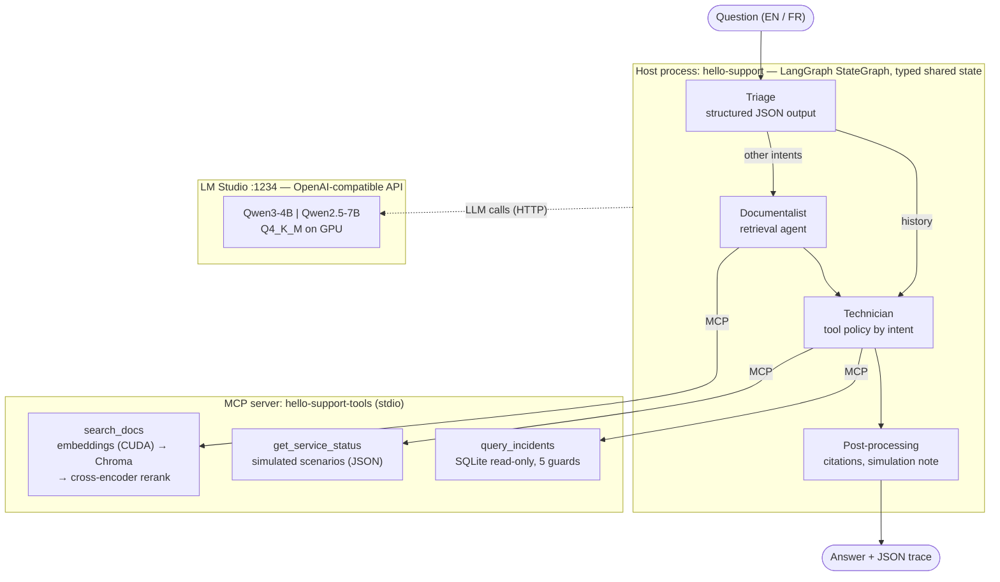

# HelloSupport

**A local-only, multi-agent troubleshooting assistant: LangGraph agents, RAG with reranking, MCP tools, guarded text-to-SQL, and a measured 4B-vs-7B model comparison. Runs on a single 8 GB GPU.**

[](CHANGELOG.md)
[](LICENSE)
[](https://www.python.org/)
[](#requirements)
[](#tests)

HelloSupport is a deliberately small "hello world" project. It exercises the building blocks
of modern LLM applications **end to end, for real, and with measurements**. Ask it a support
question in English or French ("my app can't connect to PostgreSQL, what should I check?") and
three steps cooperate:

1. a **triage** step classifies the request with structured JSON output;
2. a **documentalist** agent retrieves cited passages from a small knowledge base (vector search + cross-encoder reranking);
3. a **technician** agent observes a (simulated) service status or queries an incidents database in SQL, then writes a diagnosis that separates **observations** from **hypotheses**.

Everything runs locally: models served by LM Studio, embeddings on the GPU, no cloud API, no account, no cost.

---

## Table of contents

- [Architecture](#architecture) · [Features](#features) · [Measured results](#measured-results)
- [Requirements](#requirements) · [Installation](#installation) · [Usage](#usage) · [Demo](#demo) · [Tests](#tests)
- [Repository layout](#repository-layout) · [Design decisions](#design-decisions) · [Known limitations](#known-limitations) · [Roadmap](#roadmap)
- [License](#license) · [Author](#author)

## Architecture



- **Code decides the structure, the model decides the content.** The graph, the branch taken
  and the tools offered or *required* for each intent are enforced by code; the model writes
  the tool arguments (search queries, SQL) and the answer.
- **Hard boundary between agents and tools.** Tools live in a separate MCP server process; the
  agents only see their JSON schemas.

## Features

| Area | What is implemented |
|---|---|
| **Agents & orchestration** | LangGraph `StateGraph` with a conditional edge; shared bounded tool loop (call budgets, tool-free final call, de-duplication of repeated calls, verification of `tool_choice="required"` with one retry) |
| **Routing** | Structured-output triage (`malfunction`, `history`, `documentation`, `out_of_scope`, `vague`) driving a per-intent tool policy |
| **RAG** | Section-level chunking with citable ids, multilingual embeddings (`paraphrase-multilingual-MiniLM-L12-v2`) on CUDA, embedded **Chroma** index rebuilt only when content changes, **cross-encoder reranking** (top-5 → top-3) and an off-topic flag |
| **MCP** | Official Python SDK (v2), stdio transport, typed tool schemas (`enum` for services), explicit `ToolError`s; verified with MCP Inspector |
| **Data agent** | The model writes its own SQL against an incidents database behind **five independent guards**: single `SELECT`, forced `LIMIT`, read-only connection, SQLite authorizer, timeout |
| **Serving** | LM Studio, OpenAI-compatible API; 4B SLM and 7B model interchangeable by config; GPU offload, Q4_K_M quantization |
| **Reliability** | Deterministic post-processing: citations mapped back to exact ids, a "simulated status, no action executed" note written from tool results |
| **Observability** | Live event trace (agent, tool, arguments, result, guardrails) and a JSON export per run, with latency and token metrics |
| **Evaluation** | Six executable validation cases with automatic checks; benchmark across models with every answer archived; serving throughput measurement |

## Measured results

Six validation cases × 3 runs per model, warm (MCP session and model already loaded),
RTX 2070 Super 8 GB. Full method and raw answers: [`docs/BENCH.md`](docs/BENCH.md),
[`docs/bench/`](docs/bench/).

| Metric | Qwen3-4B-Instruct-2507 (SLM) | Qwen2.5-7B-Instruct (**default**) |
|---|---|---|
| Cases passed (all checks) | 15 / 18 | **18 / 18** |
| Checks passed | 105 / 108 | **108 / 108** |
| Latency per question, p50 / max | **6.0 s** / 11.5 s | 9.0 s / 15.7 s |
| LLM calls per question (mean) | 4.5 | 4.2 |
| Tokens in / out per question (mean) | 2,774 / 347 | 2,602 / 391 |
| Generation throughput, 1 request at a time | **107 tok/s** | 71 tok/s |
| Aggregate throughput, 4 concurrent requests | **173 tok/s** | 128 tok/s |
| Cost, local | $0 | $0 |
| Estimated cost if served by a hosted API, per 1,000 questions* | ~$0.62 (gpt-4o-mini) · ~$4.5 (Claude Haiku 4.5) | same |

\* Estimate only: measured tokens × indicative public list prices, no API call made. Check current pricing before quoting.

**Takeaways**
- The 4B model is ~1.5× faster, but it **invents source ids when a tool fails** (case C6, 3/3). The 7B is therefore the default ([ADR D-25](docs/DESIGN_DECISIONS.md)).
- Running 4 requests concurrently gives **1.6–1.8× more aggregate throughput** but **doubles per-request latency**.
- Cost is driven by **context** (~2,700 input tokens vs ~370 output), not by model size.
- Before the fixes of milestone J4, the same benchmark scored 10/18 (7B) and 7/18 (4B). Each fix came from an observed failure (see [Design decisions](#design-decisions)).

## Requirements

- **GPU**: NVIDIA, 8 GB VRAM is enough (the 7B in Q4_K_M takes ~4.7 GB). CPU works for the retrieval models, slowly.
- **[LM Studio](https://lmstudio.ai/)** with its `lms` CLI, to download and serve the LLMs.
- **Python 3.12** and **[uv](https://docs.astral.sh/uv/)**.
- Optional: **Node.js** to inspect the MCP server with MCP Inspector, and [mermaid-cli](https://github.com/mermaid-js/mermaid-cli) (`npm i -g @mermaid-js/mermaid-cli`) to rebuild the PDFs with their diagrams.
- ~10 GB of disk (two LLMs, PyTorch CUDA, retrieval models). No account, no API key.

## Installation

```bash
git clone https://github.com/StephaneHe/HelloSupport.git
cd HelloSupport
uv sync                                    # creates .venv; PyTorch CUDA comes from the PyTorch index (cu124)
```

Download the two models and start the local server:

```bash
lms get "qwen/qwen3-4b-2507@q4_k_m" -y                                                   # SLM, ~2.5 GB
lms get "https://huggingface.co/lmstudio-community/Qwen2.5-7B-Instruct-GGUF@Q4_K_M" -y   # 7B, ~4.7 GB
lms server start                                                                         # http://localhost:1234/v1
uv run hello-support smoke                 # checks chat + tool calling on both models
```

The embedding and reranking models (~0.5 GB) are pulled from the Hugging Face Hub on first use.
The incidents database `data/incidents.db` is generated on first use.

Configuration is optional (environment variables or a `.env` file, see [`.env.example`](.env.example)):

| Variable | Default | Meaning |
|---|---|---|
| `HS_LLM_BASE_URL` | `http://localhost:1234/v1` | OpenAI-compatible endpoint |
| `HS_MODEL_SLM` / `HS_MODEL_LARGE` | `qwen/qwen3-4b-2507` / `qwen2.5-7b-instruct` | model ids |
| `HS_MODEL_DEFAULT` | `large` | `slm`, `large`, or any model id |
| `HS_LLM_TIMEOUT_S` | `120` | per-call timeout |
| `HS_SCENARIO` | `stopped` | simulated service states (see below) |

## Usage

| Command | Purpose |
|---|---|
| `hello-support ask "<question>" [--scenario S] [--model slm\|large] [--quiet]` | full pipeline with a live trace; JSON trace saved to `runs/` |
| `hello-support search "<text>"` | retrieval only: vector candidates, cosine vs rerank scores, relevance flag |
| `hello-support bench [--models slm large] [--runs 3] [--cases C1 C4]` | the six validation cases → `docs/bench/*.md` + `runs/bench-*.json` |
| `hello-support throughput [--concurrency 1 4] [--requests 8]` | serving throughput and latency under concurrency |
| `hello-support smoke [slm\|large]` | model server check (chat + tool call) |
| `hello-support-mcp` | the MCP tool server alone (stdio) |
| `hello-support --version` | version |

**Scenarios** (simulated service states, nothing real is ever queried or changed):
`stopped` (PostgreSQL down), `running` (all up), `redis_down`, `tool_error` (the status tool fails).

Inspect the tool server with MCP Inspector:

```bash
npx @modelcontextprotocol/inspector --cli .venv/Scripts/hello-support-mcp.exe --method tools/list   # Windows
npx @modelcontextprotocol/inspector --cli .venv/bin/hello-support-mcp --method tools/list           # Linux/macOS
```

## Demo

The six validation cases, in about five minutes (the knowledge base and questions are in French; the code is in English):

```bash
uv run hello-support ask "Mon application ne parvient plus à se connecter à PostgreSQL. Que dois-je vérifier ?" --scenario stopped
uv run hello-support ask "Mon application ne parvient plus à se connecter à PostgreSQL. Que dois-je vérifier ?" --scenario running
uv run hello-support ask "Quelles vérifications faire pour un Redis inaccessible ?"
uv run hello-support ask "Combien d'incidents postgres ces 30 derniers jours, et le dernier est-il résolu ?"
uv run hello-support ask "Mon Kafka est lent, que faire ?"
uv run hello-support ask "Mon serveur Redis ne répond plus, que se passe-t-il ?" --scenario tool_error
```

| Case | Expected behaviour |
|---|---|
| C1 PostgreSQL stopped | calls `get_service_status`, reports `stopped` as **simulated**, cites the right section |
| C2 PostgreSQL running | same question, different conclusion (network, config, credentials); no invented failure |
| C3 Documentation question | sourced checklist, **no** status call |
| C4 Data question | writes two SQL queries (count + latest incident); the answer is derived from the returned rows |
| C5 Out of scope | says what it covers or asks a clarifying question; invents nothing |
| C6 Tool failure | controlled output stating that the check could not be done |

The first question takes ~30 s (the tool server loads the retrieval models), then 2–15 s per
question. An annotated transcript, including a guardrail rejecting an answer that skipped a
required tool call, is in [`docs/DEMO.md`](docs/DEMO.md).

## Tests

```bash
uv run pytest              # 40 offline tests, < 3 s: SQL guards, MCP contracts (real MCP client, in-memory server),
                           # agent loop and whole graph with a scripted LLM, post-processing, validation checks
uv run pytest -m models    # retrieval end to end on the GPU (downloads the HF models)
uv run hello-support bench # system-level evaluation with the real models (needs LM Studio, ~6 min)
```

Deterministic parts (guards, contracts, orchestration) are tested deterministically. Model
behaviour is **measured** by the benchmark, not asserted by unit tests. Every guardrail is
locked by a test that replays the failure it was built for.

## Repository layout

```
src/hello_support/
  cli.py            commands: smoke, search, ask, bench, throughput
  workflow.py       LangGraph graph, shared state, trace export
  agents.py         triage, prompts, per-intent tool policy, bounded tool loop
  llm.py            OpenAI-compatible client (latency, tokens)
  toolbox.py        MCP host: spawn server, list and call tools
  mcp_server.py     MCP server exposing the three tools
  retrieval.py      chunking, embeddings, Chroma, reranking
  sql_guard.py      read-only SQL execution with five guards
  data_store.py     simulated scenarios and incidents database seeding
  postprocess.py    citation normalisation, simulation note
  cases.py          the six validation cases and their checks
  benchmark.py      benchmark, throughput, cost estimate, reports
data/               knowledge base (3 sheets), scenarios.json
tests/              offline test suite
tools/md2pdf.py     Markdown → PDF export (headless Edge/Chrome; Mermaid → SVG via mermaid-cli)
docs/               specification, design decisions, benchmark, demo (French)
```

## Design decisions

All **28 design and development decisions** are documented ADR-style (need → options →
choice → rationale → trade-offs → skill demonstrated) in
[`docs/DESIGN_DECISIONS.md`](docs/DESIGN_DECISIONS.md) ([PDF](docs/DESIGN_DECISIONS.pdf)). The
specification is in [`docs/SPEC.md`](docs/SPEC.md) ([PDF](docs/SPEC.pdf)). These documents are in French.

Some lessons that shaped the design, each from a measured failure:
- **Small models do not decide by themselves to observe.** Left free, neither model called the status tool (0/3). A narrow structured-output router plus a code-enforced tool policy fixed it (D-17).
- **An API constraint is not a guarantee.** `tool_choice="required"` was not enforced by the local server and the model invented a status; the code now verifies it and retries (D-18).
- **Models hallucinate when they narrate the next step instead of doing it.** Asking for all SQL queries in one step removed an invented result (D-23).
- **What the code knows, the code says.** Simulation status, "no action executed" and valid source ids are written deterministically (D-22).
- **Prompt changes must be measured on held-out data.** Adding examples improved the 4B and degraded the 7B, until explicit rules were added (D-24).

## Known limitations

- **Toy scale**: 3 knowledge-base sheets, 14 incidents, 6 validation cases, one machine, temperature 0. No measurement here is statistically robust.
- **Simulated environment**: service statuses come from a JSON scenario file; the assistant never touches a real system.
- **Keyword-based checks** are coarse: a good answer can fail a check and a bad one can pass. Full answers are archived for human review.
- **The 4B model still invents source ids** when the status tool fails. This is flagged in the trace, not hidden.
- **The 7B sometimes presents documented symptoms as if they had been observed in logs**, which the automatic checks do not catch.
- **SQLite is not an enterprise database engine**, LM Studio is not a production serving stack, and a 12-vector Chroma index brings no performance benefit (it is there to exercise a real vector store).
- Not covered: distributed deployment, real load testing, multi-turn dialogue, authentication.

## Roadmap

- [ ] Hybrid routing: SLM for triage, 7B for the answer; measure with the same benchmark
- [ ] PostgreSQL + pgvector: incidents and vectors in the same engine
- [ ] LangGraph checkpointing: resumable runs and human-in-the-loop before sensitive actions
- [ ] Retrieval evaluation (recall@k, MRR before/after reranking) on a labelled question set
- [ ] MCP over streamable HTTP with the tool server as a separate service
- [ ] vLLM serving and a proper load test (continuous batching, ramp-up)
- [ ] OpenTelemetry tracing

## License

[MIT](LICENSE) © 2026 Stéphane Hercot.

## Author

**Stéphane Hercot** · [github.com/StephaneHe](https://github.com/StephaneHe)

Built as a hands-on learning project, with an AI coding assistant (Claude) used as a pair programmer.
