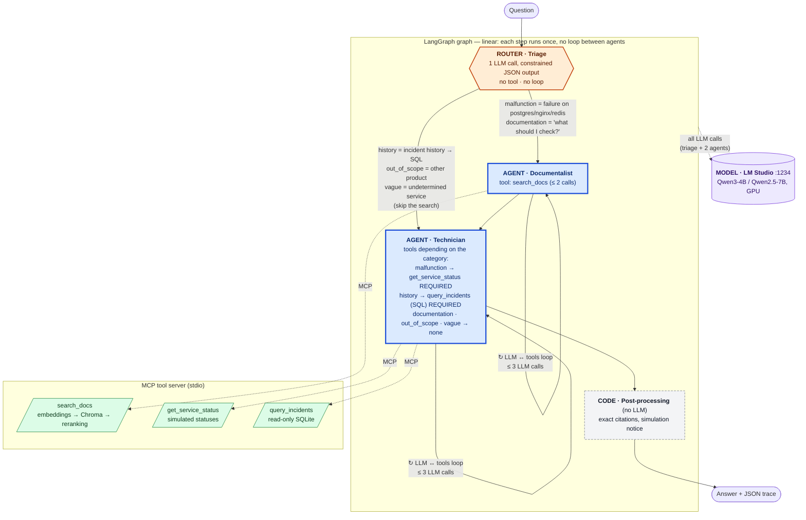
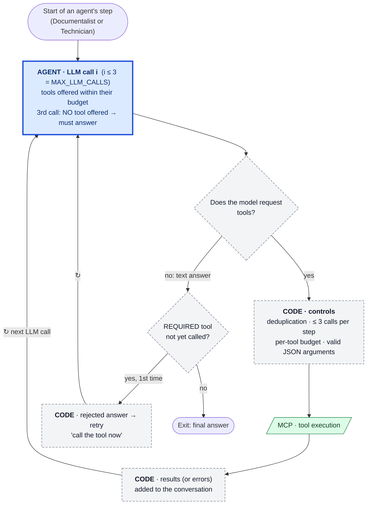

# HelloSupport — Design and development decisions

> **Final deliverable** required by the spec ([`SPEC.md`](SPEC.md) §3). This document explains
> **every** design and development choice in the project.
>
> - **During the project**: ADR-style log. Each milestone adds its dated `D-xx` entries
>   when the decision is made (with what was known at the time).
> - **At the end (J5)**: consolidation. Summary at the top, entries reviewed in light of the
>   measurements ([`BENCH.md`](BENCH.md)), PDF export ([`DESIGN_DECISIONS.pdf`](DESIGN_DECISIONS.pdf)).
>   **Status: consolidated on 2026-10-02 (v1.8.0), 28 decisions; D-29 to D-31 added on 2026-10-04.**
>
> Entry format: **Need → Options → Choice → Why → Trade-offs /
> limits → Skill demonstrated**. A revised decision is not deleted: it is marked
> `Superseded by D-yy`.

## Summary (consolidated on 2026-10-02, version 1.8.0)

**What was built.** A troubleshooting assistant in the terminal, 100% local. A question in
French or English goes through **triage** (LLM, constrained JSON output), a **documentalist**
(semantic search: embeddings → Chroma → reranking) and a **technician**. Depending on the
intent, the technician observes a **simulated** service status, queries a read-only **SQL
incident database** (text-to-SQL), or answers from the documentation. It cites its
sources and separates what was observed from what is hypothetical. Tools go through an **MCP server**,
orchestration through **LangGraph**, and the models (4B / 7B SLMs) are served by **LM Studio**
on GPU.

**Legend**

| Style in the diagram | Kind | What it is | Loop? |
|---|---|---|---|
| 🟦 blue, thick border | **AGENT** | An LLM that chooses which tools to call and with which arguments, reads the results, then answers (`run_agent`) | **yes**: LLM ↔ tools, ≤ 3 LLM calls |
| 🟧 orange hexagon | **ROUTER** | A single LLM call constrained by a JSON schema, which picks 1 of the 5 fixed categories. No tool, so not an agent | no |
| ⬜ gray, dashed border | **CODE** | Deterministic Python, no LLM | no |
| 🟩 green parallelogram | **MCP TOOL** | Exposed by the separate MCP server, called by the agents | — |
| 🟪 purple cylinder | **MODEL** | LLM served locally by LM Studio (OpenAI-compatible API) | — |

**Agent, router or code?** We call an *agent* an LLM that **decides its own** actions
(which tools, which arguments) and **loops** on their results until it can answer:
this is the case for the Documentalist and the Technician. *Triage* is not an agent but a
**router**. It makes a single LLM call, with no tool, whose output is constrained to
`{intent, service}`; it is the **code** that derives the path and the allowed tools from it (D-17).
*Post-processing* and the loop controls are deterministic **code** (D-18, D-22).

**Why no loop between agents?** The LangGraph graph is **linear**: triage →
documentalist → technician for `malfunction` and `documentation`, triage → technician directly for
`history`, `out_of_scope` and `vague` (D-30), and each node runs
once per question. The only loops are **inside** each agent, and they are
bounded (D-18, D-29):

- **At most 3 LLM calls** (`MAX_LLM_CALLS`). The last one is made without tools: the agent always ends up answering in text.
- **At most 3 tool calls per step**, after deduplication. Each tool also has its own budget (`search_docs` ≤ 2, `get_service_status` ≤ 1, `query_incidents` ≤ 2).
- **Required tool**: for `malfunction` and `history`, a tool call is required. If the model answers without making one, the code rejects that answer and retries once.
- **Exit**: the loop stops as soon as the model answers in text without requesting a tool.

**Mapping table component → decision → skill demonstrated**

| Component | Decision taken | Entries | Skill demonstrated |
|---|---|---|---|
| Model serving | LM Studio, OpenAI-compatible API, GPU, Q4_K_M | D-03, D-04 | Model-serving platforms ; GPU |
| Model choice | 7B by default, 4B SLM as a measured option | D-04, D-25 | LLMs and SLMs |
| LLM integration | `openai` SDK, wrapper that measures latency and tokens | D-05 | Model integration |
| Chunking + embeddings | `##` sections, multilingual MiniLM (Sentence Transformers) | D-06, D-07 | RAG, embeddings, Hugging Face, PyTorch |
| Vector database | Persistent embedded Chroma, fingerprint-based index | D-08 | Vector search, vector databases |
| Reranking | Cross-encoder top-5 → top-3, off-topic threshold | D-09 | Reranking |
| GPU | torch CUDA, warm-up | D-10 | GPU, latency |
| Tools | stdio MCP server, 3 typed tools, `ToolError` | D-11, D-12, D-15, D-20 | MCP, tool integration, tool calling |
| Data | SQLite incident database, simulated scenarios | D-14 | Database systems, SQL engines |
| SQL tool | Read-only text-to-SQL, 5 layers of protection | D-13, D-23 | Enterprise data agents |
| Orchestration | LangGraph: triage → documentalist → technician, `history` branch | D-16 | Orchestration, LangGraph |
| Tool decision | Router with structured output + policy enforced by the code | D-17, D-24 | AI agents, intelligent workflows |
| Reliability | Bounded loop, dedup, `required` checked, post-processing | D-18, D-22 | Reliability, production-grade |
| State and traces | `TypedDict` + reducers, timestamped JSON trace | D-19 | State management |
| Validation | 6 executable cases, benchmark, deterministic checks | D-21, D-28 | Prototype → production |
| Measurements | Warm/cold latency, throughput at concurrency 1/4, estimated cost | D-26 | Latency, throughput, cost |
| Code | Single-responsibility modules, MCP boundary | D-02, D-27 | Software architecture, Python |
| Framework | 100% local, €0 | D-01 | Cost |

**What the measurements taught us** (the resulting decisions are marked "Decision driven by a
measured failure"):
1. **Small models do not decide on their own to observe**: left free to choose, 0/3 for the 4B
   as for the 7B. A narrow router with constrained output, followed by a policy enforced by the
   code, gives 18/18 with the 7B (D-17).
2. **An API constraint is not a guarantee**: `tool_choice="required"` is not enforced by
   LM Studio, and the model invented a status. The code checks and retries (D-18). The final demo
   shows this guardrail in action.
3. **The model hallucinates when it "narrates" the next step** instead of doing it (C4). Having it
   emit all queries at once removes the problem (D-23).
4. **What the code knows, the code says**: simulated status, absence of action, list of valid
   sources (D-22).
5. **A prompt tweak must be measured on held-out data**: adding examples
   improved the SLM and degraded the 7B (D-24).
6. **Cost is driven by context, not by model size**: ~2,700 input tokens
   for ~370 output tokens (D-26).
7. **Automatic checks have bugs too**: two of them were wrong
   (D-21). Hence the archiving of full answers for review.

**Accepted limits**: 3 knowledge-base sheets, 14 incidents, 6 cases, one machine, temperature 0. No
measurement is statistically sound. SQLite is not an enterprise engine. LM Studio is not
a production server. The SLM still invents sources when a tool fails. Out of
scope: distributed systems, real scale, leadership (see [`SPEC.md`](SPEC.md) §7 and §10).

## Index

| # | Decision | Milestone | Status | Skill demonstrated |
|---|---|---|---|---|
| D-01 | 100% local, no paid cloud API | scoping | Accepted | Cost, model serving |
| D-02 | Python 3.12 + `uv` + installable package with CLI | J0 | Accepted | Python, software architecture |
| D-03 | LM Studio as the local serving platform | J0 | Accepted | Model-serving platforms |
| D-04 | Model choice: Qwen3-4B-Instruct-2507 (SLM) and Qwen2.5-7B-Instruct, Q4_K_M | J0 | Accepted, confirmed by D-25 | LLMs & SLMs, GPU |
| D-05 | LLM client: `openai` SDK via the OpenAI-compatible endpoint, thin in-house wrapper | J0 | Accepted | Model integration, latency/cost |
| D-06 | Chunking knowledge-base sheets by `##` section, `doc_id#section` citation | J1 | Accepted | RAG, semantic retrieval |
| D-07 | Embeddings: `paraphrase-multilingual-MiniLM-L12-v2` (Sentence Transformers) | J1 | Accepted | Embeddings, Hugging Face |
| D-08 | Vector store: persistent embedded Chroma, index rebuilt on fingerprint change | J1 | Accepted | Vector search, vector databases |
| D-09 | Reranking: cross-encoder `mmarco-mMiniLMv2-L12-H384-v1`, top-5 → top-2, off-topic threshold | J1 | Accepted | Reranking |
| D-10 | Embedding/reranker inference on GPU (torch CUDA), warm-up at load time | J1 | Accepted | GPU, PyTorch, latency |
| D-11 | MCP: separate tool server, stdio, `mcp` SDK v2, verified with MCP Inspector | J2 | Accepted | MCP, tool integration |
| D-12 | Typed tool contracts (`Literal` → `enum`), explicit `ToolError` | J2 | Accepted | Tool calling, reliability |
| D-13 | Read-only SQL tool: 5 layers (regex, LIMIT, `mode=ro`, authorizer, timeout) | J2 | Accepted | Enterprise data agents, SQL engines |
| D-14 | Generated SQLite incident database (relative dates), simulated JSON status scenarios | J2 | Accepted | Database integration, data analysis |
| D-15 | Loading the RAG in a thread when the MCP server starts | J2 | Accepted | Latency |
| D-16 | LangGraph orchestration: triage → documentalist → technician, `history` branch | J3 | Accepted | Orchestration, LangGraph |
| D-17 | Triage via structured output + tool policy enforced by the code | J3 | Accepted (Decision driven by a measured failure) | AI agents, intelligent workflows |
| D-18 | Bounded agent loop: budgets, last call without tools, dedup, `required` checked | J3 | Accepted | Reliability, workflow execution |
| D-19 | `TypedDict` shared state (reducers) + timestamped JSON trace with metrics | J3 | Accepted | State management, latency/cost |
| D-20 | Host MCP client with the `mcp` SDK directly (`ToolBox`), no LangChain adapter | J3 | Accepted | MCP, tool integration |
| D-21 | Validation: 6 executable cases, deterministic checks, `bench` with full answers | J4 | Accepted | Prototype → production, evaluation |
| D-22 | Deterministic post-processing: normalized citations, simulation notice | J4 | Accepted (Decision driven by a measured failure) | Reliability |
| D-23 | Data questions: all SQL queries in the same step | J4 | Accepted (Decision driven by a measured failure) | Enterprise data agents |
| D-24 | Triage: rules + examples, validated on held-out paraphrases (12/12) | J4 | Accepted (Decision driven by a measured failure) | Evaluate AI tech, SLMs |
| D-25 | **ADR**: default model = 7B (18/18); SLM faster but invents sources | J5 | Accepted | LLMs & SLMs, latency/cost, evaluate → plan |
| D-26 | Measurement method: warm/cold latency, throughput at concurrency 1/4, estimated cost | J5 | Accepted | Latency, throughput, cost |
| D-27 | Code structure: single-responsibility modules, MCP boundary | J5 | Accepted | Software architecture, Python |
| D-28 | Testing strategy: offline unit tests, model integration tests, system benchmark | J5 | Accepted | Production-grade, reliability |
| D-29 | Agents (LLM ↔ tools loop) vs router (triage) vs code; linear graph, no loop between agents | doc | Accepted | AI agents, orchestration |
| D-30 | `out_of_scope` and `vague` skip the documentalist (conditional edge), measured before/after | v1.10.0 | Accepted | Orchestration, latency/cost |
| D-31 | Web demo: Starlette + SSE on the real pipeline, one question at a time, warm MCP server | v1.11.0 | Accepted | Production-grade, observability |

---

## D-01 — 100% local, no paid cloud API

- **Date**: 2026-10-02 · **Milestone**: scoping (user decision)
- **Need**: practice LLMs, agents and RAG at no cost, without an account, and without any data
  leaving the machine.
- **Options**: (a) cloud API (OpenAI, Anthropic…), (b) local models, (c) mixed: local by
  default, cloud for comparison.
- **Choice**: (b) 100% local. Cloud cost is **estimated** in the benchmark (measured tokens ×
  public prices), without an account.
- **Why**: zero cost, no secrets to manage, reproducible offline. Above all, it forces us to
  deal with **serving** and **SLMs**, two targeted skills that a cloud API would have hidden.
- **Trade-offs**: local models (4–7B) are clearly weaker than state-of-the-art cloud models
  at tool calling and text-to-SQL. The qualitative results are therefore not
  representative of a deployment with a large model. This must be stated clearly.
- **Skill demonstrated**: Cost, model serving.

## D-02 — Python 3.12 + `uv` + installable package with CLI

- **Date**: 2026-10-02 · **Milestone**: J0
- **Need**: a project that installs and runs with one command, with a visible version
  (project convention).
- **Options**: standalone scripts + `requirements.txt`; Poetry; `uv` + `pyproject.toml`.
- **Choice**: `uv` + `pyproject.toml` (`src/` layout), CLI entry point `hello-support`, single version
  in `hello_support/__init__.py` (`__version__`), read dynamically by the build.
- **Why**: `uv` is already installed, very fast, and manages the lockfile and the venv. The
  `src/` layout prevents importing the code without installing it. A single source of truth for the version.
- **Trade-offs**: torch with CUDA must come from the PyTorch index (`cu124`), not from PyPI, hence
  an index configuration in `pyproject.toml`. Added at J1, when torch became necessary.
- **Skill demonstrated**: Python, software architecture.

## D-03 — LM Studio as the local serving platform

- **Date**: 2026-10-02 · **Milestone**: J0
- **Need**: serve a local LLM behind a standard API, using the GPU, and be able to switch
  models without touching the code.
- **Options**: (a) LM Studio (already installed, `lms` CLI, OpenAI-compatible server), (b) Ollama
  (not installed), (c) vLLM (high throughput, but Linux/WSL only and heavy on 8 GB),
  (d) `transformers` directly in-process.
- **Choice**: (a) LM Studio, server at `http://localhost:1234/v1`.
- **Why**: already in place, it handles downloading (`lms get`), GPU offload and
  GGUF quantization. It exposes the **OpenAI-compatible** API with *tool calling*. The application
  code therefore depends only on an **API contract**, not on a vendor. This is
  exactly the targeted "application / serving platform" separation.
- **Trade-offs**: a desktop tool, not a production server. No continuous batching and no serious
  throughput measurement: vLLM is noted under "going further". The server must be running
  (`lms server start`) before launching the program.
- **Skill demonstrated**: Model-serving platforms.

## D-04 — Model choice

- **Date**: 2026-10-02 · **Milestone**: J0 · **Revisable at J5** (measurements)
- **Need**: an **SLM** (3–4B) able to call tools, and a larger reference model (7B),
  both fitting in **8 GB of VRAM** (RTX 2070 Super).
- **SLM options**: Qwen2.5-3B-Instruct; **Qwen3-4B-Instruct-2507**; Llama-3.2-3B-Instruct;
  Phi-4-mini (3.8B); Gemma-3-4B (already present as `translategemma`, specialized in
  translation and without reliable native tool calling).
- **7B options**: `qwen2.5-coder-7b-instruct` (already present); **Qwen2.5-7B-Instruct**;
  Llama-3.1-8B-Instruct.
- **Choice**:
  - SLM = **`qwen/qwen3-4b-2507` in Q4_K_M** (~2.5 GB);
  - 7B = **`qwen2.5-7b-instruct` in Q4_K_M** (~4.7 GB).
- **Why**:
  - Qwen3-4B-Instruct-2507 is trained for tool calling. It is the "non-thinking" variant,
    so there is no reasoning block to filter out, answers are shorter and latency is
    lower. It is multilingual (questions in French) and was among the best public
    4B models at function calling when released.
  - For the 7B, picking the **same family** (Qwen) isolates the effect of **size** in the
    comparison. The *Instruct* version is preferred over *Coder* for dialogue and
    diagnosis. It is the model named in the user's request.
  - **Q4_K_M** is the standard quality/size trade-off. The 7B fits entirely in VRAM
    (~4.7 GB + KV cache), with headroom for the embedding and reranking models
    (~0.5 GB). Q8 (~8 GB) would not fit.
- **Trade-offs**: 4-bit quantization slightly degrades quality, especially on SQL. Two
  different families would have allowed a broader but less readable comparison. The
  two models are not loaded at the same time: LM Studio loads them on demand
  (JIT), so the first call includes a loading time. It is excluded from the measurements
  (warm-up).
- **Implementation (J0)**: `lms get "qwen/qwen3-4b-2507@q4_k_m" -y` (LM Studio staff pick).
  Qwen2.5-7B-Instruct is not a staff pick: downloaded from Hugging Face with
  `lms get "https://huggingface.co/lmstudio-community/Qwen2.5-7B-Instruct-GGUF@Q4_K_M" -y`.
- **Finding J0** (`hello-support smoke`, temperature 0, after warm-up): both models
  emit a valid `get_time({"timezone": "Europe/Brussels"})` call. SLM: hello 0.10 s,
  tool call 0.37 s (177 → 23 tokens). 7B: 0.10 s and 0.55 s (193 → 23 tokens). One-off
  measurements, not yet a benchmark (J5).
- **Skill demonstrated**: LLMs & SLMs, GPU.

## D-05 — LLM client: `openai` SDK + minimal in-house wrapper

- **Date**: 2026-10-02 · **Milestone**: J0
- **Need**: call the model with or without tools, and retrieve content, tool calls,
  tokens and latency.
- **Options**: (a) `openai` SDK pointed at `localhost:1234`, (b) `langchain-openai`
  (`ChatOpenAI`), (c) raw `httpx`.
- **Choice**: (a). An `llm.py` module of a few dozen lines returns a normalized
  result (`content`, `tool_calls`, `prompt_tokens`, `completion_tokens`, `latency_s`, `model`).
- **Why**: we see exactly what goes over the wire and comes back, which is educational and
  useful for measuring. The SDK is stable and typed. LangGraph does not require LangChain for the
  nodes: a node is a Python function. This limits the layers of abstraction.
- **Trade-offs**: we reimplement a bit of plumbing that `ChatOpenAI` + `bind_tools` provide.
  If J3 shows this is too costly, we will switch to `langchain-openai`, adding an
  entry that supersedes this one.
- **Skill demonstrated**: Model integration, latency/cost.

## D-06 — Chunking knowledge-base sheets by section

- **Date**: 2026-10-02 · **Milestone**: J1
- **Need**: retrieve a precise passage and **cite** it ("postgres_connection.md, section
  Service status"), as the expected answer requires.
- **Options**: (a) one whole document per vector, (b) fixed-size chunking (N tokens with
  overlap), (c) structure-based chunking (`##` headings).
- **Choice**: (c). One section = one chunk, identified as `doc_id#section`. The embedded text is
  prefixed with the sheet's title ("PostgreSQL: application cannot connect - Checks") so that
  the section keeps its context.
- **Why**: the sheets are short and already structured (Symptoms / Checks / Service status
  / Limits). Structural chunking gives stable, readable citations. Fixed-size chunking
  would cut in the middle of a checklist.
- **Trade-offs**: this assumes well-structured documents. On a real enterprise corpus
  (PDFs, wikis), hybrid chunking would be needed (structure + maximum size + overlap).
- **Skill demonstrated**: RAG, semantic retrieval.

## D-07 — Embedding model

- **Date**: 2026-10-02 · **Milestone**: J1
- **Need**: encode questions **in French or English** and English knowledge-base sheets
  into the same vector space, locally, on 8 GB of VRAM shared with the LLM.
- **Options**: `all-MiniLM-L6-v2` (English only);
  **`paraphrase-multilingual-MiniLM-L12-v2`** (50+ languages, 118M parameters, dim 384);
  `multilingual-e5-base` / `bge-m3` (better, but 2 to 5 times larger);
  `nomic-embed-text` served by LM Studio (already present).
- **Choice**: `paraphrase-multilingual-MiniLM-L12-v2` via Sentence Transformers (Hugging Face Hub,
  no account). Normalized vectors, cosine similarity.
- **Why**: it is the candidate proposed by the initial document. It is multilingual (the
  French query "connexion refusée" (connection refused) does retrieve the English sheet), lightweight (~0.5 GB of VRAM) and
  fast. Running it through Sentence Transformers rather than LM Studio means practicing
  **PyTorch / Hugging Face** directly.
- **Trade-offs**: quality is modest. Raw cosine separates poorly (0.46 to 0.52 for useful
  sections as well as off-topic nginx sections, see BENCH J1). This is precisely what
  justifies the reranker (D-09). An e5/bge model would be the natural improvement.
- **Skill demonstrated**: Embeddings, Hugging Face.

## D-08 — Vector store: embedded Chroma

- **Date**: 2026-10-02 · **Milestone**: J1
- **Need**: store and query vectors (top-k by similarity) without a server to
  administer.
- **Options**: (a) in-memory NumPy (initial proposal: brute-force cosine),
  (b) embedded **Chroma** (`PersistentClient`, HNSW index), (c) `sqlite-vec` (SQLite extension),
  (d) PostgreSQL + pgvector (WSL/Docker), (e) FAISS.
- **Choice**: (b) Chroma 1.5, `kb_sections` collection in **cosine** space, persisted in
  `.chroma/` (gitignored). Embeddings are computed by our code and passed to Chroma, which
  does not choose the model. The index is rebuilt only if the **fingerprint**
  (hash of the model + section contents) changes.
- **Why**: it is a real vector database (ANN index, metadata, persistence), installed
  with `pip`, without Docker. It covers the "vector database" skill at low cost. Supplying
  our own vectors keeps control of the model (D-07) and allows changing it without depending on
  Chroma's built-in embedding functions. With the fingerprint, we avoid recomputing at every
  startup while guaranteeing the index is never stale.
- **Trade-offs**: with 12 vectors, an ANN index brings **no** gain: NumPy brute force
  would be just as fast. The choice is educational, and this must be said. Chroma adds many
  dependencies. pgvector would be closer to an "AI + database" context: it is placed under
  "going further". Planned fallback: NumPy cosine if Chroma caused problems (it did not).
- **Skill demonstrated**: Vector search, vector databases.

## D-09 — Cross-encoder reranking

- **Date**: 2026-10-02 · **Milestone**: J1
- **Need**: improve the order of the passages returned to the agent (only 2, so the
  ranking matters), and detect that **no** passage matches.
- **Options**: (a) no reranking, (b) Sentence Transformers **cross-encoder**,
  (c) LLM reranker (ask the model to rank), (d) `bge-reranker-v2-m3` (more accurate, ~570M
  parameters).
- **Choice**: (b) `cross-encoder/mmarco-mMiniLMv2-L12-H384-v1` (multilingual, lightweight). Vector
  search top-5, rerank of the 5 (question, passage) pairs, top-2 kept. Each hit keeps its
  original vector rank to show the effect of reranking. Threshold `RELEVANCE_THRESHOLD = -5`
  on the cross-encoder score: below it, the passage is marked "off-topic".
- **Why**: this is the classic *retrieve & rerank* pattern. The bi-encoder is fast but
  coarse; the cross-encoder reads the question and the passage together and ranks better. Measured
  (BENCH J1): on "connexion refusée postgres", the *Symptoms* section moves from 5th to
  2nd place, ahead of two nginx sections. On a question outside the knowledge base (Kafka), all scores
  drop to ≤ -9.2 while useful passages are ≥ -4.3. This signal is far more
  discriminating than cosine (0.12–0.21). An LLM reranker would have cost one model call
  per query.
- **Trade-offs**: about 0.1–0.3 s more per query. The threshold is **empirical** and calibrated
  on 4 queries: it is a coarse filter, not a guarantee of precision. It should be
  calibrated on a question set (see "going further": RAG evaluation).
- **Revision (J3)**: `search_docs` returns the **top-3** (instead of top-2). With 2 passages,
  the reranker put "Limits" first and the "Service status" section disappeared from the context.
- **Skill demonstrated**: Reranking.

## D-10 — GPU inference and warm-up

- **Date**: 2026-10-02 · **Milestone**: J1
- **Need**: use the available GPU and measure a representative query latency.
- **Options**: CPU only; GPU via torch CUDA; embeddings served by LM Studio.
- **Choice**: torch **2.6.0+cu124** pulled from the PyTorch index (configured in
  `pyproject.toml`, since PyPI only provides the CPU build on Windows). Device chosen
  automatically (`cuda`, otherwise `cpu`) and displayed. A **warm-up** query is run when
  the `Retriever` loads.
- **Why**: the GPU is there (RTX 2070 Super). Both small models fit on it (~1 GB) alongside
  the LLM served by LM Studio. Measured: the first query costs ~2.9 s (CUDA kernel
  initialization) versus ~0.5 s afterwards. Warm-up removes this one-time cost from the per-question
  latency.
- **Trade-offs**: heavy torch CUDA download (~2.5 GB), slow `sentence_transformers` import
  (~15 s cold on Windows), total load ~27 s. Acceptable because it is paid once
  per tool-server session (J2). On CPU, the project works too, just more
  slowly.
- **Skill demonstrated**: GPU, PyTorch, latency.

## D-11 — MCP: separate tool server, stdio transport, Python SDK v2

- **Date**: 2026-10-02 · **Milestone**: J2
- **Need**: expose the tools to the agents through a **standard protocol**, so they can be
  tested on their own, reused by another client (Inspector, IDE, another agent), and
  moved without touching the agents' code.
- **Options**: (a) Python functions called directly by the agents, (b) in-house REST API,
  (c) **MCP** over stdio (local subprocess), (d) MCP over *streamable HTTP* (network server).
- **Choice**: (c) with the official `mcp` SDK **2.2** (`MCPServer`, the new name of FastMCP in
  v2). Entry point `hello-support-mcp`. The host will launch the server as a subprocess
  (J3). Tests use the same server **in memory** via `mcp.Client(server)`.
- **Why**: MCP is one of the targeted skills (integrating enterprise tools
  for agents). stdio needs no port and no auth and is sufficient locally. The
  input JSON schema is generated from Python annotations. Verified with **MCP
  Inspector** (`npx @modelcontextprotocol/inspector --cli hello-support-mcp --method tools/list`
  then `tools/call` for each of the 3 tools).
- **Trade-offs**: one subprocess per session and one more protocol to debug. SDK v2
  is recent: online examples (FastMCP, camelCase `inputSchema`) no longer apply
  as is. The Inspector in CLI mode handles `-m module` arguments poorly, hence the dedicated entry
  point. The HTTP transport (a first "distributed" step) is left to "going further".
- **Skill demonstrated**: MCP, tool integration.

## D-12 — Tool contracts: strict types, explicit errors

- **Date**: 2026-10-02 · **Milestone**: J2
- **Need**: the model **proposes** calls that can be wrong (unknown service, invalid
  SQL, empty query). These errors must be rejected cleanly and remain usable
  by the model.
- **Options**: validation in each agent; validation on the tool-server side; both.
- **Choice**: **server-side** validation, through types: `service_name: Literal["postgres",
  "nginx", "redis"]` produces an `enum` in the MCP schema, which the model sees and Pydantic
  checks. Business errors raise `ToolError`, returned to the client as `is_error=true` with a
  clear message (e.g. "unknown service", "SQL rejected: only SELECT queries are allowed").
  Tool descriptions (docstrings) explain the output format and usage, for example
  `relevant=false`.
- **Why**: a single place is authoritative, whatever the client. The error returned to the
  model lets it **correct itself once** (J3) instead of crashing. The `enum` schema
  reduces errors at the source, which matters for an SLM.
- **Trade-offs**: Pydantic validation messages are verbose for a small model. The
  server does not know about **call limits**: that is the orchestrator's job (J3).
- **Skill demonstrated**: Tool calling, reliability.

## D-13 — Read-only SQL tool: defense in depth

- **Date**: 2026-10-02 · **Milestone**: J2
- **Need**: let the agent **write SQL** (text-to-SQL, like an "enterprise data
  agent") without it being able to modify or exfiltrate anything, or lock the database.
- **Options**: (a) parameterized tool (`get_incidents(service, days)`), no free-form SQL;
  (b) free-form SQL with a regex filter; (c) free-form SQL with **several independent layers**.
- **Choice**: (c), in `sql_guard.py`:
  1. static check: a single statement, starting with `SELECT`/`WITH`, with no write
     or admin keyword (`DELETE`, `PRAGMA`, `ATTACH`, `load_extension`…);
  2. wrapped query: `SELECT * FROM (<sql>) LIMIT 51`, then truncated to 50 rows with a
     `truncated` flag;
  3. SQLite connection in **`mode=ro`**: the engine refuses any write;
  4. SQLite **authorizer**: only `SELECT`/`READ`/`FUNCTION`/`RECURSIVE` actions are allowed;
  5. **progress handler**: the query is aborted after 2 s.

  The table schema and a date-filter example are in the tool description.
- **Why**: (a) would be safer, but does not practice text-to-SQL, which is the core of a
  data agent. A regex alone can be bypassed: each layer covers the blind spots of the others,
  and layers 3–4 are guaranteed by the engine, not by our code. SQL errors
  (unknown column…) are returned as is so the model can fix its query.
  Tested: `DELETE`, `SELECT 1; DROP…`, `PRAGMA`, `ATTACH`, `load_extension` are rejected; the
  row limit is enforced (`tests/test_sql_guard.py`).
- **Trade-offs**: the regex can reject a legitimate query containing one of these words in a
  string (e.g. `summary LIKE '%update%'`). Acceptable here, to be fixed with a real SQL
  parser (`sqlglot`) if needed. Nothing prevents a **wrong but valid** query: its
  correctness is evaluated at J4 (case C4). On a real enterprise database, a dedicated read-only
  SQL role and restricted views would also be needed.
- **Skill demonstrated**: Enterprise data agents, SQL engines.

## D-14 — Data: generated SQLite incident database, simulated JSON scenarios

- **Date**: 2026-10-02 · **Milestone**: J2
- **Need**: realistic structured data for analysis questions ("combien
  d'incidents postgres ces 30 derniers jours ?" (how many postgres incidents in the last 30 days?)) and **simulated**,
  controllable service states for cases C1/C2/C6.
- **Data options**: real PostgreSQL (WSL/Docker), DuckDB, **SQLite** (stdlib).
  **Status options**: query real services; a JSON scenarios file.
- **Choice**: `incidents` table (14 rows: service, date, severity, summary, resolved) generated by
  `seed_incidents()` with dates **relative to today**. The `data/incidents.db` file
  is gitignored and created on first use. Statuses come from `scenarios.json`
  (`stopped`, `running`, `redis_down`, `tool_error`), selected by `HS_SCENARIO` (soon
  `--scenario`). Each response carries `simulated: true` and the scenario name.
- **Why**: SQLite is in the stdlib, serverless, and a real SQL engine (dates,
  aggregates, recursive CTEs, authorizer). With relative dates, "the last 30 days" always
  has the same expected answer, which makes case C4 verifiable. Scenarios make
  behavior **deterministic** and allow simulating a tool failure (C6). Since nothing
  real is touched, no dangerous action is possible.
- **Trade-offs**: SQLite is not an enterprise engine: no roles, no write
  concurrency, no distributed plan. 14 rows do not test performance. PostgreSQL +
  pgvector is under "going further".
- **Skill demonstrated**: Database integration, data analysis.

## D-15 — Loading the RAG in the background in the MCP server

- **Date**: 2026-10-02 · **Milestone**: J2
- **Need**: the `Retriever` takes ~30 s to load. If it is loaded before starting the server,
  the MCP handshake exceeds the client timeout (15 s by default for the Inspector).
- **Options**: load at startup (blocking); lazy load on first call;
  **load in a thread at startup**, with the first `search_docs` waiting for it to finish.
- **Choice**: the thread. The handshake is immediate, the `get_service_status` and
  `query_incidents` tools are available right away, and `search_docs` waits at most 180 s.
  Loading errors are returned as `ToolError`.
- **Why**: in general the documentalist calls `search_docs` first, after one LLM
  call: loading happens during that time instead of adding to latency.
- **Trade-offs**: a bit of concurrency to manage (an `Event`). Measured via the Inspector: a cold
  `search_docs` call takes ~54 s end to end (`npx` startup + process + loading).
  This is still paid once per session.
- **Skill demonstrated**: Latency.

## D-16 — Orchestration: LangGraph `StateGraph`, nodes = Python functions

- **Date**: 2026-10-02 · **Milestone**: J3
- **Need**: chain steps (triage → search → diagnosis), with conditional branches, shared state
  and guaranteed termination.
- **Options**: (a) a hand-written Python loop, (b) **LangGraph** (state graph),
  (c) a single ReAct agent (`create_react_agent`) that decides everything, (d) CrewAI / AutoGen
  (conversational multi-agent).
- **Choice**: (b) LangGraph 1.2, graph `START → triage → documentalist → technician → END`, with
  a **conditional edge**: history questions (`history`) go straight to the technician, with no
  document search. Another one exits to `END` if the documentalist fails. Nodes are plain
  `async` functions: LangChain is not needed (D-05). `recursion_limit=10` serves as a safety net.
- **Why**: it is the target agent framework. It clearly separates the **code-defined workflow**
  (structure, branches, tool policy) from the **model's decisions** (tool arguments, SQL,
  writing), which the initial document already recommended. A single ReAct agent leaves
  everything to the model, which proved unreliable with 4–7B models (D-17).
- **Trade-offs**: for 3 linear nodes, LangGraph is almost oversized. Its value shows up with
  branches, checkpoints and human-in-the-loop ("going further"). Loading LangGraph adds
  dependencies.
- **Skill demonstrated**: Orchestration, LangGraph.

- **Revision (v1.10.0, D-30)**: the conditional edge also sends `out_of_scope` and `vague`
  straight to the technician; only `malfunction` and `documentation` go through the documentalist.

## D-17 — Triage via structured output + tool policy enforced by code

- **Date**: 2026-10-02 · **Milestone**: J3 · **Decision driven by a measured failure**
- **Need**: the technician must **observe** (call `get_service_status`) when an outage is
  reported, and must not do so for a documentation question.
- **Finding**: the first version left this choice to the model (`tool_choice="auto"`, rules in
  the prompt). Measured on the technician's actual input: **0/3** calls for Qwen2.5-7B **and**
  for Qwen3-4B, whatever the layout (reminder at the end of the message, no brief, question
  last). Both models answered conditionally ("si le service est arrêté…" — "if the service is
  stopped…") since the sheet describes both cases. The 7B went as far as telling the user to call
  `get_service_status` themselves.
- **Options**: (a) more prompt engineering; (b) systematic tool call;
  (c) **router**: a short LLM call that classifies the intent into constrained JSON, followed by
  a tool policy decided by the code; (d) a bigger model.
- **Choice**: (c). `triage` node: strict JSON Schema `response_format` →
  `{intent: malfunction|history|documentation|out_of_scope|vague, service}`. The code applies
  `TECHNICIAN_POLICY`:
  - `malfunction` → only `get_service_status` is offered, and one call is **required**;
  - `history` → `query_incidents` is **required**, the model writes the SQL;
  - `documentation` → no tool;
  - `out_of_scope` / `vague` → no tool and an explicit instruction (state the limit / ask
    a question).

  An outage with no known service is reclassified as `vague`.
- **Why**: measured on 6 typical questions, triage costs ~0.3 s (after loading) and correctly
  classifies the key cases. Qwen2.5-7B: 4/6, with both "errors" (Kafka → `vague`,
  "ça marche pas" ("it doesn't work") → outage with no service) still leading to the right behavior.
  Qwen3-4B: 4/6, but it confused "outage + what should I check?" with `documentation`, fixed
  by a clarification in the prompt. The model still decides, but **on a narrow, constrained
  task**, and the code guarantees the consequences. This is a common *router + policy* pattern
  in production.
- **Trade-offs**: one more LLM call per request. The classification can be wrong, and the error
  propagates (no going back). The 5 intents are hard-coded.
- **Skill demonstrated**: AI agents, intelligent workflows.

## D-18 — Bounded agent loop and measured guardrails

- **Date**: 2026-10-02 · **Milestone**: J3
- **Need**: no infinite loop, a bounded cost, tool errors that do not crash the program, and no
  invented observation.
- **Choice** (`agents.run_agent`, shared by both agents):
  - at most 3 LLM calls per agent. The **last call is made without tools**, which forces
    a text answer;
  - per-tool budgets: `search_docs` ≤ 2, `get_service_status` ≤ 1, `query_incidents` ≤ 2.
    Exceeding one returns an error message to the model, not an exception;
  - **deduplication** of identical calls and **at most 3 calls per step**. Measured reason:
    the 7B, forced to call a failing tool (`tool_error` scenario), emitted
    **46 identical calls** in 1,024 tokens (18 s);
  - `max_tokens` = 300 for a step with tools, 700 for a final answer;
  - **`tool_choice="required"` checked by the code**: LM Studio does not strictly enforce it.
    Once, the 7B answered in text and **invented** a "en cours d'exécution" ("running") status
    without calling the tool. An answer without the required observation is therefore rejected
    and the model retried once;
  - invalid JSON arguments and unauthorized tools: refused with a message;
  - HTTP timeout for LLM calls (120 s) and tool calls (240 s).
- **Why**: the model is not trusted to stop or to respect an API constraint. Each guardrail
  above comes from a behavior **observed** during J3.
- **Trade-offs**: the limits are scope choices, not optima. A rejected answer costs one LLM
  call. Reasoning quality is not guaranteed: in case C4, the 7B computed `MAX(resolved)` and
  still concluded "le dernier n'est pas résolu" ("the last one is not resolved"). This is correct
  by chance, but not deduced from the result (J4 evaluation).
- **Skill demonstrated**: Reliability, workflow execution.

## D-19 — Explicit shared state and JSON trace

- **Date**: 2026-10-02 · **Milestone**: J3
- **Need**: know at any time what each step saw and decided, replay and measure a
  run.
- **Choice**: `State` (`TypedDict`): `question` (never modified), `model`, `scenario`, `route`,
  `evidence` (relevant passages only, deduplicated), `brief`, `observations`,
  `counters`, `status`, `errors` and `trace` (the last two with an `operator.add` reducer: nodes
  **append**, they do not overwrite), `answer`. Each event (`llm`, `tool_call`,
  `tool_result`, `limit`, `error`) is timestamped, displayed live and written to
  `runs/<timestamp>.json` with the metrics (total duration, LLM calls and time, tokens
  in/out, tool time). The `runs/` folder is gitignored.
- **Why**: updates go explicitly through node return values, which is LangGraph's model.
  Displaying the **observable decisions** (tool, arguments, result) rather than an internal
  "reasoning" follows the initial document's recommendation. The trace was used to diagnose
  each of the problems in D-17/D-18.
- **Trade-offs**: the state lives in memory for the duration of a request. There is no recovery
  after a crash (LangGraph checkpointer = "going further"). The trace contains the full texts,
  which could be a problem with sensitive data in a real-world context.
- **Skill demonstrated**: State management, latency/cost.

## D-20 — Host-side MCP client: the `mcp` SDK directly rather than `langchain-mcp-adapters`

- **Date**: 2026-10-02 · **Milestone**: J3
- **Need**: start the tool server, list its tools in the format the LLM expects, and call
  them.
- **Options**: `langchain-mcp-adapters` (converts to LangChain tools); the SDK's **`mcp.Client`**.
- **Choice**: `ToolBox` (≈ 80 lines): `mcp.Client(StdioServerParameters(...))` starts
  `python -m hello_support.mcp_server` with `HS_SCENARIO`, converts `list_tools()` to the OpenAI
  `tools` format (the MCP JSON schema is reused as is) and decodes the results. A list is
  returned as `structured_content = {"result": [...]}` or as one text block per item.
  The same `ToolBox` accepts an **in-memory** server for tests.
- **Why**: without LangChain in the loop (D-05), the adapter adds nothing. The direct SDK
  shows what an MCP host actually does: *spawn*, *handshake*, *list*, *call*.
- **Trade-offs**: result decoding has to be handled by hand. A first bug (list returned in
  several blocks) was found on the first real run.
- **Skill demonstrated**: MCP, tool integration.

## D-21 — Validation: 6 executable cases with automatic checks

- **Date**: 2026-10-02 · **Milestone**: J4
- **Need**: know whether the system "works" on the spec's cases, re-check it after every
  prompt or model change, and compare two models on the same basis.
- **Options**: (a) read the answers by hand; (b) **LLM-as-a-judge** (a model grades the
  answers); (c) **deterministic checks** on the final state (route, tools called, results,
  keywords and citations in the answer); (d) an evaluation framework (Ragas,
  DeepEval…).
- **Choice**: (c), in `cases.py`: 6 cases, each with 5 to 7 named checks (e.g. "observed
  status = stopped", "no status call", "last incident read (ORDER BY…)",
  "exact citations", "in French"). The `hello-support bench` command: N runs × models,
  a Markdown report (`docs/bench/`) with **all the answers**, and raw JSON (`runs/`).
  Unit tests (`pytest`) check the code with a **scripted** LLM; the benchmark checks the
  system with the **real** models.
- **Why**: it is reproducible, free and explainable. A failing check points to a specific
  defect. The benchmark immediately revealed two defects that were invisible in demos (D-22,
  D-23). A local LLM judge (4–7B) would be less reliable than the answers it grades, and a
  framework would add dependencies for 6 cases.
- **Trade-offs**: keyword checks are **coarse**. A good answer can fail (unexpected wording),
  a bad one can pass. They do not measure the quality of the advice. Hence full answers are
  kept for human review. 6 cases do not make a statistical evaluation.
- **Skill demonstrated**: Prototype → production, evaluation.

## D-22 — Deterministic post-processing: normalized citations + simulation notice

- **Date**: 2026-10-02 · **Milestone**: J4 · **Decision driven by a measured failure**
- **Finding** (J4 benchmark, 7B): despite the "copy the labels exactly" instruction, the model
  writes `postgres_connection.md#Service_status` (underscore). It also omits the "simulated"
  notice required by C1.
- **Options**: strengthen the prompt even more; change the identifier format;
  **post-process the answer in code**.
- **Choice**: `postprocess.py`:
  - `normalize_citations` maps each `doc.md#Section` citation back to the knowledge base's
    canonical identifier (case- and `_`-insensitive) and flags unknown citations in the trace,
    without removing them;
  - `simulation_footer` appends at the end of the answer a line built **from the tool
    results**: "Statut observé en simulation (scénario « stopped ») : postgres = stopped.
    Aucune action corrective n'a été exécutée." ("Status observed in simulation ("stopped"
    scenario): postgres = stopped. No corrective action was executed.") The sentence is in French
    if the question is.
- **Why**: it is the same principle as D-17. What the code **knows** (the status comes from a
  simulation, nothing was executed, the list of existing sections), the code says, instead of
  hoping the model will say it. This makes the answer verifiable and consistent with the
  expected answer in the initial document.
- **Trade-offs**: C1's "says simulated" check is now satisfied **by construction**. It tests the
  system, not the model, and that must be stated. Language detection is a heuristic (French
  function words).
- **Skill demonstrated**: Reliability.

## D-23 — Data questions: all queries in the same step

- **Date**: 2026-10-02 · **Milestone**: J4 · **Decision driven by a measured failure**
- **Finding**: in case C4 ("combien… et le dernier est-il résolu ?" — "how many… and is the
  last one resolved?"), the 7B ran a `COUNT(*)`, then **wrote** "Now let's check the status of
  the last incident" and **invented** the answer instead of calling the tool a 2nd time. An
  earlier version drew its conclusion from a `MAX(resolved)` that cannot answer the question.
- **Choice**: the `history` instruction asks for **all queries in the same step** (parallel tool
  calls), one query per part of the question, with the example
  `ORDER BY started_at DESC LIMIT 1`. It also forbids describing a query that was not run. The
  C4 check verifies that a query reading the last incident was actually **executed**.
- **Why**: the model hallucinates when it "narrates" the next step instead of doing it.
  Having it plan the queries all at once removes that intermediate step. Measured result:
  2 queries issued in parallel, conclusion "3 incidents, the last one unresolved" **deduced from
  the returned rows**.
- **Trade-offs**: this relies on the model's ability to make parallel calls. A question
  requiring a query that depends on the result of another (true multi-step analysis)
  would not be covered: it would then need an explicit plan or a larger step budget.
- **Skill demonstrated**: Enterprise data agents.

## D-24 — Triage: explicit rules + examples, measured on held-out paraphrases

- **Date**: 2026-10-02 · **Milestone**: J4 · **Decision driven by a measured failure**
- **Finding** (J4 benchmark #1): the SLM classified "Mon application ne parvient plus à se
  connecter à PostgreSQL. Que dois-je vérifier ?" ("My application can no longer connect to
  PostgreSQL. What should I check?") as `documentation` **3 times out of 3**. It therefore never
  observed the status, hence C1/C2 = 0/3. Adding examples alone (*few-shot*) fixed the
  SLM on the paraphrases, but **degraded the 7B**: "Mon Kafka est lent" ("My Kafka is slow") →
  `malfunction/nginx`, "My MongoDB replica set is down" → `malfunction/redis`. This is dangerous,
  since it would observe a service unrelated to the question.
- **Choice**: triage prompt = definitions + **2 explicit rules** (another product mentioned →
  `out_of_scope`, never mapped to a known service; an outage happening now → `malfunction`,
  even if the sentence ends with "what should I check?") + **6 examples** worded differently
  from the benchmark questions.
- **Measurements**: 12 questions = the 6 benchmark ones + **6 held-out paraphrases** (never seen
  during tuning): **12/12 for both models**, versus 11/12 (SLM) and 10/12 (7B) with
  examples alone.
- **Why**: an example without a rule can be over-generalized (the 7B learned "unknown
  product ⇒ pick a known service"). The rule sets the boundary, the examples show the
  format. Testing on unseen paraphrases avoids tuning the prompt for the benchmark questions
  only (overfitting).
- **Trade-offs**: 12 questions is still a small sample. Every prompt change must be
  re-measured, since a gain on one model can be a loss on the other (as observed here).
- **Skill demonstrated**: Evaluate AI tech, SLMs.

## D-25 — ADR: default model = Qwen2.5-7B-Instruct; the SLM remains a measured option

- **Date**: 2026-10-02 · **Milestone**: J5 · **Status**: Accepted. It confirms D-04 with measurements.
- **Context**: two models served locally by LM Studio, same prompts, same code, 6 cases ×
  3 runs (BENCH J4), plus a serving throughput measurement (BENCH J5).
- **Options**: (a) SLM Qwen3-4B-Instruct-2507 by default; (b) **7B by default**;
  (c) hybrid: SLM for triage (narrow task, constrained output), 7B for the answer.
- **Data**:

  | Criterion | SLM 4B | 7B |
  |---|---|---|
  | Cases passed (6 × 3) | 15/18 | **18/18** |
  | Serious defect observed | invents source identifiers when a tool fails (C6, 3/3) | sometimes presents the sheet's symptoms as "observed logs" (not detected by the checks) |
  | Triage (12 questions incl. 6 held out) | 12/12 | 12/12 |
  | p50 latency per request (warm) | **6.0 s** | 9.0 s |
  | Generation throughput, 1 request at a time | **107 tokens/s** | 71 tokens/s |
  | Aggregate throughput, 4 concurrent requests | **173 tokens/s** | 128 tokens/s |
  | VRAM (Q4_K_M) | ~2.5 GB | ~4.7 GB |
  | Estimated cost if API (gpt-4o-mini / Haiku 4.5), /1000 req. | ~$0.62 / ~$4.5 | ~$0.62 / ~$4.6 |

- **Decision**: (b) 7B by default (`HS_MODEL_DEFAULT=large`). The SLM remains selectable
  (`--model slm`) and is the best candidate for triage if latency becomes the priority.
- **Why**: for a support assistant, an **invented source** is more serious than an answer that
  is 3 s slower. The SLM is faster on every metric (~1.5×) and just as good at triage. It only
  loses on robustness when a tool fails, but that is the case that matters in production. The
  **local** cost is zero in both cases, and the estimated cloud cost is identical, because tokens
  are mostly input (RAG context) and the volumes are similar. Model size therefore does not
  change the bill: context length is what matters.
- **Consequences / next steps**: (c) is the next logical experiment: triage by the SLM, answer
  by the 7B. It would need to be measured with the same benchmark before adoption. With a larger
  (cloud) model, most guardrails would remain useful: they protect against classes of errors,
  not against a specific model.
- **Skill demonstrated**: LLMs & SLMs, latency/cost, evaluate → plan.

## D-26 — Measurement method: latency, throughput, cost

- **Date**: 2026-10-02 · **Milestone**: J5
- **Need**: discuss latency, throughput and cost with **measured figures** and a method that
  can be explained.
- **Choice**:
  - **latency**: per request and warm (MCP session and model already loaded), p50/max over
    18 requests per model. **Cold start** (20–26 s: torch, embedding models, Chroma, LM Studio
    loading) is measured separately, because it is paid once per session;
  - **breakdown** via the trace: LLM time, tool time, number of calls;
  - **throughput**: (1) generation throughput in the benchmark (tokens produced / LLM time,
    prompt included); (2) `hello-support throughput`: the same request repeated 8 times at
    concurrency 1 then 4, to measure aggregate throughput (tokens/s, requests/min) and individual
    latency;
  - **cost**: local = €0 (electricity not counted). Cloud = **estimate**: measured average
    tokens in/out × indicative public prices, with no account and no call, and prices to be
    re-checked before quoting them.
- **Key results**:
  - ~2,600–2,800 input tokens for ~350–390 output tokens per request: the **context** (prompts,
    RAG passages, tool results) dominates the cost, so that is where to optimize;
  - concurrency 4 multiplies aggregate throughput by 1.6–1.8, but doubles individual latency:
    this is the classic throughput / latency trade-off of serving;
  - loading the RAG (~14–27 s) is the largest item in cold latency.
- **Trade-offs**: a single machine, few runs, temperature 0: no real statistical
  distribution. Throughput is measured on LM Studio, not on a production server
  (vLLM, continuous batching: "going further"). Prices change.
- **Skill demonstrated**: Latency, throughput, cost.

## D-27 — Code structure

- **Date**: 2026-10-02 · **Milestone**: J5 (review)
- **Choice**: a `src/hello_support/` package of single-responsibility modules:

  | Module | Role | Depends on |
  |---|---|---|
  | `cli.py` | `smoke`, `search`, `ask`, `bench`, `throughput` commands, display | everything else (lazy imports) |
  | `workflow.py` | LangGraph graph, state, trace export | `agents`, `toolbox`, `postprocess` |
  | `agents.py` | triage, prompts, tool policy, bounded loop | `llm`, `toolbox` |
  | `llm.py` | OpenAI-compatible client, measurements | `openai` |
  | `toolbox.py` | MCP host (spawn, list, call) | `mcp` |
  | `mcp_server.py` | MCP server, 3 tools | `retrieval`, `data_store`, `sql_guard` |
  | `retrieval.py` | chunking, embeddings, Chroma, reranking | torch, sentence-transformers, chromadb |
  | `sql_guard.py` / `data_store.py` | read-only SQL; simulated data and SQLite | stdlib |
  | `postprocess.py` | citations, simulation notice | `retrieval` (list of sections) |
  | `cases.py` / `benchmark.py` | validation cases, measurements, reports | `workflow` |
  | `config.py` | environment variables | `python-dotenv` |

- **Why**: the **MCP** boundary physically separates the agents (host process) from the tools
  and data (subprocess): the agents do not know how a tool is built. Heavy dependencies
  (torch, Chroma) are loaded only by the tool server and the `search` command. Tests and the
  CLI stay fast. Code, prompts and comments are in English, the documentation in French.
- **Trade-offs**: ~1,600 lines of code (+ ~400 of tests) for a "hello world", a good part of which is guardrails and
  measurement. Prompts are Python constants, not separately versioned files.
- **Skill demonstrated**: Software architecture, Python.

## D-28 — Testing strategy

- **Date**: 2026-10-02 · **Milestone**: J5 (review)
- **Choice**: three levels.
  1. **Unit, offline, < 3 s** (`uv run pytest`, 40 tests): sheet chunking, SQL guardrails
     (rejection of `DELETE` / `DROP` / `PRAGMA` / `ATTACH` / `load_extension`, row limit),
     MCP contracts via a **real MCP client connected in memory**, agent loop and full graph
     with a **scripted LLM** (budgets, deduplication, last call without tools, retry when a
     required tool is ignored, tool error), post-processing, case checks.
  2. **Integration with models** (`pytest -m models`): end-to-end RAG on GPU.
  3. **System with the real LLMs** (`hello-support bench`): 6 cases × N × models, automatic
     checks and archived answers.
- **Why**: what is deterministic (guardrails, contracts, orchestration) is tested
  deterministically. What depends on the model is **measured**, not "tested green". The scripted
  LLM makes it possible to reproduce exactly the faulty behaviors observed (answer without the
  required tool, 46 duplicated calls) and to lock in the fixes.
- **Trade-offs**: no CI (out of scope). The benchmark is not run automatically: it needs
  LM Studio and ~6 min. Keyword checks remain coarse (D-21).
- **Skill demonstrated**: Production-grade, reliability.

## D-29 — Agents, router and code: who decides what, and why there is no loop between agents

- **Date**: 2026-10-04 · **Milestone**: documentation (no behavior change)
- **Need**: make the nature of each block readable. A reader of the diagram asked: "if there
  are agents, where are the loops?", "is triage an agent?".
- **Finding (code)**:
  - **Agents** = Documentalist and Technician. `run_agent` loops the LLM over the tools:
    the model chooses the tool and its arguments, the code executes it and returns the result.
    The loop makes ≤ 3 LLM calls (`MAX_LLM_CALLS`), the last one without tools, ≤ 3 tool calls
    per step. A required tool is retried once if the model ignored it, and the loop stops as soon
    as there is a text answer.
  - **Triage = router**: 1 LLM call with a JSON Schema `response_format` (`intent`, `service`),
    with no tool and no loop. The code derives the graph branch and the tool policy from it (D-17).
  - **Deterministic code**: loop controls (D-18), post-processing (D-22), reclassification
    of an outage with no known service as `vague`.
- **Options**: (a) a multi-agent graph with back-edges (the technician can send back to the
  documentalist, or a supervisor re-arbitrates); (b) **a linear graph, with loops
  kept inside the agents**.
- **Choice**: (b). Each LangGraph node runs at most once per question.
- **Why**: the need is sequential: find the sources, then diagnose. A back-edge between agents
  would add LLM calls (latency, tokens), a risk of ping-pong, and behavior that is harder to
  test and bound, with no measured gain on the 6 cases. The internal loops are enough to fix a
  failed query or tool call. The limits (3 LLM calls, tool budgets, `recursion_limit=10`)
  guarantee termination.
- **Trade-offs**: if the passages found are poor, the technician cannot request a new search.
  It flags this in its answer. A documentalist ↔ technician loop, or a supervisor, would be the
  natural evolution, to be measured with the same benchmark.
- **Representation**: diagrams with a legend (agent 🟦, router 🟧, code ⬜, MCP tool 🟩,
  model 🟪) and a zoom on an agent's loop (README, summary above, SPEC §4).
- **Skill demonstrated**: AI agents, agent orchestration, workflow execution.

## D-30 — `out_of_scope` and `vague` skip the documentalist

- **Date**: 2026-10-04 · **Milestone**: v1.10.0 · **User decision, measured before/after**
- **Need**: avoid paying for a document search on requests that do not need one. For
  `out_of_scope` (another product) and `vague` (undetermined service), the technician has
  **no tool** (D-17) and must not assert anything. The passages found by the documentalist
  were useless at best and misleading at worst: unrelated vector neighbors.
- **Options**: (a) stay on the common path (documentalist then technician); (b) **conditional
  edge triage → technician without tools**; (c) a **fixed** answer generated by the code,
  without an LLM ("Je ne couvre que PostgreSQL, nginx et Redis…" — "I only cover PostgreSQL,
  nginx and Redis…", "Quel service ?" — "Which service?").
- **Choice**: (b). `after_triage` sends to the documentalist only the categories that use the
  knowledge base (`NEEDS_RETRIEVAL = {malfunction, documentation}`). `history`, `out_of_scope` and
  `vague` go straight to the technician. An outage with no known service, reclassified as `vague`
  by the code, also takes this shortcut.
- **Why (b) rather than (c)**: (c) would be even faster (0 LLM calls), but a fixed text adapts
  neither to the language of the question nor to its content. The technician names the
  out-of-scope product ("je n'ai pas d'informations sur Kafka" — "I have no information about
  Kafka") and asks a suitable clarifying question ("quel service, quel symptôme ?" — "which
  service, which symptom?"). (b) changes only one graph edge and keeps the shared
  post-processing and the same checks. It is the simplest change that remains correct.
- **Measurements** (same conditions before/after, 5 runs per case and per model, warm;
  `docs/BENCH.md` § v1.10.0):

  | Model | Category | Pass rate | p50 latency | LLM calls | Tokens in |
  |---|---|---|---|---|---|
  | Qwen3-4B | out_of_scope (Kafka) | 5/5 → 5/5 | 1.26 → 0.82 s (−35%) | 3 → 2 | 1,139 → 724 |
  | Qwen3-4B | vague ("ça marche pas") | 5/5 → 5/5 | 3.07 → 0.44 s (−86%) | 4 → 2 | 2,150 → 710 |
  | Qwen2.5-7B | out_of_scope (Kafka) | 5/5 → 5/5 | 1.96 → 2.02 s (+3%) | 3 → 2 | 1,136 → 724 |
  | Qwen2.5-7B | vague ("ça marche pas") | 5/5 → 5/5 | 3.87 → 1.74 s (−55%) | 4 → 2 | 1,968 → 710 |

  Full benchmark (6 cases × 3, each model): 4B 15/18 → 15/18, 7B 18/18 → 17/18. The 7B gap
  comes from C6 (`malfunction` path, **unchanged**). Over 10 additional runs, old and new
  code both score 8/10: this is pre-existing instability (the wording "statut indéterminé"
  ("undetermined status") is not recognized by a keyword check), not a regression. Same for
  C3 with the 4B (old 5/8, new 7/8).
- **Trade-offs / findings**:
  - For `out_of_scope` with the 7B, **no latency gain**. The old documentalist already did not
    search (1 short LLM call), and the technician's answer (~100 tokens) dominates. The gain is
    then limited to input tokens (−36%).
  - The technician no longer sees a "brief" for these categories. It did not need one: it
    receives the question, the category and an explicit instruction.
  - A triage that wrongly classifies a real outage as `vague` now also loses the search. The
    risk already existed (no status tool), and triage scores 12/12 on the control set
    (D-24).
- **Rollback**: tag `pre-1.10.0` (v1.9.3); the change is contained in `after_triage`.
- **Skill demonstrated**: orchestration, latency/cost, evaluate → engineering plan.

## D-31 — Web demo: the real pipeline, a live trace, one question at a time

- **Date**: 2026-10-04 · **Milestone**: v1.11.0
- **Need**: show the system in a browser, which a terminal cannot do. It must show the triage
  category, the path through the graph, each agent's loop, the SQL written by the model and its
  rows, the guardrails, all **without duplicating the logic**.
- **Options**: (a) FastAPI + WebSocket; (b) **Starlette + Server-Sent Events** and a framework-free
  HTML/JS page; (c) Gradio or Streamlit.
- **Choice**: (b). `webapp.py` calls `workflow.run_request` and relays to the browser, over SSE, each
  trace event already emitted by the graph (`on_event`). The page (`static/`) only displays
  them.
- **Why**:
  - SSE is enough, because the stream flows in one direction only (server → browser); it is native
    in the browser (`EventSource`) and easy to test;
  - Starlette and uvicorn are already MCP dependencies: no new heavy library;
  - Gradio or Streamlit would have imposed their layout and hidden the trace, which is precisely
    the point of the demo.
- **Robustness choices**:
  - **one question at a time**: an `asyncio` lock; subsequent questions wait in a queue and see
    their position. A single 8 GB GPU and `numParallelSessions = 1` on the LM Studio side would
    make concurrency illusory anyway;
  - **a single warm MCP server**, shared: the RAG models load once (~30 s) at
    startup, not on every question;
  - **scenario switched warm** via `HS_SCENARIO_FILE`, a small extension point of `data_store`
    tested on its own: restarting the tool server on each switch would have cost ~30 s;
  - **clear errors** (LM Studio unreachable, model missing), a **maximum time** per question,
    validated parameters (length, model and scenario on an allowlist).
- **Trade-offs**:
  - no authentication: the demo is intended for a local network, and `127.0.0.1` is the default
    address;
  - the scenario switch goes through a shared file; this is correct thanks to the lock, but it
    would be global state to replace with a request parameter in a multi-user version.
- **Verification**: 7 tests (`tests/test_web.py`, scripted LLM and in-memory MCP server: SSE
  stream, SQL rows, path, scenario switch, LM Studio absent, missing model, queue). In Edge,
  **all 6 cases × 2 models pass** (category, path, trace, answer, sources), on desktop and
  on mobile.
- **Skill demonstrated**: production-grade software, observability, AI agents (shown live).
