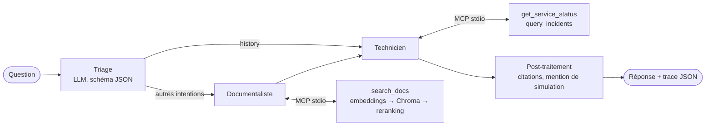

# HelloSupport — Décisions de design et de développement

> **Livrable final** exigé par la spec ([`SPEC.md`](SPEC.md) §3). Ce document explique
> **chaque** choix de design et de développement du projet.
>
> - **Pendant le projet** : journal type ADR. Chaque jalon ajoute ses entrées `D-xx`, datées,
>   au moment où la décision est prise (avec ce qu'on savait alors).
> - **À la fin (J5)** : consolidation. Synthèse en tête, entrées relues à la lumière des
>   mesures ([`BENCH.md`](BENCH.md)), export PDF ([`DESIGN_DECISIONS.pdf`](DESIGN_DECISIONS.pdf)).
>   **Statut : consolidé le 2026-10-02 (v1.8.0), 28 décisions.**
>
> Format d'une entrée : **Besoin → Options envisagées → Choix → Pourquoi → Compromis /
> limites → Compétence visée**. Une décision révisée n'est pas effacée : elle passe en
> `Remplacée par D-yy`.

## Synthèse (consolidée le 2026-10-02, version 1.8.0)

**Ce qui a été construit.** Un assistant de dépannage en terminal, 100 % local. Une question en
français ou en anglais passe par un **triage** (LLM, sortie JSON contrainte), un **documentaliste**
(recherche sémantique : embeddings → Chroma → reranking) et un **technicien**. Selon
l'intention, le technicien observe un statut de service **simulé**, interroge une **base SQL
d'incidents** en lecture seule (text-to-SQL), ou répond depuis la documentation. Il cite ses
sources et sépare l'observé de l'hypothétique. Les outils passent par un **serveur MCP**,
l'orchestration par **LangGraph**, les modèles (SLM 4 B / 7 B) sont servis par **LM Studio**
sur GPU.

**Table de correspondance composant → décision → compétence visée**

| Composant | Décision retenue | Entrées | Compétence visée |
|---|---|---|---|
| Serving des modèles | LM Studio, API OpenAI-compatible, GPU, Q4_K_M | D-03, D-04 | Model-serving platforms ; GPU |
| Choix des modèles | 7 B par défaut, SLM 4 B en option mesurée | D-04, D-25 | LLMs and SLMs |
| Intégration LLM | SDK `openai`, wrapper qui mesure latence et tokens | D-05 | Model integration |
| Découpage + embeddings | Sections `##`, MiniLM multilingue (Sentence Transformers) | D-06, D-07 | RAG, embeddings, Hugging Face, PyTorch |
| Base vectorielle | Chroma embarqué persistant, index par empreinte | D-08 | Vector search, vector databases |
| Reranking | Cross-encoder top-5 → top-3, seuil hors sujet | D-09 | Reranking |
| GPU | torch CUDA, échauffement | D-10 | GPU, latency |
| Outils | Serveur MCP stdio, 3 outils typés, `ToolError` | D-11, D-12, D-15, D-20 | MCP, tool integration, tool calling |
| Données | SQLite d'incidents, scénarios simulés | D-14 | Database systems, SQL engines |
| Outil SQL | Text-to-SQL en lecture seule, 5 couches de protection | D-13, D-23 | Enterprise data agents |
| Orchestration | LangGraph : triage → documentaliste → technicien, branche `history` | D-16 | Orchestration, LangGraph |
| Décision d'outil | Routeur par sortie structurée + politique imposée par le code | D-17, D-24 | AI agents, intelligent workflows |
| Fiabilité | Boucle bornée, dédup, `required` vérifié, post-traitement | D-18, D-22 | Reliability, production-grade |
| État et traces | `TypedDict` + reducers, trace JSON horodatée | D-19 | State management |
| Validation | 6 cas exécutables, bench, vérifications déterministes | D-21, D-28 | Prototype → production |
| Mesures | Latence à chaud/froid, débit à concurrence 1/4, coût estimé | D-26 | Latency, throughput, cost |
| Code | Modules à responsabilité unique, frontière MCP | D-02, D-27 | Software architecture, Python |
| Cadre | 100 % local, 0 € | D-01 | Cost |

**Ce que les mesures ont appris** (les décisions qui en découlent sont marquées « suite à un
échec mesuré ») :
1. **Les petits modèles ne décident pas seuls d'observer** : laissés libres de choisir, 0/3 pour le 4 B
   comme pour le 7 B. Un routeur étroit à sortie contrainte, puis une politique imposée par le
   code, donnent 18/18 avec le 7 B (D-17).
2. **Une contrainte d'API n'est pas une garantie** : `tool_choice="required"` n'est pas imposé par
   LM Studio, et le modèle a inventé un statut. Le code vérifie et relance (D-18). La démo finale
   montre ce garde-fou en action.
3. **Le modèle hallucine quand il « raconte » l'étape suivante** au lieu de la faire (C4). Faire
   émettre toutes les requêtes d'un coup supprime le problème (D-23).
4. **Ce que le code sait, le code le dit** : statut simulé, absence d'action, liste des sources
   valides (D-22).
5. **Un réglage de prompt se mesure sur des données tenues à l'écart** : un ajout d'exemples a
   amélioré le SLM et dégradé le 7 B (D-24).
6. **Le coût est porté par le contexte, pas par la taille du modèle** : ~2 700 tokens en entrée
   pour ~370 en sortie (D-26).
7. **Les vérifications automatiques ont aussi des bugs** : deux d'entre elles étaient fausses
   (D-21). D'où l'archivage des réponses complètes pour relecture.

**Limites assumées** : 3 fiches, 14 incidents, 6 cas, une machine, température 0. Aucune
mesure n'est statistiquement solide. SQLite n'est pas un moteur d'entreprise. LM Studio n'est
pas un serveur de production. Le SLM invente encore des sources quand un outil échoue. Hors
périmètre : systèmes distribués, scale réel, leadership (cf. [`SPEC.md`](SPEC.md) §7 et §10).

## Index

| # | Décision | Jalon | Statut | Compétence visée |
|---|---|---|---|---|
| D-01 | 100 % local, aucune API cloud payante | cadrage | Acceptée | Cost, model serving |
| D-02 | Python 3.12 + `uv` + package installable avec CLI | J0 | Acceptée | Python, software architecture |
| D-03 | LM Studio comme plateforme de serving locale | J0 | Acceptée | Model-serving platforms |
| D-04 | Choix des modèles : Qwen3-4B-Instruct-2507 (SLM) et Qwen2.5-7B-Instruct, Q4_K_M | J0 | Acceptée, confirmée par D-25 | LLMs & SLMs, GPU |
| D-05 | Client LLM : SDK `openai` via l'endpoint OpenAI-compatible, mince wrapper maison | J0 | Acceptée | Model integration, latency/cost |
| D-06 | Découpage des fiches par section `##`, citation `doc_id#section` | J1 | Acceptée | RAG, semantic retrieval |
| D-07 | Embeddings : `paraphrase-multilingual-MiniLM-L12-v2` (Sentence Transformers) | J1 | Acceptée | Embeddings, Hugging Face |
| D-08 | Store vectoriel : Chroma embarqué persistant, index reconstruit sur empreinte | J1 | Acceptée | Vector search, vector databases |
| D-09 | Reranking : cross-encoder `mmarco-mMiniLMv2-L12-H384-v1`, top-5 → top-2, seuil hors sujet | J1 | Acceptée | Reranking |
| D-10 | Inférence embeddings/reranker sur GPU (torch CUDA), échauffement au chargement | J1 | Acceptée | GPU, PyTorch, latency |
| D-11 | MCP : serveur d'outils séparé, stdio, SDK `mcp` v2, vérifié avec MCP Inspector | J2 | Acceptée | MCP, tool integration |
| D-12 | Contrats d'outils typés (`Literal` → `enum`), `ToolError` explicites | J2 | Acceptée | Tool calling, reliability |
| D-13 | Outil SQL lecture seule : 5 couches (regex, LIMIT, `mode=ro`, authorizer, timeout) | J2 | Acceptée | Enterprise data agents, SQL engines |
| D-14 | SQLite d'incidents générée (dates relatives), scénarios de statut JSON simulés | J2 | Acceptée | Database integration, data analysis |
| D-15 | Chargement du RAG en thread au démarrage du serveur MCP | J2 | Acceptée | Latency |
| D-16 | Orchestration LangGraph : triage → documentaliste → technicien, branche `history` | J3 | Acceptée | Orchestration, LangGraph |
| D-17 | Triage par sortie structurée + politique d'outils imposée par le code | J3 | Acceptée (suite à un échec mesuré) | AI agents, intelligent workflows |
| D-18 | Boucle d'agent bornée : budgets, dernier appel sans outils, dédup, `required` vérifié | J3 | Acceptée | Reliability, workflow execution |
| D-19 | État partagé `TypedDict` (reducers) + trace JSON horodatée avec métriques | J3 | Acceptée | State management, latency/cost |
| D-20 | Client MCP hôte avec le SDK `mcp` direct (`ToolBox`), sans adaptateur LangChain | J3 | Acceptée | MCP, tool integration |
| D-21 | Validation : 6 cas exécutables, vérifications déterministes, `bench` avec réponses complètes | J4 | Acceptée | Prototype → production, evaluation |
| D-22 | Post-traitement déterministe : citations normalisées, mention de simulation | J4 | Acceptée (suite à un échec mesuré) | Reliability |
| D-23 | Questions data : toutes les requêtes SQL dans la même étape | J4 | Acceptée (suite à un échec mesuré) | Enterprise data agents |
| D-24 | Triage : règles + exemples, validé sur paraphrases tenues à l'écart (12/12) | J4 | Acceptée (suite à un échec mesuré) | Evaluate AI tech, SLMs |
| D-25 | **ADR** : modèle par défaut = 7 B (18/18) ; SLM plus rapide mais invente des sources | J5 | Acceptée | LLMs & SLMs, latency/cost, evaluate → plan |
| D-26 | Méthode de mesure : latence à chaud/froid, débit à concurrence 1/4, coût estimé | J5 | Acceptée | Latency, throughput, cost |
| D-27 | Structure du code : modules à responsabilité unique, frontière MCP | J5 | Acceptée | Software architecture, Python |
| D-28 | Stratégie de tests : unitaires hors ligne, intégration modèles, bench système | J5 | Acceptée | Production-grade, reliability |

---

## D-01 — 100 % local, aucune API cloud payante

- **Date** : 2026-10-02 · **Jalon** : cadrage (décision utilisateur)
- **Besoin** : pratiquer LLM, agents et RAG sans frais, sans compte, et sans données qui
  sortent de la machine.
- **Options** : (a) API cloud (OpenAI, Anthropic…), (b) modèles locaux, (c) mixte : local par
  défaut, cloud pour comparer.
- **Choix** : (b) 100 % local. Le coût cloud est **estimé** dans le benchmark (tokens mesurés ×
  prix publics), sans compte.
- **Pourquoi** : coût nul, aucun secret à gérer, reproductible hors ligne. Surtout, ça oblige à
  traiter le **serving** et les **SLM**, deux compétences visées que l'API cloud aurait masquées.
- **Compromis** : les modèles locaux (4–7 B) sont nettement moins bons que les modèles cloud de
  pointe en tool calling et en text-to-SQL. Les résultats qualitatifs ne sont donc pas
  représentatifs d'un déploiement avec un grand modèle. Il faut le dire clairement.
- **Compétence visée** : Cost, model serving.

## D-02 — Python 3.12 + `uv` + package installable avec CLI

- **Date** : 2026-10-02 · **Jalon** : J0
- **Besoin** : un projet qui s'installe et se lance en une commande, avec une version visible
  (convention du projet).
- **Options** : scripts isolés + `requirements.txt` ; Poetry ; `uv` + `pyproject.toml`.
- **Choix** : `uv` + `pyproject.toml` (layout `src/`), entrée CLI `hello-support`, version unique
  dans `hello_support/__init__.py` (`__version__`) et lue dynamiquement par le build.
- **Pourquoi** : `uv` est déjà installé, très rapide, et gère le lockfile et le venv. Le layout
  `src/` évite d'importer le code sans l'avoir installé. Une seule source de vérité pour la version.
- **Compromis** : torch avec CUDA doit venir de l'index PyTorch (`cu124`), pas de PyPI, d'où
  une config d'index dans `pyproject.toml`. Ajouté à J1, quand torch devient nécessaire.
- **Compétence visée** : Python, software architecture.

## D-03 — LM Studio comme plateforme de serving locale

- **Date** : 2026-10-02 · **Jalon** : J0
- **Besoin** : servir un LLM local derrière une API standard, avec le GPU, et pouvoir changer de
  modèle sans toucher au code.
- **Options** : (a) LM Studio (déjà installé, CLI `lms`, serveur OpenAI-compatible), (b) Ollama
  (non installé), (c) vLLM (débit élevé, mais Linux/WSL seulement et lourd sur 8 Go),
  (d) `transformers` en direct dans le process.
- **Choix** : (a) LM Studio, serveur sur `http://localhost:1234/v1`.
- **Pourquoi** : déjà en place, il gère le téléchargement (`lms get`), l'offload GPU et la
  quantification GGUF. Il expose l'API **OpenAI-compatible** avec *tool calling*. Le code
  applicatif ne dépend donc que d'un **contrat d'API**, pas d'un fournisseur. C'est
  exactement la séparation « application / plateforme de serving » visée.
- **Compromis** : outil desktop, pas un serveur de prod. Pas de batching continu ni de mesure
  de débit sérieuse : vLLM est noté dans « pour aller plus loin ». Le serveur doit tourner
  (`lms server start`) avant de lancer le programme.
- **Compétence visée** : Model-serving platforms.

## D-04 — Choix des modèles

- **Date** : 2026-10-02 · **Jalon** : J0 · **Révisable à J5** (mesures)
- **Besoin** : un **SLM** (3–4 B) capable d'appeler des outils, et un modèle plus gros (7 B) de
  référence, les deux tenant dans **8 Go de VRAM** (RTX 2070 Super).
- **Options SLM** : Qwen2.5-3B-Instruct ; **Qwen3-4B-Instruct-2507** ; Llama-3.2-3B-Instruct ;
  Phi-4-mini (3,8 B) ; Gemma-3-4B (déjà présent sous la forme `translategemma`, spécialisé en
  traduction et sans tool calling natif fiable).
- **Options 7 B** : `qwen2.5-coder-7b-instruct` (déjà présent) ; **Qwen2.5-7B-Instruct** ;
  Llama-3.1-8B-Instruct.
- **Choix** :
  - SLM = **`qwen/qwen3-4b-2507` en Q4_K_M** (~2,5 Go) ;
  - 7 B = **`qwen2.5-7b-instruct` en Q4_K_M** (~4,7 Go).
- **Pourquoi** :
  - Qwen3-4B-Instruct-2507 est entraîné pour le tool calling. C'est la variante « non-thinking »,
    donc sans bloc de raisonnement à filtrer, avec des réponses plus courtes et une latence
    plus basse. Il est multilingue (questions en français) et figure parmi les meilleurs
    4 B publics en appel de fonctions à sa sortie.
  - Pour le 7 B, prendre la **même famille** (Qwen) isole l'effet de la **taille** dans la
    comparaison. La version *Instruct* est préférée à *Coder* pour du dialogue et du
    diagnostic. C'est le modèle nommé dans la demande utilisateur.
  - **Q4_K_M** est le compromis standard qualité/taille. Le 7 B tient entièrement en VRAM
    (~4,7 Go + KV-cache), avec de la marge pour les modèles d'embedding et de reranking
    (~0,5 Go). Q8 (~8 Go) ne tiendrait pas.
- **Compromis** : la quantification 4 bits dégrade un peu la qualité, surtout sur le SQL. Deux
  familles différentes auraient permis une comparaison plus large, mais moins lisible. Les
  deux modèles ne sont pas chargés en même temps : LM Studio les charge à la demande
  (JIT), et le premier appel inclut donc un temps de chargement. Il est exclu des mesures
  (échauffement).
- **Mise en œuvre (J0)** : `lms get "qwen/qwen3-4b-2507@q4_k_m" -y` (staff pick LM Studio).
  Qwen2.5-7B-Instruct n'est pas un staff pick : téléchargé depuis Hugging Face avec
  `lms get "https://huggingface.co/lmstudio-community/Qwen2.5-7B-Instruct-GGUF@Q4_K_M" -y`.
- **Constat J0** (`hello-support smoke`, températures 0, après échauffement) : les deux modèles
  émettent un appel `get_time({"timezone": "Europe/Brussels"})` valide. SLM : hello 0,10 s,
  tool call 0,37 s (177 → 23 tokens). 7 B : 0,10 s et 0,55 s (193 → 23 tokens). Mesures
  ponctuelles, pas encore un benchmark (J5).
- **Compétence visée** : LLMs & SLMs, GPU.

## D-05 — Client LLM : SDK `openai` + wrapper maison minimal

- **Date** : 2026-10-02 · **Jalon** : J0
- **Besoin** : appeler le modèle avec ou sans outils, et récupérer contenu, appels d'outils,
  tokens et latence.
- **Options** : (a) SDK `openai` pointé sur `localhost:1234`, (b) `langchain-openai`
  (`ChatOpenAI`), (c) `httpx` brut.
- **Choix** : (a). Un module `llm.py` de quelques dizaines de lignes renvoie un résultat
  normalisé (`content`, `tool_calls`, `prompt_tokens`, `completion_tokens`, `latency_s`, `model`).
- **Pourquoi** : on voit exactement ce qui part et revient sur le fil, ce qui est pédagogique et
  utile pour mesurer. Le SDK est stable et typé. LangGraph n'impose pas LangChain pour les
  nœuds : un nœud est une fonction Python. Ça limite les couches d'abstraction.
- **Compromis** : on réimplémente un peu de plomberie que `ChatOpenAI` + `bind_tools` offrent.
  Si J3 montre que c'est trop coûteux, on basculera sur `langchain-openai`, en ajoutant une
  entrée qui remplace celle-ci.
- **Compétence visée** : Model integration, latency/cost.

## D-06 — Découpage des fiches par section

- **Date** : 2026-10-02 · **Jalon** : J1
- **Besoin** : retrouver un passage précis et le **citer** (« postgres_connection.md, section
  Service status »), comme l'exige la réponse attendue.
- **Options** : (a) un document entier par vecteur, (b) découpe à taille fixe (N tokens avec
  chevauchement), (c) découpe par structure (titres `##`).
- **Choix** : (c). Une section = un chunk, identifié `doc_id#section`. Le texte embarqué est
  préfixé par le titre de la fiche (« PostgreSQL: application cannot connect - Checks ») pour que
  la section garde son contexte.
- **Pourquoi** : les fiches sont courtes et déjà structurées (Symptoms / Checks / Service status
  / Limits). La découpe structurelle donne des citations stables et lisibles. La découpe fixe
  couperait au milieu d'une liste de vérifications.
- **Compromis** : ça suppose des documents bien structurés. Sur un vrai corpus d'entreprise
  (PDF, wikis), il faudrait une découpe hybride (structure + taille maximale + chevauchement).
- **Compétence visée** : RAG, semantic retrieval.

## D-07 — Modèle d'embeddings

- **Date** : 2026-10-02 · **Jalon** : J1
- **Besoin** : encoder des questions **en français ou en anglais** et des fiches en anglais
  dans un même espace vectoriel, localement, sur 8 Go de VRAM partagés avec le LLM.
- **Options** : `all-MiniLM-L6-v2` (anglais seulement) ;
  **`paraphrase-multilingual-MiniLM-L12-v2`** (50+ langues, 118 M paramètres, dim 384) ;
  `multilingual-e5-base` / `bge-m3` (meilleurs, mais 2 à 5 fois plus gros) ;
  `nomic-embed-text` servi par LM Studio (déjà présent).
- **Choix** : `paraphrase-multilingual-MiniLM-L12-v2` via Sentence Transformers (Hugging Face Hub,
  sans compte). Vecteurs normalisés, similarité cosinus.
- **Pourquoi** : c'est le candidat proposé par le document initial. Il est multilingue (la
  requête FR « connexion refusée » retrouve bien la fiche EN), léger (~0,5 Go en VRAM) et
  rapide. Le passer par Sentence Transformers plutôt que par LM Studio fait pratiquer
  **PyTorch / Hugging Face** directement.
- **Compromis** : la qualité est modeste. Le cosinus brut sépare mal (0,46 à 0,52 pour des
  sections utiles comme pour des sections nginx hors sujet, cf. BENCH J1). C'est précisément ce
  qui justifie le reranker (D-09). Un modèle e5/bge serait l'amélioration naturelle.
- **Compétence visée** : Embeddings, Hugging Face.

## D-08 — Store vectoriel : Chroma embarqué

- **Date** : 2026-10-02 · **Jalon** : J1
- **Besoin** : stocker et interroger les vecteurs (top-k par similarité) sans serveur à
  administrer.
- **Options** : (a) NumPy en mémoire (proposition initiale : cosinus brute-force),
  (b) **Chroma** embarqué (`PersistentClient`, index HNSW), (c) `sqlite-vec` (extension SQLite),
  (d) PostgreSQL + pgvector (WSL/Docker), (e) FAISS.
- **Choix** : (b) Chroma 1.5, collection `kb_sections` en espace **cosinus**, persistée dans
  `.chroma/` (gitignoré). Les embeddings sont calculés par notre code et passés à Chroma, qui
  ne choisit pas le modèle. L'index n'est reconstruit que si l'**empreinte**
  (hash du modèle + du contenu des sections) change.
- **Pourquoi** : c'est une vraie base vectorielle (index ANN, métadonnées, persistance), installée
  par `pip`, sans Docker. Elle couvre la compétence « base vectorielle » à moindre coût. Fournir
  nos propres vecteurs garde la maîtrise du modèle (D-07) et permet de le changer sans dépendre
  des fonctions d'embedding intégrées de Chroma. Avec l'empreinte, on évite un recalcul à chaque
  démarrage tout en garantissant que l'index n'est jamais périmé.
- **Compromis** : à 12 vecteurs, un index ANN n'apporte **aucun** gain : le brute-force NumPy
  serait aussi rapide. Le choix est pédagogique, et il faut le dire. Chroma ajoute beaucoup de
  dépendances. pgvector serait plus proche d'un contexte « IA + base de données » : il est placé en
  « pour aller plus loin ». Repli prévu : cosinus NumPy si Chroma posait problème (ça n'a pas
  été le cas).
- **Compétence visée** : Vector search, vector databases.

## D-09 — Reranking par cross-encoder

- **Date** : 2026-10-02 · **Jalon** : J1
- **Besoin** : améliorer l'ordre des passages renvoyés à l'agent (seulement 2, donc le
  classement compte), et détecter qu'**aucun** passage ne correspond.
- **Options** : (a) pas de reranking, (b) **cross-encoder** Sentence Transformers,
  (c) reranker LLM (demander au modèle de classer), (d) `bge-reranker-v2-m3` (plus précis, ~570 M
  paramètres).
- **Choix** : (b) `cross-encoder/mmarco-mMiniLMv2-L12-H384-v1` (multilingue, léger). Recherche
  vectorielle top-5, rerank des 5 paires (question, passage), top-2 conservé. Chaque hit garde son
  rang vectoriel d'origine pour montrer l'effet du reranking. Seuil `RELEVANCE_THRESHOLD = -5`
  sur le score du cross-encoder : en dessous, le passage est marqué « hors sujet ».
- **Pourquoi** : c'est le schéma classique *retrieve & rerank*. Le bi-encoder est rapide mais
  grossier, le cross-encoder lit la question et le passage ensemble et classe mieux. Mesuré
  (BENCH J1) : sur « connexion refusée postgres », la section *Symptoms* passe de la 5ᵉ à la
  2ᵉ place devant deux sections nginx. Sur une question hors base (Kafka), tous les scores
  tombent ≤ -9,2 alors que les passages utiles sont ≥ -4,3. Ce signal est bien plus
  discriminant que le cosinus (0,12–0,21). Un reranker LLM aurait coûté un appel au modèle
  par requête.
- **Compromis** : environ 0,1–0,3 s de plus par requête. Le seuil est **empirique** et calibré
  sur 4 requêtes : c'est un filtre grossier, pas une garantie de précision. Il faudrait
  l'étalonner sur un jeu de questions (voir « pour aller plus loin » : évaluation RAG).
- **Révision (J3)** : `search_docs` renvoie le **top-3** (au lieu du top-2). Avec 2 passages,
  le reranker plaçait « Limits » en tête et la section « Service status » disparaissait du contexte.
- **Compétence visée** : Reranking.

## D-10 — Inférence sur GPU et échauffement

- **Date** : 2026-10-02 · **Jalon** : J1
- **Besoin** : utiliser le GPU disponible et mesurer une latence de requête représentative.
- **Options** : CPU seulement ; GPU via torch CUDA ; embeddings servis par LM Studio.
- **Choix** : torch **2.6.0+cu124** tiré de l'index PyTorch (configuré dans
  `pyproject.toml`, car PyPI ne fournit que la version CPU sous Windows). Device choisi
  automatiquement (`cuda` sinon `cpu`) et affiché. Une requête d'**échauffement** est faite au
  chargement du `Retriever`.
- **Pourquoi** : le GPU est là (RTX 2070 Super). Les deux petits modèles y tiennent (~1 Go) à côté
  du LLM servi par LM Studio. Mesuré : la première requête coûte ~2,9 s (initialisation des
  kernels CUDA) contre ~0,5 s ensuite. L'échauffement sort ce coût unique de la latence par
  question.
- **Compromis** : téléchargement de torch CUDA lourd (~2,5 Go), import de `sentence_transformers`
  lent (~15 s à froid sous Windows), chargement total ~27 s. Acceptable parce que payé une fois
  par session du serveur d'outils (J2). Sur CPU, le projet fonctionne aussi, simplement plus
  lentement.
- **Compétence visée** : GPU, PyTorch, latency.

## D-11 — MCP : serveur d'outils séparé, transport stdio, SDK Python v2

- **Date** : 2026-10-02 · **Jalon** : J2
- **Besoin** : exposer les outils aux agents par un **protocole standard**, pour pouvoir les
  tester seuls, les réutiliser par un autre client (Inspector, IDE, autre agent), et les
  déplacer sans toucher au code des agents.
- **Options** : (a) fonctions Python appelées directement par les agents, (b) API REST maison,
  (c) **MCP** en stdio (sous-processus local), (d) MCP en *streamable HTTP* (serveur réseau).
- **Choix** : (c) avec le SDK officiel `mcp` **2.2** (`MCPServer`, nouveau nom de FastMCP dans
  la v2). Point d'entrée `hello-support-mcp`. L'hôte lancera le serveur comme sous-processus
  (J3). Les tests utilisent le même serveur **en mémoire** via `mcp.Client(server)`.
- **Pourquoi** : MCP est l'une des compétences visées (intégration d'outils d'entreprise
  pour des agents). Le stdio n'a besoin d'aucun port ni d'aucune auth et suffit en local. Le
  schéma JSON des entrées est généré depuis les annotations Python. Vérifié avec **MCP
  Inspector** (`npx @modelcontextprotocol/inspector --cli hello-support-mcp --method tools/list`
  puis `tools/call` pour chacun des 3 outils).
- **Compromis** : un sous-processus par session et un protocole de plus à déboguer. Le SDK v2
  est récent : les exemples en ligne (FastMCP, `inputSchema` en camelCase) ne s'appliquent plus
  tels quels. L'Inspector en mode CLI passe mal les arguments `-m module`, d'où le point
  d'entrée dédié. Le transport HTTP (premier pas « distribué ») est laissé à « pour aller plus loin ».
- **Compétence visée** : MCP, tool integration.

## D-12 — Contrats d'outils : types stricts, erreurs explicites

- **Date** : 2026-10-02 · **Jalon** : J2
- **Besoin** : le modèle **propose** des appels qui peuvent être faux (service inconnu, SQL
  invalide, requête vide). Ces erreurs doivent être refusées proprement et rester exploitables
  par le modèle.
- **Options** : validation dans chaque agent ; validation côté serveur d'outils ; les deux.
- **Choix** : validation **côté serveur**, par les types : `service_name: Literal["postgres",
  "nginx", "redis"]` produit un `enum` dans le schéma MCP, que le modèle voit et que Pydantic
  vérifie. Les erreurs métier lèvent `ToolError`, rendu au client en `is_error=true` avec un
  message clair (ex. « unknown service », « SQL rejected: only SELECT queries are allowed »).
  Les descriptions d'outils (docstrings) expliquent le format de sortie et l'usage, par exemple
  `relevant=false`.
- **Pourquoi** : un seul endroit fait foi, quel que soit le client. L'erreur renvoyée au
  modèle lui permet de **se corriger une fois** (J3) au lieu de planter. Le schéma `enum`
  réduit les erreurs à la source, ce qui est important pour un SLM.
- **Compromis** : les messages de validation Pydantic sont verbeux pour un petit modèle. Le
  serveur ne connaît pas les **limites d'appels** : c'est le rôle de l'orchestrateur (J3).
- **Compétence visée** : Tool calling, reliability.

## D-13 — Outil SQL en lecture seule : défense en profondeur

- **Date** : 2026-10-02 · **Jalon** : J2
- **Besoin** : laisser l'agent **écrire du SQL** (text-to-SQL, comme un « enterprise data
  agent ») sans qu'il puisse modifier ou exfiltrer quoi que ce soit, ni bloquer la base.
- **Options** : (a) outil paramétré (`get_incidents(service, days)`), sans SQL libre ;
  (b) SQL libre avec un filtre regex ; (c) SQL libre avec **plusieurs couches indépendantes**.
- **Choix** : (c), dans `sql_guard.py` :
  1. contrôle statique : une seule instruction, qui commence par `SELECT`/`WITH`, sans mot-clé
     d'écriture ou d'administration (`DELETE`, `PRAGMA`, `ATTACH`, `load_extension`…) ;
  2. requête enveloppée : `SELECT * FROM (<sql>) LIMIT 51`, puis tronquée à 50 lignes avec un
     drapeau `truncated` ;
  3. connexion SQLite **`mode=ro`** : le moteur refuse toute écriture ;
  4. **authorizer** SQLite : seules les actions `SELECT`/`READ`/`FUNCTION`/`RECURSIVE` sont permises ;
  5. **progress handler** : la requête est abandonnée au-delà de 2 s.

  Le schéma de la table et un exemple de filtre de date sont dans la description de l'outil.
- **Pourquoi** : (a) serait plus sûr, mais ne pratique pas le text-to-SQL, qui est le cœur d'un
  data agent. Une regex seule se contourne : chaque couche couvre les angles morts des autres,
  et les couches 3–4 sont garanties par le moteur, pas par notre code. Les erreurs SQL
  (colonne inconnue…) sont renvoyées telles quelles pour que le modèle corrige sa requête.
  Testé : `DELETE`, `SELECT 1; DROP…`, `PRAGMA`, `ATTACH`, `load_extension` sont refusés ; la
  limite de lignes est appliquée (`tests/test_sql_guard.py`).
- **Compromis** : la regex peut refuser une requête légitime contenant un de ces mots dans une
  chaîne (ex. `summary LIKE '%update%'`). C'est acceptable ici, à corriger avec un vrai parseur
  SQL (`sqlglot`) si besoin. Rien n'empêche une requête **fausse mais valide** : la
  justesse est évaluée en J4 (cas C4). Sur une vraie base d'entreprise, il faudrait en plus un
  rôle SQL dédié en lecture seule et des vues restreintes.
- **Compétence visée** : Enterprise data agents, SQL engines.

## D-14 — Données : SQLite d'incidents générée, scénarios JSON simulés

- **Date** : 2026-10-02 · **Jalon** : J2
- **Besoin** : des données structurées réalistes pour les questions d'analyse (« combien
  d'incidents postgres ces 30 derniers jours ? ») et des états de service **simulés** et
  contrôlables pour les cas C1/C2/C6.
- **Options données** : PostgreSQL réel (WSL/Docker), DuckDB, **SQLite** (stdlib).
  **Options statuts** : interroger de vrais services ; un fichier JSON de scénarios.
- **Choix** : table `incidents` (14 lignes : service, date, sévérité, résumé, résolu) générée par
  `seed_incidents()` avec des dates **relatives à aujourd'hui**. Le fichier `data/incidents.db`
  est gitignoré et créé à la première utilisation. Les statuts viennent de `scenarios.json`
  (`stopped`, `running`, `redis_down`, `tool_error`), choisis par `HS_SCENARIO` (bientôt
  `--scenario`). Chaque réponse porte `simulated: true` et le nom du scénario.
- **Pourquoi** : SQLite est dans la stdlib, sans serveur, et c'est un vrai moteur SQL (dates,
  agrégats, CTE récursives, authorizer). Avec des dates relatives, « les 30 derniers jours » a
  toujours la même réponse attendue, ce qui rend le cas C4 vérifiable. Les scénarios rendent
  le comportement **déterministe** et permettent de simuler une panne d'outil (C6). Comme rien
  de réel n'est touché, aucune action dangereuse n'est possible.
- **Compromis** : SQLite n'est pas un moteur d'entreprise : pas de rôles, ni de concurrence
  d'écriture ni de plan distribué. 14 lignes ne testent pas la performance. PostgreSQL +
  pgvector est en « pour aller plus loin ».
- **Compétence visée** : Database integration, data analysis.

## D-15 — Chargement du RAG en arrière-plan dans le serveur MCP

- **Date** : 2026-10-02 · **Jalon** : J2
- **Besoin** : le `Retriever` met ~30 s à charger. Si on le charge avant de démarrer le serveur,
  le handshake MCP dépasse le délai du client (15 s par défaut pour l'Inspector).
- **Options** : chargement au démarrage (bloquant) ; chargement paresseux au premier appel ;
  **chargement dans un thread au démarrage**, le premier `search_docs` attendant la fin.
- **Choix** : le thread. Le handshake est immédiat, les outils `get_service_status` et
  `query_incidents` sont disponibles tout de suite, et `search_docs` attend au plus 180 s.
  Les erreurs de chargement sont renvoyées en `ToolError`.
- **Pourquoi** : en général le documentaliste appelle `search_docs` en premier, après un appel
  LLM : le chargement se fait pendant ce temps-là au lieu de s'ajouter à la latence.
- **Compromis** : un peu de concurrence à gérer (un `Event`). Mesuré via l'Inspector : un appel
  `search_docs` à froid prend ~54 s de bout en bout (démarrage `npx` + process + chargement).
  Cela reste payé une fois par session.
- **Compétence visée** : Latency.

## D-16 — Orchestration : LangGraph `StateGraph`, nœuds = fonctions Python

- **Date** : 2026-10-02 · **Jalon** : J3
- **Besoin** : enchaîner des étapes (triage → recherche → diagnostic), avec des branches
  conditionnelles, un état partagé et un arrêt garanti.
- **Options** : (a) une boucle Python « à la main », (b) **LangGraph** (graphe d'états),
  (c) un agent ReAct unique (`create_react_agent`) qui décide de tout, (d) CrewAI / AutoGen
  (multi-agent conversationnel).
- **Choix** : (b) LangGraph 1.2, graphe `START → triage → documentalist → technician → END`, avec
  une **arête conditionnelle** : les questions d'historique (`history`) vont directement au
  technicien, sans recherche documentaire. Une autre fait sortir vers `END` si le documentaliste
  échoue. Les nœuds sont de simples fonctions `async` : LangChain n'est pas nécessaire (D-05).
  `recursion_limit=10` sert de filet de sécurité.
- **Pourquoi** : c'est le framework d'agents visé. Il sépare clairement le **workflow défini
  par le code** (structure, branches, politique d'outils) des **décisions du modèle** (arguments
  d'outils, SQL, rédaction), ce que le document initial recommandait déjà. Un agent ReAct unique
  laisse tout au modèle, ce qui s'est révélé peu fiable avec des modèles 4–7 B (D-17).
- **Compromis** : pour 3 nœuds linéaires, LangGraph est presque surdimensionné. Sa valeur
  apparaît avec les branches, les checkpoints et le human-in-the-loop (« pour aller plus
  loin »). Le chargement de LangGraph ajoute des dépendances.
- **Compétence visée** : Orchestration, LangGraph.

## D-17 — Triage par sortie structurée + politique d'outils appliquée par le code

- **Date** : 2026-10-02 · **Jalon** : J3 · **Décision issue d'un échec mesuré**
- **Besoin** : le technicien doit **observer** (appeler `get_service_status`) quand une panne est
  signalée, et ne pas le faire pour une question documentaire.
- **Constat** : la première version laissait ce choix au modèle (`tool_choice="auto"`, règles dans
  le prompt). Mesuré sur l'entrée réelle du technicien : **0/3** appels pour Qwen2.5-7B **et**
  pour Qwen3-4B, quelle que soit la mise en page (rappel en fin de message, sans brief, question
  en dernier). Les deux modèles répondaient au conditionnel (« si le service est arrêté… »)
  puisque la fiche décrit les deux cas. Le 7 B allait jusqu'à dire à l'utilisateur d'appeler
  `get_service_status` lui-même.
- **Options** : (a) prompt engineering supplémentaire ; (b) appel d'outil systématique ;
  (c) **routeur** : un appel LLM court qui classe l'intention en JSON contraint, puis une
  politique d'outils décidée par le code ; (d) un modèle plus gros.
- **Choix** : (c). Nœud `triage` : `response_format` JSON Schema strict →
  `{intent: malfunction|history|documentation|out_of_scope|vague, service}`. Le code applique
  `TECHNICIAN_POLICY` :
  - `malfunction` → seul `get_service_status` est proposé, un appel est **exigé** ;
  - `history` → `query_incidents` est **exigé**, le modèle écrit le SQL ;
  - `documentation` → aucun outil ;
  - `out_of_scope` / `vague` → aucun outil et une consigne explicite (dire la limite / poser
    une question).

  Une panne sans service connu est requalifiée en `vague`.
- **Pourquoi** : mesuré sur 6 questions types, le triage coûte ~0,3 s (après chargement) et
  classe correctement les cas clés. Qwen2.5-7B : 4/6, les deux « erreurs » (Kafka → `vague`,
  « ça marche pas » → panne sans service) aboutissant quand même au bon comportement.
  Qwen3-4B : 4/6, mais il a confondu « panne + que vérifier ? » avec `documentation`, corrigé
  par une précision dans le prompt. Le modèle décide toujours, mais **sur une tâche étroite et
  contrainte**, et le code garantit les conséquences. C'est un schéma *router + policy* courant
  en production.
- **Compromis** : un appel LLM de plus par requête. La classification peut se tromper, et
  l'erreur se propage (pas de retour arrière). Les 5 intentions sont figées dans le code.
- **Compétence visée** : AI agents, intelligent workflows.

## D-18 — Boucle d'agent bornée et garde-fous mesurés

- **Date** : 2026-10-02 · **Jalon** : J3
- **Besoin** : aucune boucle infinie, un coût borné, des erreurs d'outil qui ne font pas planter
  le programme, et pas d'observation inventée.
- **Choix** (`agents.run_agent`, partagé par les deux agents) :
  - 3 appels LLM au maximum par agent. Le **dernier appel est fait sans outils**, ce qui force
    une réponse texte ;
  - budgets par outil : `search_docs` ≤ 2, `get_service_status` ≤ 1, `query_incidents` ≤ 2.
    Un dépassement renvoie au modèle un message d'erreur, pas une exception ;
  - **déduplication** des appels identiques et **3 appels au plus par étape**. Raison mesurée :
    le 7 B, forcé d'appeler un outil qui échoue (scénario `tool_error`), a émis
    **46 appels identiques** en 1 024 tokens (18 s) ;
  - `max_tokens` = 300 pour une étape avec outils, 700 pour une réponse finale ;
  - **`tool_choice="required"` vérifié par le code** : LM Studio ne l'impose pas strictement.
    Une fois, le 7 B a répondu en texte et **inventé** un statut « en cours d'exécution » sans
    appeler l'outil. Une réponse sans l'observation exigée est donc rejetée et le modèle relancé
    une fois ;
  - arguments JSON invalides et outils non autorisés : refusés avec un message ;
  - timeout HTTP des appels LLM (120 s) et des appels d'outils (240 s).
- **Pourquoi** : on ne fait pas confiance au modèle pour s'arrêter ou pour respecter une
  contrainte d'API. Chaque garde-fou ci-dessus vient d'un comportement **observé** pendant J3.
- **Compromis** : les limites sont des choix de périmètre, pas des optimums. Une réponse
  rejetée coûte un appel LLM. La qualité du raisonnement n'est pas garantie : au cas C4, le 7 B
  a calculé `MAX(resolved)` et en a pourtant conclu « le dernier n'est pas résolu ». C'est exact
  par hasard, mais pas déduit du résultat (évaluation J4).
- **Compétence visée** : Reliability, workflow execution.

## D-19 — État partagé explicite et trace JSON

- **Date** : 2026-10-02 · **Jalon** : J3
- **Besoin** : savoir à tout moment ce que chaque étape a vu et décidé, rejouer et mesurer une
  exécution.
- **Choix** : `State` (`TypedDict`) : `question` (jamais modifiée), `model`, `scenario`, `route`,
  `evidence` (passages pertinents uniquement, dédupliqués), `brief`, `observations`,
  `counters`, `status`, `errors` et `trace` (ces deux derniers avec un reducer `operator.add` : les
  nœuds **ajoutent**, n'écrasent pas), `answer`. Chaque événement (`llm`, `tool_call`,
  `tool_result`, `limit`, `error`) est horodaté, affiché en direct et écrit dans
  `runs/<horodatage>.json` avec les métriques (durée totale, appels et temps LLM, tokens
  in/out, temps des outils). Le dossier `runs/` est gitignoré.
- **Pourquoi** : les mises à jour passent explicitement par les retours des nœuds, ce qui est
  le modèle de LangGraph. Afficher les **décisions observables** (outil, arguments, résultat)
  plutôt qu'un « raisonnement » interne suit la recommandation du document initial. La trace
  a servi à diagnostiquer chacun des problèmes de D-17/D-18.
- **Compromis** : l'état vit en mémoire le temps d'une requête. Il n'y a pas de reprise après
  crash (checkpointer LangGraph = « pour aller plus loin »). La trace contient les textes
  complets, ce qui pourrait poser problème avec des données sensibles en contexte réel.
- **Compétence visée** : State management, latency/cost.

## D-20 — Client MCP côté hôte : SDK `mcp` direct plutôt que `langchain-mcp-adapters`

- **Date** : 2026-10-02 · **Jalon** : J3
- **Besoin** : lancer le serveur d'outils, lister ses outils au format attendu par le LLM et les
  appeler.
- **Options** : `langchain-mcp-adapters` (convertit en outils LangChain) ; le **`mcp.Client`** du SDK.
- **Choix** : `ToolBox` (≈ 80 lignes) : `mcp.Client(StdioServerParameters(...))` lance
  `python -m hello_support.mcp_server` avec `HS_SCENARIO`, convertit `list_tools()` au format
  OpenAI `tools` (le schéma JSON MCP est repris tel quel) et décode les résultats. Une
  liste est renvoyée en `structured_content = {"result": [...]}` ou en un bloc texte par élément.
  Le même `ToolBox` accepte un serveur **en mémoire** pour les tests.
- **Pourquoi** : sans LangChain dans la boucle (D-05), l'adaptateur n'apporte rien. Le SDK
  direct montre ce que fait réellement un hôte MCP : *spawn*, *handshake*, *list*, *call*.
- **Compromis** : il faut gérer soi-même le décodage des résultats. Un premier bug (liste
  renvoyée en plusieurs blocs) a été trouvé à la première exécution réelle.
- **Compétence visée** : MCP, tool integration.

## D-21 — Validation : 6 cas exécutables avec vérifications automatiques

- **Date** : 2026-10-02 · **Jalon** : J4
- **Besoin** : savoir si le système « marche » sur les cas de la spec, le revérifier après chaque
  changement de prompt ou de modèle, et comparer deux modèles sur la même base.
- **Options** : (a) relire les réponses à la main ; (b) **LLM-as-a-judge** (un modèle note les
  réponses) ; (c) **vérifications déterministes** sur l'état final (route, outils appelés,
  résultats, mots-clés et citations de la réponse) ; (d) un framework d'évaluation (Ragas,
  DeepEval…).
- **Choix** : (c), dans `cases.py` : 6 cas, de 5 à 7 vérifications nommées chacun (ex. « statut
  observé = stopped », « aucun appel de statut », « dernier incident lu (ORDER BY…) »,
  « citations exactes », « en français »). Commande `hello-support bench` : N exécutions × modèles,
  rapport Markdown (`docs/bench/`) avec **toutes les réponses**, et JSON brut (`runs/`).
  Les tests unitaires (`pytest`) vérifient le code avec un LLM **scripté** ; le bench vérifie le
  système avec les **vrais** modèles.
- **Pourquoi** : c'est reproductible, gratuit et explicable. Une vérification qui échoue désigne
  un défaut précis. Le bench a immédiatement révélé deux défauts invisibles en démo (D-22,
  D-23). Un juge LLM local (4–7 B) serait moins fiable que les réponses qu'il note, et un
  framework ajouterait des dépendances pour 6 cas.
- **Compromis** : les vérifications par mots-clés sont **grossières**. Une bonne réponse peut
  échouer (formulation imprévue), une mauvaise peut passer. Elles ne mesurent pas la qualité du
  conseil. D'où la conservation des réponses complètes pour relecture humaine. 6 cas ne font pas
  une évaluation statistique.
- **Compétence visée** : Prototype → production, evaluation.

## D-22 — Post-traitement déterministe : citations normalisées + mention de simulation

- **Date** : 2026-10-02 · **Jalon** : J4 · **Décision issue d'un échec mesuré**
- **Constat** (bench J4, 7 B) : malgré la consigne « copier les étiquettes exactement », le modèle
  écrit `postgres_connection.md#Service_status` (underscore). Il omet aussi la mention « simulé »
  exigée par C1.
- **Options** : renforcer encore le prompt ; changer le format des identifiants ;
  **post-traiter la réponse dans le code**.
- **Choix** : `postprocess.py` :
  - `normalize_citations` ramène chaque citation `doc.md#Section` à l'identifiant canonique de
    la base (insensible à la casse et aux `_`) et signale les citations inconnues dans la trace,
    sans les supprimer ;
  - `simulation_footer` ajoute en fin de réponse une ligne construite **à partir des résultats
    d'outils** : « Statut observé en simulation (scénario « stopped ») : postgres = stopped.
    Aucune action corrective n'a été exécutée. » La phrase est en français si la question l'est.
- **Pourquoi** : c'est le même principe que D-17. Ce que le code **sait** (le statut vient d'une
  simulation, rien n'a été exécuté, la liste des sections existantes), le code le dit, au lieu
  d'espérer que le modèle le dise. Ça rend la réponse vérifiable et conforme à la réponse
  attendue du document initial.
- **Compromis** : la vérification « dit simulé » de C1 est désormais satisfaite **par
  construction**. Elle teste le système, pas le modèle, et il faut le dire. La détection de
  langue est une heuristique (mots-outils français).
- **Compétence visée** : Reliability.

## D-23 — Questions de données : toutes les requêtes dans la même étape

- **Date** : 2026-10-02 · **Jalon** : J4 · **Décision issue d'un échec mesuré**
- **Constat** : au cas C4 (« combien… et le dernier est-il résolu ? »), le 7 B a exécuté un
  `COUNT(*)`, puis il a **écrit** « Now let's check the status of the last incident » et
  **inventé** la réponse au lieu d'appeler l'outil une 2ᵉ fois. Une version antérieure
  concluait à partir d'un `MAX(resolved)` qui ne permet pas de répondre.
- **Choix** : la consigne `history` demande **toutes les requêtes dans la même étape** (appels
  d'outils parallèles), une requête par partie de la question, avec l'exemple
  `ORDER BY started_at DESC LIMIT 1`. Elle interdit aussi de décrire une requête non exécutée. La
  vérification C4 contrôle qu'une requête lisant le dernier incident a bien été **exécutée**.
- **Pourquoi** : le modèle hallucine quand il « raconte » l'étape suivante au lieu de la faire.
  Faire planifier les requêtes d'un coup supprime cette étape intermédiaire. Résultat mesuré :
  2 requêtes émises en parallèle, conclusion « 3 incidents, le dernier non résolu » **déduite des
  lignes renvoyées**.
- **Compromis** : ça repose sur l'aptitude du modèle aux appels parallèles. Une question
  nécessitant une requête dépendant du résultat d'une autre (vraie analyse en plusieurs temps)
  ne serait pas couverte : il faudrait alors un plan explicite ou un budget d'étapes plus grand.
- **Compétence visée** : Enterprise data agents.

## D-24 — Triage : règles explicites + exemples, mesurés sur des paraphrases tenues à l'écart

- **Date** : 2026-10-02 · **Jalon** : J4 · **Décision issue d'un échec mesuré**
- **Constat** (bench J4 n° 1) : le SLM classait « Mon application ne parvient plus à se connecter
  à PostgreSQL. Que dois-je vérifier ? » en `documentation` **3 fois sur 3**. Il n'observait donc
  jamais le statut, d'où C1/C2 = 0/3. Ajouter seulement des exemples (*few-shot*) a corrigé le
  SLM sur les paraphrases, mais **dégradé le 7 B** : « Mon Kafka est lent » → `malfunction/nginx`,
  « My MongoDB replica set is down » → `malfunction/redis`. C'est dangereux, puisqu'il observerait
  un service sans rapport avec la question.
- **Choix** : prompt de triage = définitions + **2 règles explicites** (un autre produit cité →
  `out_of_scope`, jamais mappé sur un service connu ; une panne vécue maintenant → `malfunction`,
  même si la phrase finit par « que vérifier ? ») + **6 exemples** formulés différemment des
  questions du bench.
- **Mesure** : 12 questions = les 6 du bench + **6 paraphrases tenues à l'écart** (jamais vues
  pendant le réglage) : **12/12 pour les deux modèles**, contre 11/12 (SLM) et 10/12 (7 B) avec
  les seuls exemples.
- **Pourquoi** : un exemple sans règle peut être sur-généralisé (le 7 B a appris « produit
  inconnu ⇒ choisir un service connu »). La règle fixe la limite, les exemples montrent le
  format. Tester sur des paraphrases non vues évite de régler le prompt pour les seules
  questions du bench (sur-ajustement).
- **Compromis** : 12 questions restent un petit échantillon. Chaque modification de prompt doit
  être re-mesurée, car un gain sur un modèle peut être une perte sur l'autre (cas observé ici).
- **Compétence visée** : Evaluate AI tech, SLMs.

## D-25 — ADR : modèle par défaut = Qwen2.5-7B-Instruct ; le SLM reste une option mesurée

- **Date** : 2026-10-02 · **Jalon** : J5 · **Statut** : Acceptée. Elle confirme D-04 avec des mesures.
- **Contexte** : deux modèles servis localement par LM Studio, mêmes prompts, même code, 6 cas ×
  3 exécutions (BENCH J4), plus une mesure de débit du serving (BENCH J5).
- **Options** : (a) SLM Qwen3-4B-Instruct-2507 par défaut ; (b) **7 B par défaut** ;
  (c) hybride : SLM pour le triage (tâche étroite, sortie contrainte), 7 B pour la réponse.
- **Données** :

  | Critère | SLM 4 B | 7 B |
  |---|---|---|
  | Cas réussis (6 × 3) | 15/18 | **18/18** |
  | Défaut grave observé | invente des identifiants de source quand un outil échoue (C6, 3/3) | présente parfois les symptômes de la fiche comme des « logs observés » (non détecté par les vérifications) |
  | Triage (12 questions dont 6 tenues à l'écart) | 12/12 | 12/12 |
  | Latence p50 par requête (à chaud) | **6,0 s** | 9,0 s |
  | Débit de génération, 1 requête à la fois | **107 tokens/s** | 71 tokens/s |
  | Débit agrégé, 4 requêtes concurrentes | **173 tokens/s** | 128 tokens/s |
  | VRAM (Q4_K_M) | ~2,5 Go | ~4,7 Go |
  | Coût estimé si API (gpt-4o-mini / Haiku 4.5), /1000 req. | ~0,62 $ / ~4,5 $ | ~0,62 $ / ~4,6 $ |

- **Décision** : (b) 7 B par défaut (`HS_MODEL_DEFAULT=large`). Le SLM reste sélectionnable
  (`--model slm`) et c'est le meilleur candidat pour le triage si la latence devient prioritaire.
- **Pourquoi** : sur un assistant de support, une **source inventée** est plus grave qu'une
  réponse plus lente de 3 s. Le SLM est plus rapide sur tous les indicateurs (~1,5×) et aussi bon
  au triage. Il ne perd que sur la robustesse en cas d'erreur d'outil, mais c'est le cas qui
  compte en production. Le coût **local** est nul dans les deux cas, et le coût cloud estimé est
  identique, car les tokens sont surtout en entrée (contexte du RAG) et les volumes sont proches.
  La taille du modèle ne change donc pas la facture : c'est la longueur du contexte qui compte.
- **Conséquences / suite** : (c) est la prochaine expérience logique : triage par le SLM, réponse
  par le 7 B. Il faudrait la mesurer avec le même bench avant de l'adopter. Avec un modèle
  plus grand (cloud), la plupart des garde-fous resteraient utiles : ils protègent contre
  des classes d'erreurs, pas contre un modèle précis.
- **Compétence visée** : LLMs & SLMs, latency/cost, evaluate → plan.

## D-26 — Méthode de mesure : latence, débit, coût

- **Date** : 2026-10-02 · **Jalon** : J5
- **Besoin** : parler de latence, de débit et de coût avec des **chiffres mesurés** et une méthode
  qu'on peut expliquer.
- **Choix** :
  - **latence** : par requête et à chaud (session MCP et modèle déjà chargés), p50/max sur
    18 requêtes par modèle. Le **démarrage à froid** (20–26 s : torch, modèles d'embedding,
    Chroma, chargement LM Studio) est mesuré à part, parce qu'il se paie une fois par session ;
  - **décomposition** par la trace : temps LLM, temps des outils, nombre d'appels ;
  - **débit** : (1) débit de génération dans le bench (tokens produits / temps LLM, prompt compris) ;
    (2) `hello-support throughput` : la même requête répétée 8 fois à concurrence 1 puis 4,
    pour mesurer le débit agrégé (tokens/s, requêtes/min) et la latence individuelle ;
  - **coût** : local = 0 € (électricité non comptée). Cloud = **estimation** : tokens in/out
    moyens mesurés × prix publics indicatifs, sans compte ni appel, avec des prix à revérifier
    avant de les citer.
- **Résultats marquants** :
  - ~2 600–2 800 tokens en entrée pour ~350–390 en sortie par requête : le **contexte** (prompts,
    passages du RAG, résultats d'outils) domine le coût, donc c'est là qu'il faut optimiser ;
  - la concurrence 4 multiplie le débit agrégé par 1,6–1,8, mais double la latence individuelle :
    c'est le compromis débit / latence classique du serving ;
  - le chargement du RAG (~14–27 s) est le premier poste de la latence à froid.
- **Compromis** : une seule machine, peu d'exécutions, température 0 : pas de vraie
  distribution statistique. Le débit est mesuré sur LM Studio, pas sur un serveur de production
  (vLLM, batching continu : « pour aller plus loin »). Les prix évoluent.
- **Compétence visée** : Latency, throughput, cost.

## D-27 — Structure du code

- **Date** : 2026-10-02 · **Jalon** : J5 (bilan)
- **Choix** : un package `src/hello_support/` en modules à responsabilité unique :

  | Module | Rôle | Dépend de |
  |---|---|---|
  | `cli.py` | commandes `smoke`, `search`, `ask`, `bench`, `throughput`, affichage | tout le reste (imports tardifs) |
  | `workflow.py` | graphe LangGraph, état, export des traces | `agents`, `toolbox`, `postprocess` |
  | `agents.py` | triage, prompts, politique d'outils, boucle bornée | `llm`, `toolbox` |
  | `llm.py` | client OpenAI-compatible, mesures | `openai` |
  | `toolbox.py` | hôte MCP (spawn, list, call) | `mcp` |
  | `mcp_server.py` | serveur MCP, 3 outils | `retrieval`, `data_store`, `sql_guard` |
  | `retrieval.py` | découpage, embeddings, Chroma, reranking | torch, sentence-transformers, chromadb |
  | `sql_guard.py` / `data_store.py` | SQL lecture seule ; données simulées et SQLite | stdlib |
  | `postprocess.py` | citations, mention de simulation | `retrieval` (liste des sections) |
  | `cases.py` / `benchmark.py` | cas de validation, mesures, rapports | `workflow` |
  | `config.py` | variables d'environnement | `python-dotenv` |

- **Pourquoi** : la frontière **MCP** sépare physiquement les agents (processus hôte) des outils
  et des données (sous-processus) : les agents ne savent pas comment un outil est fait. Les
  dépendances lourdes (torch, Chroma) ne sont chargées que par le serveur d'outils et la commande
  `search`. Les tests et la CLI restent rapides. Code, prompts et commentaires sont en anglais,
  la documentation en français.
- **Compromis** : ~1 600 lignes de code (+ ~400 de tests) pour un « hello world », dont une bonne part de garde-fous et de
  mesure. Les prompts sont des constantes Python, pas des fichiers versionnés à part.
- **Compétence visée** : Software architecture, Python.

## D-28 — Stratégie de tests

- **Date** : 2026-10-02 · **Jalon** : J5 (bilan)
- **Choix** : trois niveaux.
  1. **Unitaires, hors ligne, < 3 s** (`uv run pytest`, 40 tests) : découpage des fiches, garde-fous
     SQL (refus de `DELETE` / `DROP` / `PRAGMA` / `ATTACH` / `load_extension`, limite de lignes),
     contrats MCP via un **client MCP réel connecté en mémoire**, boucle d'agent et graphe complet
     avec un **LLM scripté** (budgets, déduplication, dernier appel sans outils, relance quand un
     outil exigé est ignoré, erreur d'outil), post-traitement, vérifications des cas.
  2. **Intégration avec modèles** (`pytest -m models`) : RAG de bout en bout sur GPU.
  3. **Système avec les vrais LLM** (`hello-support bench`) : 6 cas × N × modèles, vérifications
     automatiques et réponses archivées.
- **Pourquoi** : ce qui est déterministe (garde-fous, contrats, orchestration) est testé de façon
  déterministe. Ce qui dépend du modèle est **mesuré**, pas « testé vert ». Le LLM scripté permet
  de reproduire exactement les comportements fautifs observés (réponse sans l'outil exigé,
  46 appels dupliqués) et de verrouiller les correctifs.
- **Compromis** : pas de CI (hors périmètre). Le bench n'est pas lancé automatiquement : il
  faut LM Studio et ~6 min. Les vérifications par mots-clés restent grossières (D-21).
- **Compétence visée** : Production-grade, reliability.
