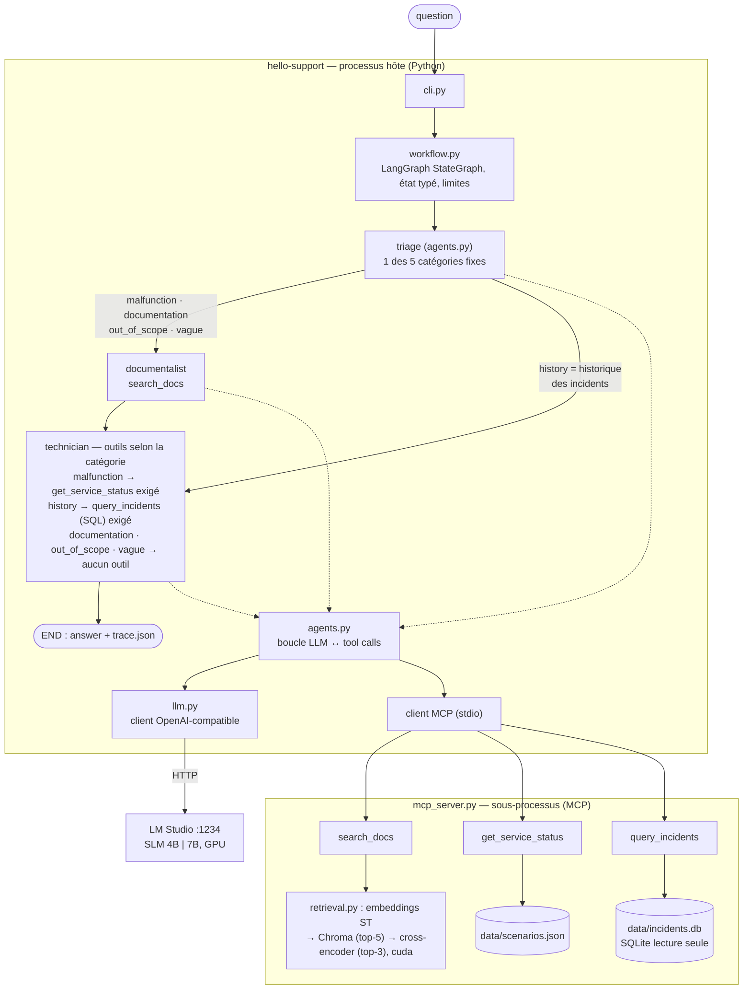

# Spec — HelloSupport : assistant de dépannage « hello world » agents + RAG + MCP + données

- **Statut** : `implémentée` (v1.8.0, 2026-10-02) ; **100 % local** : aucune API cloud payante, aucun compte
- **Résultat** : critères du §6 atteints avec le modèle par défaut (7 B : 18/18) ; SLM 15/18 — voir [`BENCH.md`](BENCH.md) et les décisions dans [`DESIGN_DECISIONS.md`](DESIGN_DECISIONS.md)
- **Date** : 2026-10-02 (amendée : livrable `DESIGN_DECISIONS.md`)
- **Auteur** : Stéphane Hercot (avec Claude). Base : une proposition initiale de projet minimal, complétée pour couvrir l'ensemble des compétences visées

---

## 1. Problème

Objectif d'apprentissage : acquérir une **pratique concrète** des agents IA, du RAG, des
embeddings, de la recherche vectorielle, du reranking, du tool calling, de MCP, des SLM, du
model serving et de **l'intégration aux bases de données**. L'auteur n'avait pas encore
manipulé ces briques ensemble, et voulait pouvoir dire « je l'ai fait, voici ce que j'ai
appris et mesuré », sans y passer des semaines.

## 2. Objectif

En **~5 jours**, livrer un programme Python en terminal qui répond à une question de
support (« PostgreSQL ne répond plus, que vérifier ? »). Pour cela, **deux agents
orchestrés par LangGraph** utilisent **trois outils MCP** : des fiches (RAG avec base
vectorielle et reranking), un statut de service simulé et une **base SQL d'incidents**
interrogée en text-to-SQL. Le tout tourne sur un **LLM/SLM servi localement**. Le projet
touche **au moins une fois, réellement et de façon démontrable**, chaque compétence
technique visée.

**Atteint quand** : les 6 cas de validation du §6 passent en démo réelle, les tests
automatisés passent, le tableau de mesures (§5, J5) est rempli avec des chiffres
**mesurés**, et [`DESIGN_DECISIONS.md`](DESIGN_DECISIONS.md) (+ PDF) explique chaque choix.

---

## 3. Périmètre

### Dans le périmètre

- CLI : `hello-support ask "<question>" [--scenario stopped|running] [--model <id>]`,
  `hello-support search "<texte>"`, `hello-support bench`, `hello-support --version`.
- **3 fiches Markdown** (PostgreSQL connexion, nginx indisponible, Redis inaccessible),
  sections titrées (Symptoms / Checks / Service status / Limits).
- **RAG** : découpage par section → embeddings (`paraphrase-multilingual-MiniLM-L12-v2`)
  → **Chroma** embarqué (top-5) → **reranking cross-encoder**
  (`cross-encoder/mmarco-mMiniLMv2-L12-H384-v1`) → top-2 avec scores et citations.
  Le tout sur **GPU** (`cuda`) si disponible.
- **Serveur MCP** (SDK Python `mcp`, FastMCP, transport stdio) exposant :
  - `search_docs(query)` → `[{doc_id, section, text, score, rerank_score}]`
  - `get_service_status(service_name)` (postgres | nginx | redis) → `{service, status, simulated: true}` lu dans `scenarios.json`
  - `query_incidents(sql)` → lignes JSON. **SQLite read-only** (`file:incidents.db?mode=ro`), une seule
    instruction `SELECT`, `LIMIT 50` forcé, schéma décrit dans la docstring de l'outil.
- **Deux agents** (un seul helper de boucle « LLM → tool call → résultat », réutilisé) :
  - *Documentaliste* : outil `search_docs` (max 2 appels). Produit les evidence + « ce qui manque ».
  - *Technicien* : outils `get_service_status` (max 1) et `query_incidents` (max 2). Produit la réponse :
    observation / explication possible / vérification suggérée / sources. Ne dit jamais avoir réparé quoi que ce soit.
- **Orchestration LangGraph** : `StateGraph` `documentalist → technician → END`, état typé
  (`question, evidence, observations, counters, errors, answer, trace`). Max 3 appels LLM par
  agent, `recursion_limit` comme filet de sécurité, timeout par appel.
- **Client MCP** côté hôte via `langchain-mcp-adapters` (ou client `mcp` direct).
- **Model serving local** : **LM Studio** en mode serveur (API compatible OpenAI, `http://localhost:1234/v1`),
  deux modèles interchangeables par config : un **SLM** (~3–4 B, ex. Qwen2.5-3B-Instruct / Qwen3-4B) et un
  **7 B** (ex. Qwen2.5-7B-Instruct). **Pas d'API cloud** : l'interface OpenAI-compatible permettrait d'en brancher une, mais ce n'est pas fait.
- **Observabilité minimale** : trace JSON par exécution (`runs/<timestamp>.json`) avec appels, arguments,
  durées, tokens in/out. Résumé affiché en fin de réponse.
- **Mini-benchmark** : les 6 cas × 2 modèles → tableau Markdown (latence p50/max, tokens, appels d'outils
  corrects, verdict qualitatif) ; coût local = 0 € ; coût cloud **estimé** à partir des tokens mesurés × prix publics (sans compte).
- **Tests pytest** : contrats des outils, garde-fous SQL, limites, graphe avec LLM factice.
- **`docs/DESIGN_DECISIONS.md` (+ PDF)** — livrable final : pour **chaque** composant / décision de design et de dev
  (orchestration LangGraph, état partagé, MCP et ses outils, outil SQL lecture seule, SQLite, embeddings, Chroma,
  reranker, LM Studio et choix 3–4 B vs 7 B, GPU, mesures latence/coût, structure du code, tests…) :
  **besoin → options envisagées → choix → pourquoi → compromis/limites → compétence visée**.
  Tenu **au fil de chaque jalon** (journal type ADR, entrées `D-xx` datées), puis **consolidé** à J5
  (synthèse + PDF). Remplace l'ancien « ADR-001 », qui devient l'entrée « choix du modèle par défaut ».
- Code, prompts et commentaires en anglais ; docs projet en français.

### Hors-périmètre (explicitement exclu)

- API web, UI, Docker, cloud, CI, authentification, multi-utilisateur.
- Actions correctrices réelles sur des services (tout est simulé ou en lecture seule).
- Dialogue multi-tour : une demande de précision **clôt** la requête.
- Fine-tuning ou entraînement de modèle.
- Persistance / reprise d'état (checkpoints), PostgreSQL réel, pgvector, tests de charge → §10.
- Toute prétention de « scale » ou de « production ».

---

## 4. Architecture



Arborescence cible :

```
hello_support/  __init__.py (__version__), cli.py, workflow.py, agents.py, llm.py,
                mcp_server.py, retrieval.py, sql_guard.py, metrics.py
data/           kb/*.md (3 fiches), scenarios.json, seed_incidents.py → incidents.db
tests/          test_tools.py, test_sql_guard.py, test_workflow_fake_llm.py
docs/           SPEC.md, DESIGN_DECISIONS.md (+ .pdf), BENCH.md
runs/           traces JSON (gitignoré)
```

---

## 5. Jalons

Chaque jalon = un commit (convention du projet) **et** au moins une entrée `D-xx` ajoutée à `DESIGN_DECISIONS.md`
pour les choix faits pendant le jalon. Durées indicatives pour une personne qui découvre les briques.

| # | Jalon | Livrable | « C'est fait » quand… | Durée |
|---|---|---|---|---|
| **J0** | Socle | Projet `uv`, `__version__`, `.gitignore`, `.env.example`, LM Studio serveur + 2 modèles téléchargés, `llm.py` | `hello-support --version` affiche `1.x.y` ; un script envoie « say hello » au SLM **et** au 7 B via `localhost:1234` et affiche latence + tokens ; un appel de **tool calling** factice (`get_time`) est correctement émis par le modèle | 0,5 j |
| **J1** | RAG | 3 fiches, `retrieval.py` (ST → Chroma → cross-encoder), commande `search` | `hello-support search "connexion refusée postgres"` affiche top-2 `doc_id#section` avec score cosinus **et** score rerank ; le device affiché est `cuda` ; au moins un exemple où le rerank **change l'ordre** est noté dans `BENCH.md` | 0,5–1 j |
| **J2** | Données + MCP | `scenarios.json`, `seed_incidents.py` (~15 incidents : id, service, started_at, severity, summary, resolved), `sql_guard.py`, `mcp_server.py` (3 outils) | Les 3 outils répondent dans **MCP Inspector** (`npx @modelcontextprotocol/inspector`) ; `DELETE FROM incidents` et `SELECT 1; DROP …` sont refusés avec une erreur explicite ; tests `test_tools` + `test_sql_guard` verts | 0,5 j |
| **J3** | Agents + orchestration | `agents.py`, `workflow.py`, client MCP, limites, trace JSON | `hello-support ask "Mon app ne se connecte plus à PostgreSQL" --scenario stopped` affiche agent actif → outil → arguments → résultat → réponse citant `stopped` + `postgres_connection.md#Service status` ; `runs/*.json` contient toute la trace | 1–1,5 j |
| **J4** | Validation | 6 cas (§6) en démo réelle + `test_workflow_fake_llm.py` | `pytest` vert ; les 6 cas sont exécutés avec le 7 B, la sortie est capturée dans `docs/BENCH.md` (y compris les échecs, notés tels quels) | 1 j |
| **J5** | Mesure + évaluation + doc | `hello-support bench`, `docs/BENCH.md`, `docs/DESIGN_DECISIONS.md` consolidé + `.pdf`, README | Tableau SLM vs 7 B rempli (latence p50/max, tokens, appels d'outils corrects / 6, coût cloud estimé, remarques) ; `DESIGN_DECISIONS` consolidé (synthèse, une entrée par composant, décision « modèle par défaut » fondée sur les mesures) et exporté en PDF ; README : lancement, exemple réussi, cas d'échec, limites ; release `minor` + CHANGELOG | 0,5–1 j |

**Total : ~4 à 5,5 jours.** Si le temps manque, l'ordre de sacrifice est : bench à 2 modèles
(garder 1 modèle) → Chroma (repli cosinus NumPy). **Ne pas sacrifier** le SQL, le reranking ni `DESIGN_DECISIONS.md`
(exigé par l'utilisateur) : ce sont les éléments différenciants.

---

## 6. Critères d'acceptation (cas de validation)

- [x] **C1 PostgreSQL arrêté** (`--scenario stopped`) : `get_service_status("postgres")` est appelé ; la réponse
      cite `stopped`, précise que c'est **simulé** et cite la fiche + section.
- [x] **C2 PostgreSQL actif** (`--scenario running`, même question) : la conclusion change ; aucune panne inventée ;
      l'observation est séparée de l'hypothèse (adresse, identifiants…).
- [x] **C3 Question documentaire** (« Quelles vérifications pour un Redis inaccessible ? ») : réponse sourcée
      **sans** appel à `get_service_status`.
- [x] **C4 Question data** (« Combien d'incidents postgres ces 30 derniers jours, et le dernier est-il résolu ? ») :
      `query_incidents` est appelé avec un `SELECT` valide ; la réponse reprend les chiffres retournés.
- [x] **C5 Inconnu ou vague** (« Mon Kafka est lent » / « ça marche pas ») : l'assistant dit qu'aucune fiche ne
      couvre la demande ou demande une précision ; aucune fiche ni observation fabriquée.
- [x] **C6 Erreur et limite** : un service inconnu, une SQL refusée ou une limite d'appels atteinte produisent une sortie
      contrôlée avec trace lisible, sans boucle infinie.
- [x] `pytest` vert ; `hello-support --version` OK ; aucun secret dans git ; `BENCH.md` contient des chiffres mesurés.
- [x] `DESIGN_DECISIONS.md` + `.pdf` : chaque composant listé au §3 a son entrée (besoin, options, choix, pourquoi, compromis, compétence visée).

---

## 7. Ce que le projet doit permettre d'expliquer (1 phrase par compétence)

> Phrases de cadrage écrites **avant** l'implémentation, en anglais, au registre « prototype
> personnel » (ne pas les gonfler). Les résultats réellement mesurés sont dans [`BENCH.md`](BENCH.md)
> et la synthèse de [`DESIGN_DECISIONS.md`](DESIGN_DECISIONS.md).

| Compétence | Phrase |
|---|---|
| AI agents | "I built two tool-using agents, a retriever and a troubleshooter, that decide which tool to call and must separate observations from hypotheses." |
| Agentic / multi-step workflows | "The request flows through retrieve → diagnose → answer, and each step can call tools several times within hard limits." |
| Orchestration & state management | "I used a LangGraph StateGraph with a typed shared state (evidence, observations, counters, trace), so every transition is explicit and replayable from a JSON trace." |
| Tool calling | "The model only *proposes* tool calls; the host validates the arguments with Pydantic before executing, and feeds errors back to the model once." |
| MCP | "The three tools live in a separate MCP server over stdio, so the agent code doesn't know whether a tool is a file, a JSON or a database. I tested them in MCP Inspector." |
| LLMs & SLMs | "I ran the same workflow on a ~3-4B SLM and a 7B model and measured where the small one failed, mostly on tool-argument formatting and SQL." |
| Model serving | "Models were served locally through LM Studio's OpenAI-compatible endpoint with GPU offload, so switching model or moving to a cloud endpoint is a config change." |
| RAG & semantic retrieval | "Answers are grounded in retrieved sections with citations, and the agent must say 'not covered' when the nearest neighbours are irrelevant." |
| Embeddings & vector search | "I embedded section-level chunks with a multilingual Sentence-Transformers model and stored them in Chroma for top-k similarity search." |
| Reranking | "A cross-encoder re-scores the top-5 candidates, and I logged a concrete case where it fixed the order the bi-encoder got wrong." |
| Enterprise data agent / DB integration | "One tool lets the agent query an incidents database in SQL, in text-to-SQL style, behind a read-only connection, a single-SELECT guard and a forced LIMIT." |
| Latency / throughput / cost | "Each run logs per-call latency and tokens, and I benchmarked six scenarios on two models. Local inference cost nothing, and latency was the trade-off I measured." |
| Reliability / prototype → production | "Bounded loops, timeouts, validated tool contracts and tests with a fake LLM: the habits I'd require before promoting a prototype." |
| Python & architecture | "It's a small Python package with clear boundaries: CLI, workflow, agents, LLM client, MCP server, retrieval, SQL guard." |
| PyTorch / Hugging Face / GPU | "Embeddings and the reranker run with PyTorch on CUDA, using models pulled from the Hugging Face Hub, on an 8 GB consumer GPU." |
| Evaluate AI tech → engineering plan | "I kept a decision log (ADR-style: need, options, choice, trade-offs) for every component, and picked the default model from measurements, which is how I'd frame such decisions for a team." |
| LangGraph | "I used LangGraph for the code-defined workflow and kept tool choice to the model: deterministic structure, autonomous steps." |
| Database systems & SQL engines | "The data side is deliberately simple, SQLite, but the read-only and guard pattern is what I'd carry over to Postgres or an enterprise engine." |

**Non couverts, assumés** : systèmes distribués, scale réel, leadership d'équipe, C/C++/Java,
recherche.

---

## 8. Prérequis et outils (tous gratuits)

| Outil | Rôle | État machine |
|---|---|---|
| Python 3.12 + `uv` | runtime, venv, dépendances | ✅ installés |
| PyTorch CUDA + GPU NVIDIA 8 Go | embeddings / reranker sur GPU | ✅ (torch 2.6 cu124) |
| LM Studio (`lms`) | serveur de modèles local OpenAI-compatible | ✅ installé ; modèles téléchargés par `lms get` (voir `DESIGN_DECISIONS.md`) |
| `langgraph`, `langchain-openai`, `langchain-mcp-adapters`, `mcp` | orchestration, client LLM, MCP | pip (uv) |
| `sentence-transformers`, `chromadb` | embeddings, reranker, vector DB embarquée | pip (uv), modèles HF Hub sans compte |
| `sqlite3` (stdlib), `pydantic`, `pytest` | base d'incidents, validation, tests | stdlib / pip |
| Node.js (`npx`) | MCP Inspector pour tester le serveur | ✅ installé |

Aucun compte payant requis. Coût par défaut : **0 €**. Docker et WSL ne sont pas nécessaires.

## 9. Risques

| Risque | Proba. | Impact | Mitigation |
|---|---|---|---|
| Le SLM appelle mal les outils | Moyenne | Moyen | Validation Pydantic + 1 retour d'erreur ; 7 B par défaut ; le documenter dans BENCH (c'est un apprentissage) |
| SQL générée fausse ou dangereuse | Moyenne | Faible | read-only, `SELECT` unique, `LIMIT`, schéma dans la description de l'outil, test dédié |
| Installation Chroma / torch sous Windows | Faible | Moyen | torch déjà présent ; repli cosinus NumPy (documenté dans `DESIGN_DECISIONS.md`) |
| Dérive de périmètre | Élevée | Élevé | §3 hors-périmètre ; tout le reste va en §10 |
| Surpromesse sur ce que démontre le prototype | Moyenne | Élevé | §7 formulé « prototype » ; chiffres mesurés uniquement |

Décisions prises (2026-10-02) :

- Dépôt local d'abord ; publié en open source (licence MIT) en v1.9.0, après accord explicite de l'auteur.
- **100 % local** : pas d'API cloud payante ; les coûts cloud sont **estimés** à partir des prix publics.

---

## 10. Pour aller plus loin (hors hello world, à ne faire qu'après J5)

Classés par valeur ajoutée :

1. **PostgreSQL + pgvector** (dans WSL ou Docker) : une seule base pour les incidents ET les vecteurs.
   C'est le pont le plus direct entre IA et bases de données (moteurs SQL à recherche vectorielle intégrée).
2. **Persistance LangGraph** (checkpointer SQLite/Postgres) : reprise d'une exécution et human-in-the-loop
   avant une action « sensible ».
3. **Évaluation RAG** : petit jeu de questions → métriques retrieval (recall@k, MRR avant/après rerank).
4. **Serving haute performance** : vLLM (WSL/Linux) et mesure du débit (tokens/s) sous requêtes concurrentes
   → vrai point « throughput ».
5. **Transport MCP HTTP** (streamable HTTP) + serveur d'outils séparé → premier pas « distribué » (deux processus, réseau).
6. **Observabilité** : traces OpenTelemetry / Langfuse local.
7. **Agent data analysis** : génération d'un graphique ou d'un résumé statistique sur les incidents.
8. ~~**Publication open source** du dépôt~~ : fait en v1.9.0 (licence MIT).
