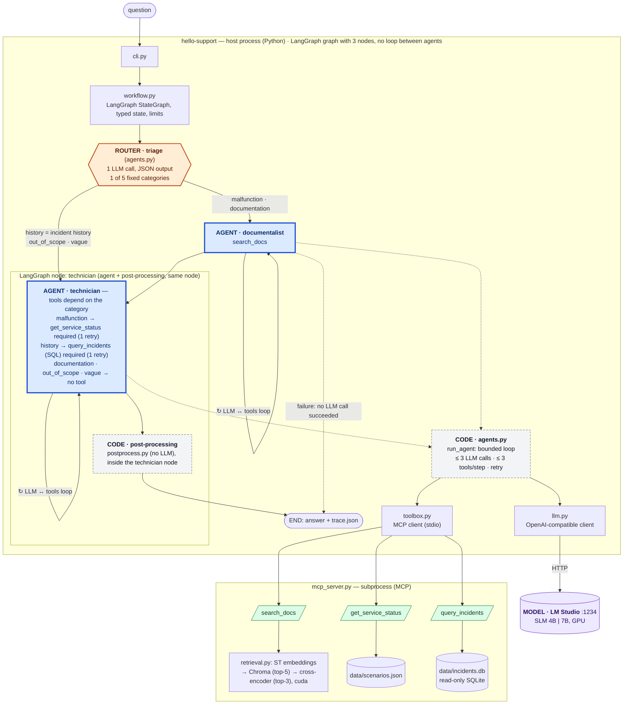

# Spec — HelloSupport: "hello world" troubleshooting assistant with agents + RAG + MCP + data

- **Status**: `implemented` (v1.8.0, 2026-10-02); current version **1.11.2** (2026-10-04), web demo added in v1.11.0 (D-31); **100% local**: no paid cloud API, no account
- **Result**: §6 criteria met with the default model. On v1.11.2 (2026-10-04): 7B 18/18 (re-scored with the fixed C6 check, 16/18 raw), SLM 16/18. First measurement on v1.7.0 (2026-10-02): 7B 18/18, SLM 15/18 — see [`BENCH.md`](BENCH.md) and the decisions in [`DESIGN_DECISIONS.md`](DESIGN_DECISIONS.md)
- **Date**: 2026-10-02 (amended: `DESIGN_DECISIONS.md` deliverable; amended 2026-10-04 in v1.11.2 to match the code: §3, §4, §5, §6, §7, §8)
- **Author**: Stéphane Hercot (with Claude). Basis: an initial minimal project proposal, extended to cover all the targeted skills

---

## 1. Problem

Learning goal: gain **hands-on practice** with AI agents, RAG, embeddings, vector search,
reranking, tool calling, MCP, SLMs, model serving and **database integration**. The author
had not yet worked with these building blocks together, and wanted to be able to say "I did
it, here is what I learned and measured", without spending weeks on it.

## 2. Goal

In **~5 days**, deliver a terminal Python program that answers a support question
("PostgreSQL ne répond plus, que vérifier ?" — "PostgreSQL is not responding, what should I
check?"). To do so, **two agents orchestrated by LangGraph** use **three MCP tools**:
knowledge-base sheets (RAG with a vector database and reranking), a simulated service status
and an **SQL incidents database** queried via text-to-SQL. Everything runs on a **locally
served LLM/SLM**. The project touches **each targeted technical skill at least once, for
real and demonstrably**.

**Achieved when**: the 6 validation cases in §6 pass in a real demo, the automated tests
pass, the measurements table (§5, J5) is filled with **measured** figures, and
[`DESIGN_DECISIONS.md`](DESIGN_DECISIONS.md) (+ PDF) explains every choice.

---

## 3. Scope

### In scope

- CLI: `hello-support ask "<question>" [--scenario stopped|running] [--model <id>]`,
  `hello-support search "<texte>"`, `hello-support bench`, `hello-support --version`.
  *Amended in v1.11.2*: the CLI also has `smoke`, `throughput` and `web` (browser demo with a
  live trace, added in v1.11.0, D-31), plus the `hello-support-mcp` tool server entry point.
  Four scenarios exist: `stopped`, `running`, `redis_down`, `tool_error`. The scenario is
  taken from the file named by `HS_SCENARIO_FILE` (used by the web demo), then from
  `--scenario` / `HS_SCENARIO` (`--scenario` sets `HS_SCENARIO` for the spawned tool server),
  then the default `stopped`.
- **3 Markdown sheets** (PostgreSQL connection, nginx unavailable, Redis unreachable),
  with titled sections (Symptoms / Checks / Service status / Limits).
- **RAG**: split by section → embeddings (`paraphrase-multilingual-MiniLM-L12-v2`)
  → embedded **Chroma** (top-5) → **cross-encoder reranking**
  (`cross-encoder/mmarco-mMiniLMv2-L12-H384-v1`) → top-3 with scores and citations
  (amended in v1.11.2: the plan said top-2; `search_docs` returns 3 hits, while the CLI
  `search` command keeps a default `--top-n` of 2).
  All on **GPU** (`cuda`) when available.
- **MCP server** (official Python `mcp` SDK v2, class `MCPServer`, stdio transport) exposing:
  - `search_docs(query)` → `[{doc_id, section, text, score, vector_rank, rerank_score, relevant}]`
  - `get_service_status(service_name)` (postgres | nginx | redis) → `{service, status, simulated: true, scenario}` read from `scenarios.json`
  - `query_incidents(sql)` → JSON rows. **Read-only SQLite** (`file:incidents.db?mode=ro`), a single
    `SELECT` statement, forced `LIMIT 50`, schema described in the tool's docstring.
- **Two agents** (a single, reused "LLM → tool call → result" loop helper):
  - *Documentalist*: `search_docs` tool (max 2 calls). Produces the evidence + "what is missing".
  - *Technician*: `get_service_status` (max 1) and `query_incidents` (max 2) tools. Produces the answer:
    observation / possible explanation / suggested check / sources. Never claims to have fixed anything.
- **LangGraph orchestration**: `StateGraph` with three nodes, as drawn in §4 (amended in v1.11.2;
  the plan was `documentalist → technician → END`): `START → triage`; for `malfunction` and
  `documentation`, `triage → documentalist → technician → END`; for `history`, `out_of_scope` and
  `vague`, `triage → technician → END`; `documentalist → END` when it fails (no LLM call succeeded).
  Post-processing runs inside the technician node. Typed state (`question, model, scenario,
  route, evidence, brief, observations, counters, status, errors, answer, trace`). Max 3 LLM
  calls per agent, `recursion_limit` as a safety net, per-call timeout.
- **MCP client** on the host side: a direct `mcp` client (`toolbox.py`); `langchain-mcp-adapters`
  was not used (D-05, D-20).
- **Local model serving**: **LM Studio** in server mode (OpenAI-compatible API, `http://localhost:1234/v1`),
  two models swappable via config: an **SLM** (~3–4B, e.g. Qwen2.5-3B-Instruct / Qwen3-4B) and a
  **7B** (e.g. Qwen2.5-7B-Instruct). **No cloud API**: the OpenAI-compatible interface would allow plugging one in, but this is not done.
- **Minimal observability**: JSON trace per run (`runs/<timestamp>.json`) with calls, arguments,
  durations, tokens in/out. Summary displayed at the end of the answer.
- **Mini-benchmark**: the 6 cases × 2 models → Markdown table (p50/max latency, tokens, correct tool
  calls, qualitative verdict); local cost = €0; cloud cost **estimated** from measured tokens × public prices (no account).
- **pytest tests**: tool contracts, SQL guardrails, limits, graph with a fake LLM.
- **`docs/DESIGN_DECISIONS.md` (+ PDF)** — final deliverable: for **each** component / design and dev decision
  (LangGraph orchestration, shared state, MCP and its tools, read-only SQL tool, SQLite, embeddings, Chroma,
  reranker, LM Studio and the 3–4B vs 7B choice, GPU, latency/cost measurements, code structure, tests…):
  **need → options considered → choice → why → trade-offs/limits → skill demonstrated**.
  Kept **at each milestone** (ADR-style log, dated `D-xx` entries), then **consolidated** at J5
  (summary + PDF). Replaces the former "ADR-001", which becomes the "default model choice" entry.
- Code, prompts, comments and documentation in English.

### Out of scope (explicitly excluded)

- ~~Web API, UI~~ (superseded in v1.11.0: a local web demo with an HTTP/SSE API was added, D-31),
  Docker, cloud, CI, authentication, multi-user.
- Real corrective actions on services (everything is simulated or read-only).
- Multi-turn dialogue: a request for clarification **ends** the request.
- Fine-tuning or model training.
- State persistence / resumption (checkpoints), real PostgreSQL, pgvector, load tests → §10.
- Any claim of "scale" or "production".

---

## 4. Architecture

**Legend**: 🟦 **agent** (LLM that chooses its tools and loops LLM ↔ tools, ≤ 3 LLM calls) ·
🟧 **router** (triage: 1 LLM call with JSON output, no tool and no loop) · ⬜ deterministic **code** ·
🟩 **MCP tool** · 🟪 **model** served by LM Studio. The LangGraph graph has three nodes (triage,
documentalist, technician) and two conditional edges, with no loop between agents; post-processing
is plain code run at the end of the technician node, and the dashed edge is the documentalist
failure exit (fixed fallback answer, status `failed`). "Required" means the code forces the tool
call and retries **once** if the model answers without it; if the model answers in text a second
time, that answer is accepted without observation but traced (a `limit` event and an error "a
tool call was required but never made; answer accepted without observation"). The details of an agent's loop and the "agent / router / code" choice are explained in
[`DESIGN_DECISIONS.md`](DESIGN_DECISIONS.md) (summary and D-29).

Layout (amended in v1.11.2: the pre-implementation target layout was replaced): the code lives in
`src/hello_support/`; see the README section *Repository layout* for the current list of modules.
Differences from the original plan: there is no `metrics.py` (run metrics are computed by
`summarize` in `workflow.py` and by `benchmark.py`), and there is no `data/seed_incidents.py`
(the incidents database is seeded by `data_store.py`).

---

## 5. Milestones

Each milestone = one commit (project convention) **and** at least one `D-xx` entry added to `DESIGN_DECISIONS.md`
for the choices made during the milestone. Durations are indicative for someone discovering the building blocks.

| # | Milestone | Deliverable | "Done" when… | Duration |
|---|---|---|---|---|
| **J0** | Foundation | `uv` project, `__version__`, `.gitignore`, `.env.example`, LM Studio server + 2 downloaded models, `llm.py` | `hello-support --version` prints `1.x.y`; a script sends "say hello" to the SLM **and** to the 7B via `localhost:1234` and prints latency + tokens; a dummy **tool calling** call (`get_time`) is correctly emitted by the model | 0.5 d |
| **J1** | RAG | 3 sheets, `retrieval.py` (ST → Chroma → cross-encoder), `search` command | `hello-support search "connexion refusée postgres"` prints top-2 `doc_id#section` with cosine score **and** rerank score; the displayed device is `cuda`; at least one example where reranking **changes the order** is recorded in `BENCH.md` | 0.5–1 d |
| **J2** | Data + MCP | `scenarios.json`, `seed_incidents.py` (~15 incidents: id, service, started_at, severity, summary, resolved), `sql_guard.py`, `mcp_server.py` (3 tools) | The 3 tools respond in **MCP Inspector** (`npx @modelcontextprotocol/inspector`); `DELETE FROM incidents` and `SELECT 1; DROP …` are rejected with an explicit error; `test_tools` + `test_sql_guard` tests green | 0.5 d |
| **J3** | Agents + orchestration | `agents.py`, `workflow.py`, MCP client, limits, JSON trace | `hello-support ask "Mon app ne se connecte plus à PostgreSQL" --scenario stopped` displays active agent → tool → arguments → result → answer citing `stopped` + `postgres_connection.md#Service status`; `runs/*.json` contains the full trace | 1–1.5 d |
| **J4** | Validation | 6 cases (§6) in a real demo + `test_workflow_fake_llm.py` | `pytest` green; the 6 cases are run with the 7B, the output is captured in `docs/BENCH.md` (including failures, recorded as is) | 1 d |
| **J5** | Measurement + evaluation + docs | `hello-support bench`, `docs/BENCH.md`, consolidated `docs/DESIGN_DECISIONS.md` + `.pdf`, README | SLM vs 7B table filled (p50/max latency, tokens, correct tool calls / 6, estimated cloud cost, remarks); `DESIGN_DECISIONS` consolidated (summary, one entry per component, "default model" decision based on measurements) and exported to PDF; README: how to run, successful example, failure cases, limits; `minor` release + CHANGELOG | 0.5–1 d |

*Amended in v1.11.2*: J2 was implemented with the seeding code in `data_store.py` (14 incidents,
not a `seed_incidents.py` script). The dates are relative to the seed day, and since v1.11.2 the
database is re-seeded automatically when the seed day (stored in `PRAGMA user_version`) is not today.

**Total: ~4 to 5.5 days.** If time runs short, the sacrifice order is: 2-model benchmark
(keep 1 model) → Chroma (NumPy cosine fallback). **Do not sacrifice** SQL, reranking or `DESIGN_DECISIONS.md`
(required by the user): these are the differentiating elements.

---

## 6. Acceptance criteria (validation cases)

- [x] **C1 PostgreSQL stopped** (`--scenario stopped`): `get_service_status("postgres")` is called; the answer
      cites `stopped`, states that it is **simulated** and cites the sheet + section.
- [x] **C2 PostgreSQL running** (`--scenario running`, same question): the conclusion changes; no invented outage;
      the observation is separated from the hypothesis (address, credentials…).
- [x] **C3 Documentation question** ("Quelles vérifications pour un Redis inaccessible ?" — "What checks for an unreachable Redis?"): sourced answer
      **without** a call to `get_service_status`.
- [x] **C4 Data question** ("Combien d'incidents postgres ces 30 derniers jours, et le dernier est-il résolu ?" — "How many postgres incidents in the last 30 days, and is the latest one resolved?"):
      `query_incidents` is called with a valid `SELECT`; the answer reports the returned figures.
- [x] **C5 Out of scope** ("Mon Kafka est lent, que faire ?" — "My Kafka is slow, what should I do?"): the assistant says that no sheet
      covers the request or asks for clarification; no fabricated sheet or observation.
- [x] **C6 Tool failure** (`--scenario tool_error`, "Mon serveur Redis ne répond plus, que se passe-t-il ?" — "My Redis server no longer responds, what is going on?"):
      the status tool fails; the error is traced, the run ends in a controlled way (status `done`), the answer says
      the check failed and asserts no status.

*Amended in v1.11.2*: C5 and C6 above are the executable cases of `src/hello_support/cases.py`. The plan
also listed the vague question "ça marche pas" under C5: it is handled by the `vague` route and tested in
`tests/test_workflow_fake_llm.py::test_out_of_scope_and_vague_skip_the_documentalist`, but it is not a
benchmark case. The other C6 situations of the plan (unknown service, rejected SQL query, reached call limit)
are covered by unit tests instead: `tests/test_tools.py`, `tests/test_agents.py` and `tests/test_guardrails.py`.
- [x] `pytest` green; `hello-support --version` OK; no secret in git; `BENCH.md` contains measured figures.
- [x] `DESIGN_DECISIONS.md` + `.pdf`: each component listed in §3 has its entry (need, options, choice, why, trade-offs, skill demonstrated).

---

## 7. What the project should make it possible to explain (1 sentence per skill)

> Framing sentences written **before** implementation, in English, in a "personal prototype"
> register (do not inflate them). The actually measured results are in [`BENCH.md`](BENCH.md)
> and the summary of [`DESIGN_DECISIONS.md`](DESIGN_DECISIONS.md).

| Skill | Sentence |
|---|---|
| AI agents | "I built two tool-using agents, a retriever and a troubleshooter, that decide which tool to call and must separate observations from hypotheses." |
| Agentic / multi-step workflows | "The request flows through retrieve → diagnose → answer, and each step can call tools several times within hard limits." |
| Orchestration & state management | "I used a LangGraph StateGraph with a typed shared state (evidence, observations, counters, trace), so every transition is explicit and replayable from a JSON trace." |
| Tool calling | "The model only *proposes* tool calls; the host checks that the arguments are valid JSON, the tool server validates types and allowed values (Pydantic in the MCP SDK) before executing, and errors are fed back to the model." *(Amended in v1.11.2: the original sentence said the host validated the arguments with Pydantic.)* |
| MCP | "The three tools live in a separate MCP server over stdio, so the agent code doesn't know whether a tool is a file, a JSON or a database. I tested them in MCP Inspector." |
| LLMs & SLMs | "I ran the same workflow on a ~3-4B SLM and a 7B model and measured where the small one failed, mostly on tool-argument formatting and SQL." |
| Model serving | "Models were served locally through LM Studio's OpenAI-compatible endpoint with GPU offload, so switching model or moving to a cloud endpoint is a config change." |
| RAG & semantic retrieval | "Answers are grounded in retrieved sections with citations, and the agent must say 'not covered' when the nearest neighbours are irrelevant." |
| Embeddings & vector search | "I embedded section-level chunks with a multilingual Sentence-Transformers model and stored them in Chroma for top-k similarity search." |
| Reranking | "A cross-encoder re-scores the top-5 candidates, and I logged a concrete case where it fixed the order the bi-encoder got wrong." |
| Enterprise data agent / DB integration | "One tool lets the agent query an incidents database in SQL, in text-to-SQL style, behind a read-only connection, a single-SELECT guard and a forced LIMIT." |
| Latency / throughput / cost | "Each run logs per-call latency and tokens, and I benchmarked six scenarios on two models. Local inference cost nothing, and latency was the trade-off I measured." |
| Reliability / prototype → production | "Bounded loops, timeouts, validated tool contracts and tests with a fake LLM: the habits I'd require before promoting a prototype." |
| Python & architecture | "It's a small Python package with clear boundaries: CLI, workflow, agents, LLM client, MCP server, retrieval, SQL guard." |
| PyTorch / Hugging Face / GPU | "Embeddings and the reranker run with PyTorch on CUDA, using models pulled from the Hugging Face Hub, on an 8 GB consumer GPU." |
| Evaluate AI tech → engineering plan | "I kept a decision log (ADR-style: need, options, choice, trade-offs) for every component, and picked the default model from measurements, which is how I'd frame such decisions for a team." |
| LangGraph | "I used LangGraph for the code-defined workflow and kept tool choice to the model: deterministic structure, autonomous steps." |
| Database systems & SQL engines | "The data side is deliberately simple, SQLite, but the read-only and guard pattern is what I'd carry over to Postgres or an enterprise engine." |

**Not covered, by choice**: distributed systems, real scale, team leadership, C/C++/Java,
research.

---

## 8. Prerequisites and tools (all free)

| Tool | Role | Machine status |
|---|---|---|
| Python 3.12 + `uv` | runtime, venv, dependencies | ✅ installed |
| PyTorch CUDA + 8 GB NVIDIA GPU | embeddings / reranker on GPU | ✅ (torch 2.6 cu124) |
| LM Studio (`lms`) | local OpenAI-compatible model server | ✅ installed; models downloaded with `lms get` (see `DESIGN_DECISIONS.md`) |
| `langgraph`, ~~`langchain-openai`, `langchain-mcp-adapters`~~, `mcp` | orchestration, LLM client, MCP | pip (uv); amended in v1.11.2: no LangChain package is used, the `openai` client and a direct `mcp` client replace them (D-05, D-20) |
| `sentence-transformers`, `chromadb` | embeddings, reranker, embedded vector DB | pip (uv), HF Hub models without an account |
| `sqlite3` (stdlib), `pydantic`, `pytest` | incidents database, validation, tests | stdlib / pip; `pydantic` is only a transitive dependency (MCP SDK) |
| Node.js (`npx`) | MCP Inspector to test the server | ✅ installed |

No paid account required. Default cost: **€0**. Docker and WSL are not needed.

## 9. Risks

| Risk | Prob. | Impact | Mitigation |
|---|---|---|---|
| The SLM calls tools incorrectly | Medium | Medium | Pydantic validation + 1 error feedback; 7B by default; document it in BENCH (it is a learning point) |
| Generated SQL is wrong or dangerous | Medium | Low | read-only, single `SELECT`, `LIMIT`, schema in the tool description, dedicated test |
| Chroma / torch installation on Windows | Low | Medium | torch already present; NumPy cosine fallback (documented in `DESIGN_DECISIONS.md`) |
| Scope creep | High | High | §3 out of scope; everything else goes to §10 |
| Overpromising on what the prototype demonstrates | Medium | High | §7 phrased as "prototype"; measured figures only |

Decisions made (2026-10-02):

- Local repository first; published as open source (MIT license) in v1.9.0, after the author's explicit approval.
- **100% local**: no paid cloud API; cloud costs are **estimated** from public prices.

---

## 10. Going further (beyond hello world, only after J5)

Ranked by added value:

1. **PostgreSQL + pgvector** (in WSL or Docker): a single database for both incidents AND vectors.
   This is the most direct bridge between AI and databases (SQL engines with built-in vector search).
2. **LangGraph persistence** (SQLite/Postgres checkpointer): resuming a run and human-in-the-loop
   before a "sensitive" action.
3. **RAG evaluation**: small question set → retrieval metrics (recall@k, MRR before/after rerank).
4. **High-performance serving**: vLLM (WSL/Linux) and throughput measurement (tokens/s) under concurrent requests
   → a real "throughput" point.
5. **MCP HTTP transport** (streamable HTTP) + separate tool server → a first "distributed" step (two processes, network).
6. **Observability**: OpenTelemetry traces / local Langfuse.
7. **Data analysis agent**: generating a chart or a statistical summary of the incidents.
8. ~~**Open-source publication** of the repository~~: done in v1.9.0 (MIT license).
